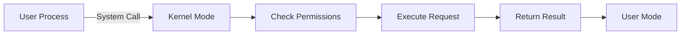

<!-- 
Generated by LectureQ
Date: 2025-08-08 01:36:07
Model: qwen3:30b
-->

<think>
I need to create comprehensive academic notes from the lecture slides and transcript about Operating Systems. I'll synthesize both sources to create well-structured markdown notes.

Let me analyze the content first:

The lecture covers:
- Introduction to Operating Systems
- Course information (prerequisites, learning outcomes, assessments)
- Motivation for studying OS
- Definitions and history of OS
- Virtualization concepts
- Processes and system calls
- Protection mechanisms
- Hardware abstraction

I'll organize the notes into logical sections based on the content. I'll use proper markdown formatting with clear hierarchical headers.

Let me structure the notes:

1. Title and overview
2. Course Information (prerequisites, learning outcomes, assessments)
3. Motivation for Operating Systems
4. Definitions and History
5. Virtualization Concepts
6. Processes
7. System Calls and Protection
8. Hardware Abstraction
9. Summary

Now I'll create the notes based on this structure, synthesizing both the slides and transcript.

I'll make sure to include:
- Key definitions
- Important concepts
- Examples from the lecture
- Diagrams described in the slides (using text descriptions)
- Important details from the transcript
- Clear organization with proper headers

Let me create the notes now.
</think>

# Operating Systems: Week 1 Introduction

**Date:** Week 1 Lecture  
**Course:** Operating Systems (COMP SCI 3200/7200)

## Overview
This lecture introduces the fundamental concepts of operating systems, covering course structure, motivation for studying OS, key definitions, virtualization, processes, and system calls. The lecture emphasizes that operating systems are not just memorization tasks but require understanding design decisions and trade-offs in system implementation.

---

## Course Information

### Housekeeping & Team
- **Course Coordinator:** Bernard Evans (IW 5.44)
- **Workshop Supervisors:** Anubhav Gupta, Jyothis Joy, Nithin Dharanu, Arjun Sharma
- **Resources:**
  - MyUni (Echo360, Lecture Notes, Piazza)
  - Textbook: *Operating Systems: Three Easy Pieces* (highly recommended)

### Prerequisites & Assumed Knowledge
| Category | Requirements |
|----------|--------------|
| **Prerequisites** | Algorithm Design & Data Structures OR Programming for IT Specialists OR Foundations of Computer Science B |
| **Assumed Knowledge** | Coding, stacks, queues, trees |
| **Additional Assumed Knowledge** | Computer Systems (logic gates, registers, program counters, memory, stack, assembly, compilation) <br> Systems Programming (processes, pipes, file descriptors, system calls, C-code) |

> **Note:** The textbook covers the missing systems programming concepts for Assignment 1.

### Course Learning Outcomes
1. Explain the role of the operating system as a high-level interface to hardware
2. Use OS as a resource manager that supports multiprogramming
3. Explain low-level implementation of CPU dispatch
4. Explain low-level implementation of memory management
5. Explain performance trade-offs inherent in OS implementation

> **Key Insight:** Operating systems are not about memorizing terms but understanding design decisions. Every component represents a choice with trade-offs.

### Assessment Structure
| Component | Weight | Details |
|-----------|--------|---------|
| Quizzes | 6% | 4 quizzes, best 3 count |
| Tutorials | 6% | Preparation (online, due before tutorial) + Participation (in-person) |
| Assignment 1 | 8% | System Calls (C-coding, processes, signals) |
| Assignment 2 | 15% | Scheduling (coding + report) |
| Assignment 3 | 15% | TBD |
| Exam | 50% | Likely a hurdle |

> **Key Advice:** 
> - Read the textbook (it's conversational and well-written)
> - Start early, work consistently
> - Practice theoretical/numerical questions
> - Have fun!

---

## Motivation: Why Study Operating Systems?

### Core Reasons
- **Learning C:** OS development requires C programming
- **Understanding How Stuff Actually Happens:** 
  - Memory management
  - Processes
  - Registers
  - Concurrency
- **Beyond Surface-Level Knowledge:** 
  - Understanding the difference between Mac, Windows, and Linux at a fundamental level
  - Moving beyond "I use a computer" to "How does the computer actually work?"

> **Key Insight:** Operating systems are the layer that makes all other software possible. They abstract hardware complexity so developers don't need to understand every detail of the underlying hardware.

---

## Definitions & History

### What is an Operating System?
- **Definition:** A program/process that controls other processes and simplifies computer operation
- **Core Functions:**
  - Interfaces software and hardware (abstraction)
  - Allocates resources
  - Manages processes and hardware
  - Allows multiprocessing
  - Handles CPU dispatch and memory management

### Historical Context
- **Pre-OS Era:** Human operators manually managed computer programs
  - *Example:* Switchboard operators connecting phone calls
  - *Computer Operator:* Manually loading programs onto punch cards
  - *Problem:* CPU was idle while waiting for input/output (waste of money)

- **Evolution of OS:** 
  - Replaced human operators with software
  - Optimized CPU usage, memory usage, time, and security
  - *Example:* From single-program computers to multi-programming systems

> **Key Insight:** The primary motivation for OS was to maximize CPU utilization by eliminating idle time.

---

## Virtualization

### Concept
> "To make a thing, like a thing, but not actually a thing, but seem like a thing."

### Why Virtualization?
- **Problem:** Without abstraction, programs must directly interact with hardware
  - *Example:* Program must specify exact printer model (EPSON Stylus S22)
  - *Example:* Program must specify exact memory addresses

- **Solution:** OS provides abstraction layer
  - *Example:* Program simply says "use printer" without specifying model
  - *Example:* Program uses address space without knowing physical memory layout

### Hardware Abstraction
| Hardware Components | Software Abstraction |
|---------------------|----------------------|
| Processor | Thread |
| Memory | Address Space |
| Disks/SSDs | Files |
| Networks | Sockets |
| Machines | Processes |

> **Key Insight:** The OS creates an illusion that each process has its own private universe with infinite resources.

### Advantages of Abstraction
- Code reuse
- Unifies interface for many devices
- Allows higher-level functionality

### Challenges of Abstraction
- What is the best abstraction?
- Functionality vs. Generality
- How much hardware control should be exposed?
- How much does hardware determine the abstraction?

---

## Processes

### Definition
- **Process:** A thread of control (not a program)
- **Components:**
  - Registers
  - Program Counter
  - Stack Pointer
  - Visible address space
  - Open files
  - Open communication channels

### Process vs. Thread
| Feature | Process | Thread |
|---------|---------|--------|
| Memory Space | Private | Shared |
| Program Counter | Separate | Shared |
| Stack | Separate | Shared |
| Registers | Separate | Shared |

> **Key Insight:** "Every process is running at least one (and usually one) thread."

### Process Lifecycle
1. **Initiation:** Loader loads code into memory
   - Fixes pointers (program assumes address 0)
   - Sets up stack layout
   - Handles libraries
2. **Execution:** Process runs in its own address space
3. **Termination:** Process completes or is killed

---

## System Calls & Protection

### Why Protection?
- **Problem:** Processes must be isolated from each other and the OS
  - *Example:* Process 1 shouldn't be able to destroy Process 2
  - *Example:* Process shouldn't be able to destroy the OS itself

### Protection Mechanisms
- **Process Isolation:** Each process has its own address space
- **Kernel Mode:** OS has privileged access to hardware
- **User Mode:** Processes run with restricted access

### System Call Flow


### Modes of Execution
| Mode | Permissions | Hardware Access |
|------|-------------|-----------------|
| **User Mode** | Limited | No direct hardware access |
| **Kernel Mode** | Full | Direct hardware access |

> **Key Insight:** System calls are like asking a librarian for restricted information—they provide safe access to protected resources.

### System Call Implementation
1. User process calls system call wrapper (e.g., `sys_read`)
2. System call wrapper marshals arguments
3. Hardware triggers trap (mode switch to kernel)
4. Kernel validates request
5. Kernel executes request
6. Kernel returns result to user process

### Interrupts vs. Exceptions
| Type | Trigger | Nature | Example |
|------|---------|--------|---------|
| **Interrupt** | External event | Asynchronous | Timer, I/O device |
| **Exception** | Internal error | Synchronous | Segmentation fault, divide-by-zero |

---

## Hardware Abstraction (Revision)

### Memory Layout for a Process
```
Memory
┌───────────────┐
│     Data      │ ← Global data
├───────────────┤
│     Code      │ ← Program instructions
├───────────────┤
│     Stack     │ ← Current execution state
└───────────────┘
```

### Key Registers
| Register | Purpose | Example |
|----------|---------|---------|
| Program Counter (PC) | Current instruction | `fac(5)` → `fac(4)` |
| Stack Pointer (SP) | Current stack position | Tracks function calls |
| Accumulator | Temporary storage | Old machines had one |
| Status Register | Flags (overflow, interrupts) | Tracks process state |

### x86 Architecture (32-bit vs 64-bit)
| Register | 32-bit | 64-bit |
|----------|--------|--------|
| Program Counter | EIP | RIP |
| Stack Pointer | ESP | RSP |
| Accumulator | EAX | RAX |
| Base Register | EBX | RBX |
| Counter Register | ECX | RCX |
| Destination Index | EDI | RDI |
| Stack Base Pointer | EBP | RBP |
| Source Index | ESI | RSI |
| Data Register | EDX | RDX |

> **Key Insight:** Different architectures have different register naming conventions, which is why software may need to be compiled for specific platforms.

---

## OS Dispatch & Scheduling

### Key Questions
1. **When do I do this?** (Scheduling)
   - Use external timer to regain control periodically
   - Time slicing: Do a bit → Interrupt → Do a bit more → Interrupt

2. **How do I do this?** (Dispatching)
   - Save registers for current process
   - Load registers for next process
   - Switch to kernel stack
   - Return from trap

### Process Control Block (PCB)
| Field | Description |
|-------|-------------|
| PID | Process ID |
| Process State | Running, Ready, Blocked |
| Execution State | Registers, PC, SP |
| Scheduling Priority | For scheduling algorithms |
| Accounting Info | Parent/child processes |
| Credentials | Access permissions |
| Open Files | File descriptors |

### Process States
| State | Description |
|-------|-------------|
| **Running** | Currently executing on CPU |
| **Ready** | Waiting for CPU |
| **Blocked** | Waiting for I/O or other resource |

### Queues
- **Runnable Processes Queue:** Processes ready to run
- **Waiting Queue (I/O):** Processes waiting for I/O operations

---

## Summary & Key Takeaways

### Core Concepts
1. **Operating Systems** are the interface between hardware and software
2. **Virtualization** creates the illusion that each process has its own private universe
3. **Processes** are threads of control with their own address spaces
4. **System Calls** provide safe access to hardware through kernel mode
5. **Protection** is achieved through mode switching and process isolation

### Design Philosophy
> "Every part of an Operating System is a design decision. There are choices."

### Study Approach
- **Do not memorize:** Understand the "why" behind each design choice
- **Think like a designer:** "How would I build an OS?"
- **Read the textbook:** It's conversational and well-written
- **Start early:** This course has significant content

### Final Thought
> "Operating systems is the subject which will peel apart the differences between Mac, Windows, and Linux at a fundamental level."

---

## Key Terms to Remember
- **Abstraction:** Hiding hardware complexity behind a simplified interface
- **Virtualization:** Creating the illusion of dedicated resources
- **Process:** An executing instance of a program with its own address space
- **System Call:** Request to the OS for a service (e.g., `read()`, `write()`)
- **Kernel Mode:** Privileged mode for OS operations
- **User Mode:** Restricted mode for application processes
- **Process Control Block (PCB):** Data structure containing process state information