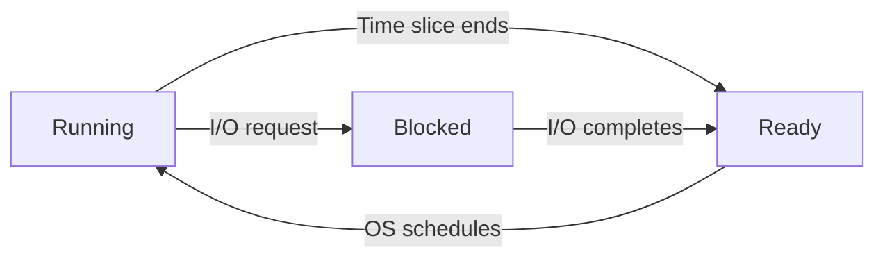

<!-- 
Generated by LectureQ
Date: 2025-08-08 02:06:45
Model: qwen3:30b
-->

<think>
We are creating comprehensive study notes for the textbook chapter titled "Week 1 Introduction: Textbook Processes" (Slides 1-13). The chapter is about the fundamental concept of a process in operating systems.

We'll structure the notes as follows:

1. Chapter Title and Learning Objectives (if any)
2. Key Concepts and Definitions
3. Main Theories and Models
4. Step-by-Step Explanations
5. Important Examples and Applications
6. Figures and Diagrams (described and referenced)
7. Summary
8. Review Questions (from the homework section)

We'll use markdown with proper headers, bullet points, bold for key terms, and blockquotes for key insights.

Let's extract the key information from the slides:

- The process is defined as a running program (a program in execution).
- The OS provides the illusion of many CPUs (virtualization) through time sharing (context switching).
- Mechanisms (low-level) vs. Policies (high-level).
- Process API: Create, Destroy, Wait, Miscellaneous Control, Status.
- Process creation: loading program into memory (code, static data), initializing stack, heap, I/O setup, then starting at main().
- Process states: Running, Ready, Blocked (with transitions).
- Data structures: Process Control Block (PCB) in xv6 example.
- Summary of key terms.

We'll also note the references and the homework simulation, but focus on the content.

Now, let's create the notes.
</think>

# Comprehensive Study Notes: The Abstraction - The Process

---

## Chapter Title & Learning Objectives
**Chapter Title:** Week 1 Introduction: Textbook Processes  
**Core Objective:** Understand the fundamental OS abstraction of a *process* and how it enables the illusion of multiple CPUs through virtualization.

---

## Key Concepts & Definitions

### **Process**
> **Definition:** A running program (not the static code on disk, but the active execution instance).  
> **Key Insight:** *"The program itself is a lifeless thing... it just sits there on the disk... It is the operating system that takes these bytes and gets them running."*  
> **Machine State Components:**  
> - **Memory (Address Space):** Instructions and data in memory  
> - **Registers:** Program Counter (PC), Stack Pointer, etc.  
> - **I/O State:** Open files, network connections  

### **Virtualization of CPU**
> **Core Problem:** *"HOW TO PROVIDE THE ILLUSION OF MANY CPUS?"*  
> **Solution:** **Time Sharing** (context switching between processes on a single physical CPU).  
> **Trade-off:** *"The potential cost is performance, as each will run more slowly if the CPU(s) must be shared."*  

### **Mechanisms vs. Policies**
| **Mechanisms** | **Policies** |
|----------------|--------------|
| Low-level methods to *implement* functionality | High-level algorithms to *decide* how to use mechanisms |
| *Example:* Context switch (how to switch processes) | *Example:* Scheduling policy (which process to run?) |
| **Design Principle:** *"Separate policy and mechanism"* (modular design) | **Key Insight:** *"Separating the two allows one easily to change policies without having to rethink the mechanism."* |

---

## Process API (Core Interface)
All modern OSes provide these fundamental operations:

| Operation | Description | Example |
|-----------|-------------|---------|
| **Create** | Launch a new process | `fork()` in UNIX, double-clicking an app icon |
| **Destroy** | Terminate a process forcefully | `kill()` command |
| **Wait** | Suspend execution until a process completes | `wait()` system call |
| **Miscellaneous Control** | Suspend/resume processes | `pause()`, `resume()` |
| **Status** | Query process state/metrics | `ps` command, `getpid()` |

> **Note:** *"These APIs, in some form, are available on any modern operating system."*

---

## Process Creation: Step-by-Step
How a program becomes a process (from disk to execution):

1. **Load Code & Static Data**  
   - Read executable from disk into memory (address space)  
   - *Modern OSes use **lazy loading** (load on-demand) instead of eager loading (load all at once)*

2. **Initialize Memory Structures**  
   - Allocate **stack** (for local variables, function calls)  
   - Initialize **heap** (for dynamic memory via `malloc()`)  
   - Set up **I/O** (e.g., default file descriptors: stdin, stdout, stderr)

3. **Start Execution**  
   - Transfer control to `main()` (entry point)  
   - *Mechanism:* Specialized context switch to begin execution

> **Figure 4.1 (Slide 4):** *Program → Process Transformation*  
> `Disk (code + static data) → Memory (address space) → Running Process`

---

## Process States & Transitions
**Three Core States** (simplified view):
| State | Description | Trigger |
|-------|-------------|---------|
| **Running** | Executing on CPU | OS scheduler assigns CPU |
| **Ready** | Waiting to run | OS deschedules (e.g., time slice expires) |
| **Blocked** | Waiting for event (e.g., I/O) | Initiates I/O (disk/network) |

### **State Transitions** (Figure 4.2)


### **Real-World Example** (Figure 4.4)
| Time | Process 0 | Process 1 | Event |
|------|-----------|-----------|-------|
| 1-2 | Running | Ready | - |
| 3 | Blocked (I/O start) | Running | Process 0 initiates I/O |
| 4-6 | Blocked | Running | Process 1 runs |
| 7 | Ready | Running | I/O completes |
| 8 | Ready | Done | Process 1 finishes |
| 9-10 | Running | - | Process 0 resumes |

> **Key Insight:** *"The OS must decide: run Process 1 while Process 0 is blocked? (Yes → improves CPU utilization)"*

---

## Data Structures: Process Control Block (PCB)
**Core Tracking Structure** for all processes (xv6 example in Figure 4.5):

```c
struct proc {
  char* mem;        // Start of process memory
  uint sz;          // Size of memory
  char* kstack;     // Kernel stack bottom
  enum proc_state state; // Current state (RUNNING, READY, BLOCKED, etc.)
  int pid;          // Process ID
  struct proc* parent; // Parent process
  void* chan;       // Wait channel (for I/O completion)
  int killed;       // Flag for termination
  struct file* ofile[NOFILE]; // Open files
  struct inode* cwd; // Current directory
  struct context context; // Saved registers (for context switch)
  struct trapframe* tf; // Interrupt context
};
```

### **Key PCB Fields**
| Field | Purpose |
|-------|---------|
| `state` | Tracks current state (RUNNING, READY, SLEEPING, ZOMBIE) |
| `context` | Stores CPU registers during context switch |
| `pid` | Unique process identifier |
| `killed` | Flag for termination request |
| `ZOMBIE` | Final state after exit (parent cleans up via `wait()`) |

> **Zombie State Insight:** *"Processes in ZOMBIE state have exited but not been cleaned up. Parent calls `wait()` to get exit code (0 = success, non-zero = error)."*

---

## Summary of Critical Principles
> **"The OS creates the illusion of many CPUs by time-sharing a single physical CPU through context switching."**  
> **"Mechanisms implement the 'how' (e.g., context switch), policies decide the 'which' (e.g., scheduling algorithm)."**  
> **"Process creation requires loading code, initializing stack/heap, and setting up I/O before starting at `main()`."**  
> **"Process states (Running/Ready/Blocked) and transitions are fundamental to OS scheduling."**

---

## Key Terminology Glossary
| Term | Definition |
|------|------------|
| **Process** | A running program (active execution instance) |
| **Address Space** | Memory accessible to a process (code, data, stack, heap) |
| **Context Switch** | Mechanism to stop one process and start another (via register save/restore) |
| **Time Sharing** | CPU virtualization technique: share CPU among processes via rapid switching |
| **Space Sharing** | Resource division in space (e.g., disk blocks assigned to files) |
| **PCB (Process Control Block)** | Data structure tracking process state (registers, memory, I/O) |
| **Zombie Process** | Process that has exited but not yet cleaned up by parent |

---

## Review Questions (From Homework Simulation)
1. **CPU Utilization:**  
   *Run `process-run.py -l 5:100,5:100` → CPU utilization = 100% (both processes use CPU continuously)*  
   *Why?* No I/O blocking → CPU never idle.

2. **I/O vs. CPU Work:**  
   *Run `process-run.py -l 4:100,1:0` → Total time = 5 units (4 CPU + 1 I/O)*  
   *Why?* I/O process blocks CPU → CPU runs 4 units for Process 1, then I/O completes → Process 2 runs.

3. **Order Matters:**  
   *Run `process-run.py -l 1:0,4:100` vs. `4:100,1:0` → Same total time (5 units)*  
   *Why?* I/O process blocks CPU regardless of order → CPU runs 4 units for Process 1, then I/O completes.

4. **I/O Switching Behavior:**  
   - `-S SWITCH ON END`: CPU waits for I/O to finish → **Total time = 5 units** (Process 1 runs 4 units, then I/O completes)  
   - `-S SWITCH ON IO`: CPU switches to other process during I/O → **Total time = 4 units** (Process 2 runs during I/O)

5. **I/O Completion Handling:**  
   - `-I IORUNLATER`: CPU keeps running current process after I/O → **Inefficient** (CPU idle during I/O)  
   - `-I IORUNIMMEDIATE`: Runs I/O-completed process immediately → **Efficient** (minimizes idle time)

---

## Chapter Summary
| **Concept** | **Key Takeaway** |
|-------------|------------------|
| **Process** | Running program (not static code) |
| **CPU Virtualization** | Time-sharing via context switching creates illusion of multiple CPUs |
| **Mechanisms vs. Policies** | Mechanisms = *how* (context switch), Policies = *which* (scheduling) |
| **Process Creation** | Load → Initialize stack/heap → Setup I/O → Start at `main()` |
| **Process States** | Running → Ready → Blocked (transitions driven by OS scheduler) |
| **PCB** | Core data structure tracking process state (registers, memory, I/O) |

> **Final Insight:** *"By combining mechanisms (context switches) and policies (scheduling), the OS virtualizes the CPU to enable concurrent execution of multiple processes."*

---

## References (Key Papers)
- **[V+65]** *Structure of the Multics Supervisor* (1965) – Early process concepts  
- **[DV66]** *Programming Semantics for Multiprogrammed Computations* (1966) – Process state models  
- **[L+75]** *Policy/Mechanism Separation in Hydra* (1975) – Foundational design principle  
- **[BH70]** *The Nucleus of a Multiprogramming System* (1970) – Microkernel ideas  

> **Note:** *"The xv6 kernel (Slide 8) is a simplified OS for learning – download it to explore real PCB implementations."*