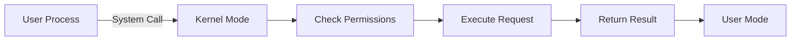
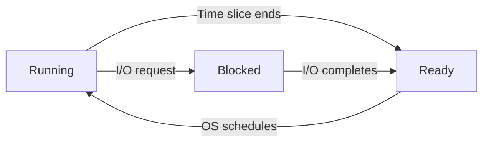

<!-- 
Combined Study Guide
Generated by LectureQ
Date: 2025-08-08 02:09:51
Week/Module: Week 1 Introduction
Files Combined: 5
Content Type: Mixed
-->

# Week 1 Introduction - Complete Study Guide

> **Auto-generated combined study guide**  
> Generated from 5 individual notes files  
> Date: August 08, 2025

## 📚 Table of Contents

1. [Operating Systems: Week 1 Introduction](#operating-systems-week-1-introduction)
2. [Week 1: CPU Mechanisms - Limited Direct Execution](#week-1-cpu-mechanisms---limited-direct-execution)
3. [Chapter 1: Introduction to Operating Systems](#chapter-1-introduction-to-operating-systems)
4. [Comprehensive Study Notes: The Abstraction - The Process](#comprehensive-study-notes-the-abstraction---the-process)
5. [Week 1: Operating Systems Fundamentals](#week-1-operating-systems-fundamentals)


---

# Operating Systems: Week 1 Introduction

<think>
I need to create comprehensive academic notes from the lecture slides and transcript about Operating Systems. I'll synthesize both sources to create well-structured markdown notes.

Let me analyze the content first:

The lecture covers:
- Introduction to Operating Systems
- Course information (prerequisites, learning outcomes, assessments)
- Motivation for studying OS
- Definitions and history of OS
- Virtualization concepts
- Processes and system calls
- Protection mechanisms
- Hardware abstraction

I'll organize the notes into logical sections based on the content. I'll use proper markdown formatting with clear hierarchical headers.

Let me structure the notes:

1. Title and overview
2. Course Information (prerequisites, learning outcomes, assessments)
3. Motivation for Operating Systems
4. Definitions and History
5. Virtualization Concepts
6. Processes
7. System Calls and Protection
8. Hardware Abstraction
9. Summary

Now I'll create the notes based on this structure, synthesizing both the slides and transcript.

I'll make sure to include:
- Key definitions
- Important concepts
- Examples from the lecture
- Diagrams described in the slides (using text descriptions)
- Important details from the transcript
- Clear organization with proper headers

Let me create the notes now.
</think>


**Date:** Week 1 Lecture  
**Course:** Operating Systems (COMP SCI 3200/7200)

### Overview
This lecture introduces the fundamental concepts of operating systems, covering course structure, motivation for studying OS, key definitions, virtualization, processes, and system calls. The lecture emphasizes that operating systems are not just memorization tasks but require understanding design decisions and trade-offs in system implementation.

---

### Course Information

#### Housekeeping & Team
- **Course Coordinator:** Bernard Evans (IW 5.44)
- **Workshop Supervisors:** Anubhav Gupta, Jyothis Joy, Nithin Dharanu, Arjun Sharma
- **Resources:**
  - MyUni (Echo360, Lecture Notes, Piazza)
  - Textbook: *Operating Systems: Three Easy Pieces* (highly recommended)

#### Prerequisites & Assumed Knowledge
| Category | Requirements |
|----------|--------------|
| **Prerequisites** | Algorithm Design & Data Structures OR Programming for IT Specialists OR Foundations of Computer Science B |
| **Assumed Knowledge** | Coding, stacks, queues, trees |
| **Additional Assumed Knowledge** | Computer Systems (logic gates, registers, program counters, memory, stack, assembly, compilation) <br> Systems Programming (processes, pipes, file descriptors, system calls, C-code) |

> **Note:** The textbook covers the missing systems programming concepts for Assignment 1.

#### Course Learning Outcomes
1. Explain the role of the operating system as a high-level interface to hardware
2. Use OS as a resource manager that supports multiprogramming
3. Explain low-level implementation of CPU dispatch
4. Explain low-level implementation of memory management
5. Explain performance trade-offs inherent in OS implementation

> **Key Insight:** Operating systems are not about memorizing terms but understanding design decisions. Every component represents a choice with trade-offs.

#### Assessment Structure
| Component | Weight | Details |
|-----------|--------|---------|
| Quizzes | 6% | 4 quizzes, best 3 count |
| Tutorials | 6% | Preparation (online, due before tutorial) + Participation (in-person) |
| Assignment 1 | 8% | System Calls (C-coding, processes, signals) |
| Assignment 2 | 15% | Scheduling (coding + report) |
| Assignment 3 | 15% | TBD |
| Exam | 50% | Likely a hurdle |

> **Key Advice:** 
> - Read the textbook (it's conversational and well-written)
> - Start early, work consistently
> - Practice theoretical/numerical questions
> - Have fun!

---

### Motivation: Why Study Operating Systems?

#### Core Reasons
- **Learning C:** OS development requires C programming
- **Understanding How Stuff Actually Happens:** 
  - Memory management
  - Processes
  - Registers
  - Concurrency
- **Beyond Surface-Level Knowledge:** 
  - Understanding the difference between Mac, Windows, and Linux at a fundamental level
  - Moving beyond "I use a computer" to "How does the computer actually work?"

> **Key Insight:** Operating systems are the layer that makes all other software possible. They abstract hardware complexity so developers don't need to understand every detail of the underlying hardware.

---

### Definitions & History

#### What is an Operating System?
- **Definition:** A program/process that controls other processes and simplifies computer operation
- **Core Functions:**
  - Interfaces software and hardware (abstraction)
  - Allocates resources
  - Manages processes and hardware
  - Allows multiprocessing
  - Handles CPU dispatch and memory management

#### Historical Context
- **Pre-OS Era:** Human operators manually managed computer programs
  - *Example:* Switchboard operators connecting phone calls
  - *Computer Operator:* Manually loading programs onto punch cards
  - *Problem:* CPU was idle while waiting for input/output (waste of money)

- **Evolution of OS:** 
  - Replaced human operators with software
  - Optimized CPU usage, memory usage, time, and security
  - *Example:* From single-program computers to multi-programming systems

> **Key Insight:** The primary motivation for OS was to maximize CPU utilization by eliminating idle time.

---

### Virtualization

#### Concept
> "To make a thing, like a thing, but not actually a thing, but seem like a thing."

#### Why Virtualization?
- **Problem:** Without abstraction, programs must directly interact with hardware
  - *Example:* Program must specify exact printer model (EPSON Stylus S22)
  - *Example:* Program must specify exact memory addresses

- **Solution:** OS provides abstraction layer
  - *Example:* Program simply says "use printer" without specifying model
  - *Example:* Program uses address space without knowing physical memory layout

#### Hardware Abstraction
| Hardware Components | Software Abstraction |
|---------------------|----------------------|
| Processor | Thread |
| Memory | Address Space |
| Disks/SSDs | Files |
| Networks | Sockets |
| Machines | Processes |

> **Key Insight:** The OS creates an illusion that each process has its own private universe with infinite resources.

#### Advantages of Abstraction
- Code reuse
- Unifies interface for many devices
- Allows higher-level functionality

#### Challenges of Abstraction
- What is the best abstraction?
- Functionality vs. Generality
- How much hardware control should be exposed?
- How much does hardware determine the abstraction?

---

### Processes

#### Definition
- **Process:** A thread of control (not a program)
- **Components:**
  - Registers
  - Program Counter
  - Stack Pointer
  - Visible address space
  - Open files
  - Open communication channels

#### Process vs. Thread
| Feature | Process | Thread |
|---------|---------|--------|
| Memory Space | Private | Shared |
| Program Counter | Separate | Shared |
| Stack | Separate | Shared |
| Registers | Separate | Shared |

> **Key Insight:** "Every process is running at least one (and usually one) thread."

#### Process Lifecycle
1. **Initiation:** Loader loads code into memory
   - Fixes pointers (program assumes address 0)
   - Sets up stack layout
   - Handles libraries
2. **Execution:** Process runs in its own address space
3. **Termination:** Process completes or is killed

---

### System Calls & Protection

#### Why Protection?
- **Problem:** Processes must be isolated from each other and the OS
  - *Example:* Process 1 shouldn't be able to destroy Process 2
  - *Example:* Process shouldn't be able to destroy the OS itself

#### Protection Mechanisms
- **Process Isolation:** Each process has its own address space
- **Kernel Mode:** OS has privileged access to hardware
- **User Mode:** Processes run with restricted access

#### System Call Flow


#### Modes of Execution
| Mode | Permissions | Hardware Access |
|------|-------------|-----------------|
| **User Mode** | Limited | No direct hardware access |
| **Kernel Mode** | Full | Direct hardware access |

> **Key Insight:** System calls are like asking a librarian for restricted information—they provide safe access to protected resources.

#### System Call Implementation
1. User process calls system call wrapper (e.g., `sys_read`)
2. System call wrapper marshals arguments
3. Hardware triggers trap (mode switch to kernel)
4. Kernel validates request
5. Kernel executes request
6. Kernel returns result to user process

#### Interrupts vs. Exceptions
| Type | Trigger | Nature | Example |
|------|---------|--------|---------|
| **Interrupt** | External event | Asynchronous | Timer, I/O device |
| **Exception** | Internal error | Synchronous | Segmentation fault, divide-by-zero |

---

### Hardware Abstraction (Revision)

#### Memory Layout for a Process
```
Memory
┌───────────────┐
│     Data      │ ← Global data
├───────────────┤
│     Code      │ ← Program instructions
├───────────────┤
│     Stack     │ ← Current execution state
└───────────────┘
```

#### Key Registers
| Register | Purpose | Example |
|----------|---------|---------|
| Program Counter (PC) | Current instruction | `fac(5)` → `fac(4)` |
| Stack Pointer (SP) | Current stack position | Tracks function calls |
| Accumulator | Temporary storage | Old machines had one |
| Status Register | Flags (overflow, interrupts) | Tracks process state |

#### x86 Architecture (32-bit vs 64-bit)
| Register | 32-bit | 64-bit |
|----------|--------|--------|
| Program Counter | EIP | RIP |
| Stack Pointer | ESP | RSP |
| Accumulator | EAX | RAX |
| Base Register | EBX | RBX |
| Counter Register | ECX | RCX |
| Destination Index | EDI | RDI |
| Stack Base Pointer | EBP | RBP |
| Source Index | ESI | RSI |
| Data Register | EDX | RDX |

> **Key Insight:** Different architectures have different register naming conventions, which is why software may need to be compiled for specific platforms.

---

### OS Dispatch & Scheduling

#### Key Questions
1. **When do I do this?** (Scheduling)
   - Use external timer to regain control periodically
   - Time slicing: Do a bit → Interrupt → Do a bit more → Interrupt

2. **How do I do this?** (Dispatching)
   - Save registers for current process
   - Load registers for next process
   - Switch to kernel stack
   - Return from trap

#### Process Control Block (PCB)
| Field | Description |
|-------|-------------|
| PID | Process ID |
| Process State | Running, Ready, Blocked |
| Execution State | Registers, PC, SP |
| Scheduling Priority | For scheduling algorithms |
| Accounting Info | Parent/child processes |
| Credentials | Access permissions |
| Open Files | File descriptors |

#### Process States
| State | Description |
|-------|-------------|
| **Running** | Currently executing on CPU |
| **Ready** | Waiting for CPU |
| **Blocked** | Waiting for I/O or other resource |

#### Queues
- **Runnable Processes Queue:** Processes ready to run
- **Waiting Queue (I/O):** Processes waiting for I/O operations

---

### Summary & Key Takeaways

#### Core Concepts
1. **Operating Systems** are the interface between hardware and software
2. **Virtualization** creates the illusion that each process has its own private universe
3. **Processes** are threads of control with their own address spaces
4. **System Calls** provide safe access to hardware through kernel mode
5. **Protection** is achieved through mode switching and process isolation

#### Design Philosophy
> "Every part of an Operating System is a design decision. There are choices."

#### Study Approach
- **Do not memorize:** Understand the "why" behind each design choice
- **Think like a designer:** "How would I build an OS?"
- **Read the textbook:** It's conversational and well-written
- **Start early:** This course has significant content

#### Final Thought
> "Operating systems is the subject which will peel apart the differences between Mac, Windows, and Linux at a fundamental level."

---

### Key Terms to Remember
- **Abstraction:** Hiding hardware complexity behind a simplified interface
- **Virtualization:** Creating the illusion of dedicated resources
- **Process:** An executing instance of a program with its own address space
- **System Call:** Request to the OS for a service (e.g., `read()`, `write()`)
- **Kernel Mode:** Privileged mode for OS operations
- **User Mode:** Restricted mode for application processes
- **Process Control Block (PCB):** Data structure containing process state information


---

# Week 1: CPU Mechanisms - Limited Direct Execution

<think>
I'll create comprehensive study notes for the textbook chapter "Week 1 Introduction: Textbook CPU Mechanisms" based on the provided slides. I'll follow the instructions to create well-structured, comprehensive study notes in markdown format.

Let me analyze the content first to understand the key concepts:

The chapter is about CPU virtualization mechanisms, specifically "Limited Direct Execution" (LDE), which is a technique for operating systems to virtualize the CPU while maintaining control.

Key topics covered:
1. The need for CPU virtualization (sharing physical CPU among many processes)
2. Challenges: performance and control
3. Basic technique: Limited Direct Execution
4. Problem #1: Restricted Operations (system calls, user mode vs kernel mode)
5. Problem #2: Switching Between Processes (cooperative vs non-cooperative approaches, timer interrupts, context switches)

I'll organize the notes following the chapter structure, highlighting key concepts, definitions, and processes.

Let me create the study notes:


### Learning Objectives
- Understand the fundamental challenge of CPU virtualization: sharing the physical CPU among multiple processes while maintaining control
- Learn the concept of "Limited Direct Execution" as a mechanism for CPU virtualization
- Understand the role of hardware support (user mode vs kernel mode) in enabling secure system calls
- Learn how operating systems regain control of the CPU through timer interrupts
- Understand the context switch mechanism for process switching

### Core Challenge of CPU Virtualization

**THE CRUX: HOW TO EFFICIENTLY VIRTUALIZE THE CPU WITH CONTROL**

Operating systems must:
- Virtualize the CPU in an efficient manner (minimize overhead)
- Retain control over the system (prevent processes from monopolizing CPU or accessing restricted resources)

This requires both hardware and operating system support.

### 6.1 Basic Technique: Limited Direct Execution

#### Concept
- **Direct Execution**: Run programs directly on the CPU (without virtualization)
- **Limited Direct Execution (LDE)**: Run programs directly but with restrictions to maintain OS control

#### Why Limited?
Without limitations, the OS would be "just a library" - unable to control processes, leading to security and stability issues.

#### Direct Execution Protocol (Without Limits)
1. Create entry for process in process list
2. Allocate memory for program
3. Load program into memory
4. Set up stack with argc/argv
5. Clear registers
6. Execute call to main()
7. Run main()
8. Execute return from main()
9. Free memory of process
10. Remove from process list

*Figure 6.1: Direct Execution Protocol (Without Limits)*

### 6.2 Problem #1: Restricted Operations

#### The Challenge
How can a process perform restricted operations (I/O, resource access) without giving it complete control over the system?

#### Solution: Hardware Modes of Execution

| Mode | Permissions | Description |
|------|-------------|-------------|
| **User Mode** | Restricted | Code running here cannot perform privileged operations (e.g., I/O requests) |
| **Kernel Mode** | Full Access | OS/kernel runs here; can perform all operations including privileged ones |

#### System Calls: The Mechanism for Restricted Operations

**How System Calls Work:**
1. User program calls a library function (e.g., `open()`, `read()`)
2. Library code prepares arguments and system call number
3. Library executes a **trap instruction** (special hardware instruction)
4. Hardware:
   - Saves registers
   - Switches to kernel mode
   - Jumps to trap handler (via trap table)
5. OS handles the system call
6. OS executes **return-from-trap instruction**
   - Restores registers
   - Switches back to user mode
   - Returns to instruction after trap

#### Key Insight: System Call Number
- User code places system call number in a register or stack location
- OS checks validity of number before executing corresponding code
- This provides a level of protection (user can't specify exact kernel address)

#### Important Details
- **Trap Table**: Set up by OS at boot time; tells hardware where to jump for different exceptions (system calls, interrupts)
- **Trap Instruction**: Must be executed in user mode to trigger a system call
- **Return-from-trap Instruction**: Must be executed in kernel mode to return to user mode

#### Security Consideration: User Input Handling
- OS must validate all user inputs to system calls
- Example: For `write()` system call, must check buffer address to prevent kernel memory access
- **Principle**: Treat all user inputs with suspicion - "a secure system must treat user inputs with great suspicion"

### 6.3 Problem #2: Switching Between Processes

#### The Challenge
How can the OS regain control of the CPU to switch between processes?

#### Cooperative Approach
- OS trusts processes to behave reasonably
- Processes give up CPU via:
  - System calls (e.g., `open()`, `read()`)
  - Illegal operations (e.g., divide by zero, invalid memory access)
  - Explicit `yield()` system call

**Limitation**: If a process enters an infinite loop without making system calls, OS cannot regain control (requires reboot)

#### Non-Cooperative Approach: Timer Interrupt
- **Key Insight**: A timer interrupt allows OS to regain control even if processes are non-cooperative
- **How it works**:
  1. At boot time, OS sets up timer interrupt handler in trap table
  2. OS starts the timer (privileged operation)
  3. Timer interrupts CPU every X milliseconds
  4. Hardware saves current state and jumps to interrupt handler
  5. OS regains control and can switch processes

*Figure 6.3: Limited Direct Execution Protocol (Timer Interrupt)*

#### Context Switch
- **Definition**: The low-level operation to switch from one process to another
- **How it works**:
  1. Hardware saves current process's registers (onto kernel stack)
  2. OS decides to switch processes (via scheduler)
  3. OS saves current process's context (registers, PC) into process structure
  4. OS restores next process's context (registers, PC) from its process structure
  5. OS switches to new process's kernel stack
  6. OS executes return-from-trap instruction

*Figure 6.4: The xv6 Context Switch Code*

#### Context Switch Steps (Detailed)
1. **Timer interrupt occurs**:
   - Hardware saves user registers onto kernel stack
   - Switches to kernel mode
   - Jumps to trap handler

2. **OS handles interrupt**:
   - Decides to switch from Process A to Process B
   - Calls `switch()` routine
   - Saves Process A's registers into its process structure
   - Restores Process B's registers from its process structure
   - Switches to Process B's kernel stack

3. **Return from trap**:
   - Hardware restores Process B's registers from kernel stack
   - Switches to user mode
   - Jumps to Process B's PC

#### Key Insight: Two Types of Register Saves/Restores
1. **Hardware implicit save** (during interrupt):
   - User registers saved onto kernel stack
   - Happens automatically when interrupt occurs

2. **Software explicit save** (during context switch):
   - Kernel registers saved into process structure
   - Done by OS code

### 6.4 Worried About Concurrency?

#### Challenge
What happens when:
- A timer interrupt occurs during a system call?
- Multiple interrupts occur simultaneously?

#### Solutions
1. **Disable interrupts during interrupt processing**:
   - Ensures only one interrupt is handled at a time
   - Risk: Disabling for too long could lead to lost interrupts

2. **Advanced locking schemes**:
   - Protect concurrent access to internal data structures
   - Enable multiple activities within kernel simultaneously
   - Particularly important on multiprocessors

### 6.5 Summary

#### Limited Direct Execution (LDE) Protocol
- **Core Idea**: Run programs directly on CPU but with restrictions to maintain OS control
- **Key Components**:
  1. Hardware modes (user mode vs kernel mode)
  2. System calls (via trap instruction)
  3. Timer interrupt (for non-cooperative scheduling)
  4. Context switches (for process switching)

#### Analogy: Baby Proofing
- Just as you "baby proof" a room by restricting dangerous elements, the OS "baby proofs" the CPU by:
  1. Setting up trap handlers at boot time
  2. Starting an interrupt timer
  3. Running processes in restricted mode

#### Performance Considerations
- **System call cost**: ~4 microseconds (1996), ~0.1-0.5 microseconds (modern systems)
- **Context switch cost**: ~6 microseconds (1996), ~0.1-0.5 microseconds (modern systems)
- **Note**: OS operations are often memory-intensive, so memory bandwidth improvements don't track CPU speed as closely

### Key Terms and Definitions

| Term | Definition |
|------|------------|
| **Limited Direct Execution (LDE)** | A CPU virtualization technique where programs run directly on the CPU but with restrictions to maintain OS control |
| **User Mode** | Hardware execution mode where processes cannot perform privileged operations |
| **Kernel Mode** | Hardware execution mode where OS/kernel has full access to hardware resources |
| **System Call** | A mechanism for user processes to request OS services (via trap instruction) |
| **Trap Instruction** | Hardware instruction that switches to kernel mode and jumps to trap handler |
| **Return-from-trap Instruction** | Hardware instruction that switches back to user mode and returns to user code |
| **Trap Table** | Data structure set up by OS at boot time that tells hardware where to jump for different exceptions |
| **Timer Interrupt** | Hardware mechanism that periodically interrupts CPU to allow OS to regain control |
| **Context Switch** | Low-level operation to switch from one process to another by saving/restoring register state |

### Important Figures and Diagrams

*Figure 6.1: Direct Execution Protocol (Without Limits)*
- Shows the basic sequence of running a program without restrictions

*Figure 6.2: Limited Direct Execution Protocol*
- Shows the full sequence including system calls and context switches

*Figure 6.3: Limited Direct Execution Protocol (Timer Interrupt)*
- Shows the timeline of a timer interrupt triggering a context switch

*Figure 6.4: The xv6 Context Switch Code*
- Shows the assembly code for a context switch in the xv6 operating system

### Summary Box: How Limited Direct Execution Works

**The LDE Protocol in a Nutshell:**

1. **At Boot Time**:
   - OS sets up trap table (specifies addresses for system calls, timer interrupts)
   - OS starts timer interrupt

2. **When Running a Process**:
   - OS allocates memory, sets up process structure
   - OS executes `return-from-trap` to start process (switches to user mode)
   - Process runs until:
     - Makes system call (traps to OS)
     - Timer interrupt occurs (traps to OS)

3. **When OS Regains Control**:
   - Handles system call or timer interrupt
   - Decides whether to switch processes
   - If switching:
     - Saves current process context
     - Restores next process context
     - Executes `return-from-trap` to resume next process

### Review Questions (from Chapter)

1. How does the OS regain control of the CPU when a process is running?
2. What is the difference between user mode and kernel mode?
3. How do system calls work at the hardware level?
4. What is the purpose of the trap table?
5. How does a timer interrupt help with process scheduling?
6. What is a context switch, and how does it work?

### Performance Notes

- **System Call Cost**: 
  - 1996 (Linux 1.3.37, 200 MHz P6): ~4 microseconds
  - Modern systems (2-3 GHz processors): ~0.1-0.5 microseconds

- **Context Switch Cost**:
  - 1996 (Linux 1.3.37, 200 MHz P6): ~6 microseconds
  - Modern systems (2-3 GHz processors): ~0.1-0.5 microseconds

- **Important Note**: OS operations are often memory-intensive, so memory bandwidth improvements don't track CPU speed as closely as might be expected.

### Key Insights

> **"The OS must virtualize the CPU in an efficient manner while retaining control over the system. To do so, both hardware and operating-system support will be required."**

> **"A secure system must treat user inputs with great suspicion. Not doing so will undoubtedly lead to easily hacked software..."**

> **"The addition of a timer interrupt gives the OS the ability to run again on a CPU even if processes act in a non-cooperative fashion. Thus, this hardware feature is essential in helping the OS maintain control of the machine."**

> **"Reboot is useful because it moves software back to a known and likely more tested state. Reboots also reclaim stale or leaked resources which may otherwise be hard to handle."**

### References (Key Papers)

- **[K+61]**: Atlas system pioneered many modern concepts
- **[M+63]**: Early paper about time-sharing using timer interrupts
- **[S07]**: "Return-into-libc" attack technique showing security implications
- **[MS96]**: lmbench benchmark for measuring system call and context switch costs
- **[C+04]**: "Microreboot" technique for system recovery

### Homework: Measurement

**Task**: Measure the cost of a system call and context switch.

**System Call Measurement**:
- Repeatedly call a simple system call (e.g., 0-byte read)
- Time the operation and divide by number of iterations
- Account for timer precision (measure back-to-back calls to `gettimeofday()`)

**Context Switch Measurement**:
- Use two processes communicating via pipes
- One process writes to a pipe, waits for read
- OS switches to other process, which reads from first pipe and writes to second
- Measure communication cost to estimate context switch cost
- Ensure both processes run on the same CPU (use `sched_setaffinity()` on Linux)

**Note**: On multi-CPU systems, ensure both processes are bound to the same processor to measure pure context switch cost.
</think>

# Week 1: CPU Mechanisms - Limited Direct Execution

### Learning Objectives
- Understand the fundamental challenge of CPU virtualization: sharing the physical CPU among multiple processes while maintaining control
- Learn the concept of **Limited Direct Execution** as a mechanism for CPU virtualization
- Understand the role of hardware support (user mode vs kernel mode) in enabling secure system calls
- Learn how operating systems regain control of the CPU through timer interrupts
- Understand the context switch mechanism for process switching

---

### Core Challenge of CPU Virtualization

> **THE CRUX: HOW TO EFFICIENTLY VIRTUALIZE THE CPU WITH CONTROL**

Operating systems must:
- **Virtualize the CPU** in an efficient manner (minimize overhead)
- **Retain control** over the system (prevent processes from monopolizing CPU or accessing restricted resources)

This requires **both hardware and operating system support**. The OS will often use a judicious bit of hardware support to accomplish its work effectively.

---

### 6.1 Basic Technique: Limited Direct Execution

#### Concept
- **Direct Execution**: Run programs directly on the CPU (without virtualization)
- **Limited Direct Execution (LDE)**: Run programs directly but with restrictions to maintain OS control

#### Why Limited?
Without limitations, the OS would be "just a library" - unable to control processes, leading to security and stability issues.

#### Direct Execution Protocol (Without Limits)
1. Create entry for process in process list
2. Allocate memory for program
3. Load program into memory
4. Set up stack with argc/argv
5. Clear registers
6. Execute call to main()
7. Run main()
8. Execute return from main()
9. Free memory of process
10. Remove from process list

*Figure 6.1: Direct Execution Protocol (Without Limits)*

---

### 6.2 Problem #1: Restricted Operations

#### The Challenge
How can a process perform restricted operations (I/O, resource access) without giving it complete control over the system?

> **THE CRUX: HOW TO PERFORM RESTRICTED OPERATIONS**

A process must be able to perform I/O and other restricted operations, but without giving the process complete control over the system.

---

#### Hardware Modes of Execution

| Mode | Permissions | Description |
|------|-------------|-------------|
| **User Mode** | Restricted | Code running here cannot perform privileged operations (e.g., I/O requests) |
| **Kernel Mode** | Full Access | OS/kernel runs here; can perform all operations including privileged ones |

---

#### System Calls: The Mechanism for Restricted Operations

**How System Calls Work:**
1. User program calls a library function (e.g., `open()`, `read()`)
2. Library code prepares arguments and system call number
3. Library executes a **trap instruction** (special hardware instruction)
4. Hardware:
   - Saves registers
   - Switches to kernel mode
   - Jumps to trap handler (via trap table)
5. OS handles the system call
6. OS executes **return-from-trap instruction**
   - Restores registers
   - Switches back to user mode
   - Returns to instruction after trap

---

#### Key Insight: System Call Number
- User code places system call number in a register or stack location
- OS checks validity of number before executing corresponding code
- This provides a level of protection (user can't specify exact kernel address)

---

#### Important Details
- **Trap Table**: Set up by OS at boot time; tells hardware where to jump for different exceptions (system calls, interrupts)
- **Trap Instruction**: Must be executed in user mode to trigger a system call
- **Return-from-trap Instruction**: Must be executed in kernel mode to return to user mode

> **"The hardware needs to be a bit careful when executing a trap, in that it must make sure to save enough of the caller's registers in order to be able to return correctly when the OS issues the return-from-trap instruction."**

---

#### Security Consideration: User Input Handling
- OS must validate all user inputs to system calls
- Example: For `write()` system call, must check buffer address to prevent kernel memory access
- **Principle**: Treat all user inputs with suspicion - "a secure system must treat user inputs with great suspicion"

> **"Not doing so will undoubtedly lead to easily hacked software, a despairing sense that the world is an unsafe and scary place, and the loss of job security for the all-too-trusting OS developer."**

---

### 6.3 Problem #2: Switching Between Processes

#### The Challenge
How can the OS regain control of the CPU to switch between processes?

> **THE CRUX: HOW TO REGAIN CONTROL OF THE CPU**

---

#### Cooperative Approach
- OS trusts processes to behave reasonably
- Processes give up CPU via:
  - System calls (e.g., `open()`, `read()`)
  - Illegal operations (e.g., divide by zero, invalid memory access)
  - Explicit `yield()` system call

**Limitation**: If a process enters an infinite loop without making system calls, OS cannot regain control (requires reboot)

---

#### Non-Cooperative Approach: Timer Interrupt
> **"The addition of a timer interrupt gives the OS the ability to run again on a CPU even if processes act in a non-cooperative fashion. Thus, this hardware feature is essential in helping the OS maintain control of the machine."**

**How it works**:
1. At boot time, OS sets up timer interrupt handler in trap table
2. OS starts the timer (privileged operation)
3. Timer interrupts CPU every X milliseconds
4. Hardware saves current state and jumps to interrupt handler
5. OS regains control and can switch processes

*Figure 6.3: Limited Direct Execution Protocol (Timer Interrupt)*

---

#### Context Switch
> **"A context switch is conceptually simple: all the OS has to do is save a few register values for the currently-executing process and restore a few for the soon-to-be-executing process."**

**How it works**:
1. Hardware saves current process's registers (onto kernel stack) when interrupt occurs
2. OS decides to switch processes (via scheduler)
3. OS saves current process's context (registers, PC) into process structure
4. OS restores next process's context (registers, PC) from its process structure
5. OS switches to new process's kernel stack
6. OS executes return-from-trap instruction

*Figure 6.4: The xv6 Context Switch Code*

---

#### Context Switch Steps (Detailed)

1. **Timer interrupt occurs**:
   - Hardware saves user registers onto kernel stack
   - Switches to kernel mode
   - Jumps to trap handler

2. **OS handles interrupt**:
   - Decides to switch from Process A to Process B
   - Calls `switch()` routine
   - Saves Process A's registers into its process structure
   - Restores Process B's registers from its process structure
   - Switches to Process B's kernel stack

3. **Return from trap**:
   - Hardware restores Process B's registers from kernel stack
   - Switches to user mode
   - Jumps to Process B's PC

---

#### Two Types of Register Saves/Restores
1. **Hardware implicit save** (during interrupt):
   - User registers saved onto kernel stack
   - Happens automatically when interrupt occurs

2. **Software explicit save** (during context switch):
   - Kernel registers saved into process structure
   - Done by OS code

> **"The latter action moves the system from running as if it just trapped into the kernel from A to as if it just trapped into the kernel from B."**

---

### 6.4 Worried About Concurrency?

#### Challenge
What happens when:
- A timer interrupt occurs during a system call?
- Multiple interrupts occur simultaneously?

#### Solutions
1. **Disable interrupts during interrupt processing**:
   - Ensures only one interrupt is handled at a time
   - Risk: Disabling for too long could lead to lost interrupts

2. **Advanced locking schemes**:
   - Protect concurrent access to internal data structures
   - Enable multiple activities within kernel simultaneously
   - Particularly important on multiprocessors

> **"Operating systems also have developed a number of sophisticated locking schemes to protect concurrent access to internal data structures."**

---

### 6.5 Summary

#### Limited Direct Execution (LDE) Protocol
- **Core Idea**: Run programs directly on CPU but with restrictions to maintain OS control
- **Key Components**:
  1. Hardware modes (user mode vs kernel mode)
  2. System calls (via trap instruction)
  3. Timer interrupt (for non-cooperative scheduling)
  4. Context switches (for process switching)

---

#### Analogy: Baby Proofing
> **"In an analogous manner, the OS 'baby proofs' the CPU, by first (during boot time) setting up the trap handlers and starting an interrupt timer, and then by only running processes in a restricted mode."**

---

#### Performance Considerations
| Operation | 1996 (Linux 1.3.37, 200 MHz P6) | Modern Systems (2-3 GHz) |
|-----------|----------------------------------|--------------------------|
| **System Call** | ~4 microseconds | ~0.1-0.5 microseconds |
| **Context Switch** | ~6 microseconds | ~0.1-0.5 microseconds |

> **"Not all operating-system actions track CPU performance. As Ousterhout observed, many OS operations are memory intensive, and memory bandwidth has not improved as dramatically as processor speed over time."**

---

### Key Terms and Definitions

| Term | Definition |
|------|------------|
| **Limited Direct Execution (LDE)** | A CPU virtualization technique where programs run directly on the CPU but with restrictions to maintain OS control |
| **User Mode** | Hardware execution mode where processes cannot perform privileged operations |
| **Kernel Mode** | Hardware execution mode where OS/kernel has full access to hardware resources |
| **System Call** | A mechanism for user processes to request OS services (via trap instruction) |
| **Trap Instruction** | Hardware instruction that switches to kernel mode and jumps to trap handler |
| **Return-from-trap Instruction** | Hardware instruction that switches back to user mode and returns to user code |
| **Trap Table** | Data structure set up by OS at boot time that tells hardware where to jump for different exceptions |
| **Timer Interrupt** | Hardware mechanism that periodically interrupts CPU to allow OS to regain control |
| **Context Switch** | Low-level operation to switch from one process to another by saving/restoring register state |

---

### Summary Box: How Limited Direct Execution Works

**The LDE Protocol in a Nutshell:**

1. **At Boot Time**:
   - OS sets up trap table (specifies addresses for system calls, timer interrupts)
   - OS starts timer interrupt

2. **When Running a Process**:
   - OS allocates memory, sets up process structure
   - OS executes `return-from-trap` to start process (switches to user mode)
   - Process runs until:
     - Makes system call (traps to OS)
     - Timer interrupt occurs (traps to OS)

3. **When OS Regains Control**:
   - Handles system call or timer interrupt
   - Decides whether to switch processes
   - If switching:
     - Saves current process context
     - Restores next process context
     - Executes `return-from-trap` to resume next process

---

### Review Questions

1. How does the OS regain control of the CPU when a process is running?
2. What is the difference between user mode and kernel mode?
3. How do system calls work at the hardware level?
4. What is the purpose of the trap table?
5. How does a timer interrupt help with process scheduling?
6. What is a context switch, and how does it work?

---

### Key Insights

> **"The OS must virtualize the CPU in an efficient manner while retaining control over the system. To do so, both hardware and operating-system support will be required."**

> **"A secure system must treat user inputs with great suspicion. Not doing so will undoubtedly lead to easily hacked software..."**

> **"Reboot is useful because it moves software back to a known and likely more tested state. Reboots also reclaim stale or leaked resources which may otherwise be hard to handle."**

> **"The only solution to infinite loops (and similar behaviors) under cooperative preemption is to reboot the machine. While you may scoff at this hack, researchers have shown that reboot (or in general, starting over some piece of software) can be a hugely useful tool in building robust systems."**

---

### References (Key Papers)

- **[K+61]**: "One-Level Storage System" by T. Kilburn et al. - Atlas pioneered many modern concepts
- **[M+63]**: "A Time-Sharing Debugging System for a Small Computer" - Early paper about time-sharing using timer interrupts
- **[S07]**: "The Geometry of Innocent Flesh on the Bone" - Shows security implications of arbitrary code execution
- **[MS96]**: "lmbench: Portable tools for performance analysis" - Benchmark for measuring system call and context switch costs
- **[C+04]**: "Microreboot — A Technique for Cheap Recovery" - Shows how reboot can improve system robustness

---

### Homework: Measurement

**Task**: Measure the cost of a system call and context switch.

**System Call Measurement**:
- Repeatedly call a simple system call (e.g., 0-byte read)
- Time the operation and divide by number of iterations
- Account for timer precision (measure back-to-back calls to `gettimeofday()`)

**Context Switch Measurement**:
- Use two processes communicating via pipes
- One process writes to a pipe, waits for read
- OS switches to other process, which reads from first pipe and writes to second
- Measure communication cost to estimate context switch cost
- Ensure both processes run on the same CPU (use `sched_setaffinity()` on Linux)

> **"On multi-CPU systems, ensure both processes are bound to the same processor to measure pure context switch cost."**


---

# Chapter 1: Introduction to Operating Systems

<think>
I need to create comprehensive study notes from the provided textbook chapter on "Introduction to Operating Systems." I'll follow the instructions carefully to create well-structured markdown notes that would be perfect for exam preparation.

Let me analyze the chapter content first:

The chapter is an introduction to operating systems, covering:
1. Basic concepts of what an OS does
2. The concept of virtualization
3. Virtualizing the CPU
4. Virtualizing memory
5. Concurrency
6. Persistence
7. Design goals of operating systems
8. History of operating systems

I'll organize my notes following the chapter structure, with clear hierarchical headers, key concepts highlighted, and important examples included.

Let me start creating the notes:


### Learning Objectives
- Understand the fundamental role of an operating system
- Learn about virtualization as a core concept in OS design
- Understand the main themes of operating systems: virtualization, concurrency, and persistence
- Recognize the historical development of operating systems
- Identify key design goals of modern operating systems

### Key Concepts and Definitions

#### Operating System (OS)
- The body of software responsible for making it easy to run programs, allowing programs to share memory, enabling programs to interact with devices, and other related functions.
- Sometimes called a **virtual machine** because it takes physical resources and transforms them into a more general, powerful, and easy-to-use virtual form.
- Also known as a **resource manager** because it manages system resources (CPU, memory, disk).

#### Virtualization
- The technique where the OS takes a physical resource (such as the processor, memory, or a disk) and transforms it into a more general, powerful, and easy-to-use virtual form.
- The primary way the OS makes the system easy to use.

#### System Calls
- Interfaces (APIs) provided by the OS that applications can call to run programs, access memory and devices, etc.
- A typical OS exports a few hundred system calls available to applications.

#### Concurrency
- The conceptual term referring to problems that arise when working on many things at once (i.e., concurrently) in the same program.
- Problems of concurrency arose first within the operating system itself.

#### Persistence
- The ability to store data reliably and efficiently on non-volatile storage (like disks) so that data is not lost when power is turned off or the system crashes.

#### Abstraction
- Fundamental to everything in computer science; makes it possible to write large programs by dividing them into small and understandable pieces.
- Allows writing in high-level languages without thinking about assembly, etc.

#### Protection
- The principle that ensures applications cannot harm each other or the OS itself.
- Underlies much of what an OS must do.

#### Isolation
- The key to protection; isolating processes from one another.

### Core Themes of Operating Systems

#### 1. Virtualizing the CPU
- **The Crux of the Problem**: How to virtualize resources (specifically, how to make a single CPU appear as many virtual CPUs).
- **How it works**: The OS, with hardware help, creates the illusion that the system has a very large number of virtual CPUs.
- **Example**: Running multiple instances of a program (e.g., `./cpu A & ./cpu B &`) on a single processor, making it seem like they're running simultaneously.

#### 2. Virtualizing Memory
- **The Crux of the Problem**: How to provide each process with its own private memory space.
- **How it works**: Each process accesses its own private virtual address space, which the OS maps onto physical memory.
- **Example**: Running multiple instances of `mem.c` (Figure 2.3), where each process has memory at the same virtual address (0x200000) but they don't interfere with each other.

#### 3. Concurrency
- **The Crux of the Problem**: How to build correct concurrent programs when multiple threads are executing within the same memory space.
- **Example**: The multi-threaded program in Figure 2.5 (`threads.c`) where two threads increment a shared counter. When run with high values of `loops`, the final value is often not what's expected (e.g., 143,012 instead of 200,000) due to concurrency issues.

#### 4. Persistence
- **The Crux of the Problem**: How to store data persistently (reliably and efficiently on disk).
- **How it works**: The OS manages disk storage through a file system, which handles requests to read/write data to disk.
- **Example**: The program in Figure 2.6 (`io.c`) that creates a file with "hello world" using system calls (`open()`, `write()`, `close()`).

### Key Examples and Case Studies

#### Example 1: CPU Virtualization (Figure 2.1 & 2.2)
```c
#include <stdio.h>
#include <stdlib.h>
#include <sys/time.h>
#include <assert.h>
#include "common.h"

int main(int argc, char *argv[])
{
    if (argc != 2) {
        fprintf(stderr, "usage: cpu <string>\n");
        exit(1);
    }
    char*str = argv[1];
    while (1) {
        Spin(1);
        printf("%s\n", str);
    }
    return 0;
}
```

**Output when running multiple instances**:
```
prompt> ./cpu A & ./cpu B & ./cpu C & ./cpu D &
[1] 7353
[2] 7354
[3] 7355
[4] 7356
A
B
D
C
A
B
D
C
A
...
```

**Key Insight**: Even with a single CPU, the OS creates the illusion that multiple programs are running simultaneously through context switching.

#### Example 2: Memory Virtualization (Figure 2.3 & 2.4)
```c
#include <unistd.h>
#include <stdio.h>
#include <stdlib.h>
#include "common.h"

int main(int argc, char *argv[])
{
    int*p = malloc(sizeof(int)); // a1
    assert(p != NULL);
    printf("(%d) address pointed to by p: %p\n", getpid(), p); // a2
    *p = 0; // a3
    while (1) {
        Spin(1);
        *p = *p + 1;
        printf("(%d) p: %d\n", getpid(), *p); // a4
    }
    return 0;
}
```

**Output when running multiple instances**:
```
prompt> ./mem & ./mem &
[1] 24113
[2] 24114
(24113) address pointed to by p: 0x200000
(24114) address pointed to by p: 0x200000
(24113) p: 1
(24114) p: 1
(24114) p: 2
(24113) p: 2
...
```

**Key Insight**: Each process has its own private memory space, even though they're using the same virtual address (0x200000). This is achieved through memory virtualization.

#### Example 3: Concurrency Issues (Figure 2.5)
```c
#include <stdio.h>
#include <stdlib.h>
#include "common.h"
#include "common_threads.h"

volatile int counter = 0;
int loops;

void*worker(void *arg) {
    int i;
    for (i = 0; i < loops; i++) {
        counter++;
    }
    return NULL;
}

int main(int argc, char *argv[]) {
    if (argc != 2) {
        fprintf(stderr, "usage: threads <value>\n");
        exit(1);
    }
    loops = atoi(argv[1]);
    pthread_t p1, p2;
    printf("Initial value : %d\n", counter);
    
    Pthread_create(&p1, NULL, worker, NULL);
    Pthread_create(&p2, NULL, worker, NULL);
    Pthread_join(p1, NULL);
    Pthread_join(p2, NULL);
    printf("Final value : %d\n", counter);
    return 0;
}
```

**Expected vs. Actual Output**:
- Expected: `Final value : 2000` (for `loops=1000`)
- Actual: `Final value : 143012` (for `loops=100000`)

**Key Insight**: The increment operation (`counter++`) is not atomic; it involves three instructions (load, increment, store). When multiple threads execute these instructions concurrently, they can interfere with each other, leading to unexpected results.

#### Example 4: File System Persistence (Figure 2.6)
```c
#include <stdio.h>
#include <unistd.h>
#include <assert.h>
#include <fcntl.h>
#include <sys/types.h>

int main(int argc, char *argv[]) {
    int fd = open("/tmp/file",
                  O_WRONLY|O_CREAT|O_TRUNC,
                  S_IRWXU);
    assert(fd > -1);
    int rc = write(fd, "hello world\n", 13);
    assert(rc == 13);
    close(fd);
    return 0;
}
```

**Key Insight**: The OS handles the complexity of writing to disk through system calls (`open()`, `write()`, `close()`), which are routed to the file system. The file system manages disk storage, handles data structures, and ensures reliability through techniques like journaling or copy-on-write.

### Design Goals of Operating Systems

#### 1. Abstraction
- **Goal**: Make the system convenient and easy to use.
- **Why it matters**: Abstraction allows developers to work at higher levels of complexity without worrying about low-level details.
- **Examples**: 
  - Writing in C instead of assembly
  - Writing in assembly without thinking about logic gates
  - Building a processor out of gates without thinking about transistors

#### 2. High Performance
- **Goal**: Minimize the overheads of the OS.
- **Overheads to minimize**: 
  - Extra time (more instructions)
  - Extra space (in memory or on disk)
- **Trade-off**: Virtualization and ease of use are worth it, but not at excessive cost.

#### 3. Protection
- **Goal**: Provide protection between applications, as well as between the OS and applications.
- **Key Principle**: Isolation - isolating processes from one another.
- **Why it matters**: Prevents malicious or accidental bad behavior of one program from harming others or the OS itself.

#### 4. Reliability
- **Goal**: Ensure the OS runs non-stop; when it fails, all applications fail.
- **Challenge**: As OSes grow more complex (millions of lines of code), building a reliable OS becomes increasingly difficult.

#### 5. Other Goals
- **Energy-efficiency**: Important in our increasingly green world.
- **Security**: Protection against malicious applications (an extension of protection).
- **Mobility**: Important as OSes run on smaller and smaller devices.

### Historical Development of Operating Systems

#### Early Operating Systems: Just Libraries
- **Characteristics**: 
  - Basic set of libraries of commonly-used functions.
  - No real OS; just a collection of functions.
  - One program ran at a time, controlled by a human operator.
- **Mode of Computing**: Batch processing (jobs set up and run in a batch by an operator).
- **Reason for batch processing**: Cost - computers were too expensive to use interactively.

#### Beyond Libraries: Protection
- **Key Development**: System calls (pioneered by the Atlas computing system).
- **Key Difference**: System call vs. procedure call.
  - **System call**: Transfers control into the OS while raising hardware privilege level.
  - **Procedure call**: Just a function call without privilege level change.
- **Hardware Support**: Special instructions to switch between user mode (restricted) and kernel mode (full access).

#### The Era of Multiprogramming
- **Key Driver**: Minicomputers (e.g., PDP family) made computers more affordable.
- **Key Concept**: Multiprogramming - loading multiple jobs into memory and switching rapidly between them.
- **Why it mattered**: Improved CPU utilization by overlapping I/O and computation.
- **Key System**: UNIX (developed by Ken Thompson and Dennis Ritchie at Bell Labs).
  - Borrowed ideas from Multics, TENEX, and Berkeley Time-Sharing System.
  - Made systems simpler and easier to use.
  - Popularized through free distribution of source code.

#### The Modern Era: Personal Computers
- **Key Driver**: PCs (Apple II, IBM PC) became dominant.
- **Initial Problem**: Early PC OSes (like DOS, early Mac OS) lacked important features (memory protection, cooperative scheduling).
- **Evolution**: 
  - Mac OS X/macOS has UNIX at its core.
  - Windows adopted many UNIX features (starting with Windows NT).
  - Modern smartphones run Linux-based OSes (like Android).

#### The Importance of UNIX
- **Key Principles**: 
  - Building small powerful programs that can be connected together.
  - Shell with pipes for meta-level programming.
  - Compiler for C programming language.
- **Impact**: 
  - UNIX's simplicity and power made it enormously popular.
  - Early open-source distribution (free copies to anyone who asked).
  - Berkeley's BSD distribution added advanced features (virtual memory, file system, networking).
  - Linux (created by Linus Torvalds) became the dominant OS for servers, cloud, and mobile.

### Summary of Key Concepts

#### Virtualization
- **Core Concept**: Transforming physical resources into virtual, more powerful, and easier-to-use forms.
- **Why it matters**: Makes the system easy to use.
- **Examples**: 
  - CPU virtualization: Multiple programs running seemingly simultaneously on a single CPU.
  - Memory virtualization: Each process has its own private memory space.

#### Concurrency
- **Core Concept**: Problems that arise when multiple threads or processes execute concurrently.
- **Why it matters**: Concurrency issues can lead to unexpected results (like the counter example).
- **Key Insight**: The OS must provide mechanisms to handle concurrency correctly.

#### Persistence
- **Core Concept**: Storing data reliably on non-volatile storage.
- **Why it matters**: Data in memory is volatile; without persistence, data is lost on power loss or crash.
- **Key Component**: File system (manages disk storage).

#### Design Goals
- **Abstraction**: Make the system easy to use.
- **Performance**: Minimize OS overhead.
- **Protection**: Isolate processes from each other.
- **Reliability**: Ensure the OS runs non-stop.

### Historical Timeline

| Era | Key Systems | Key Features | Impact |
|-----|-------------|--------------|--------|
| Early (1950s-1960s) | Batch processing systems | Just libraries of functions; one program at a time | Limited usability; expensive to use interactively |
| 1960s | Atlas (pioneered system calls) | System calls; user mode/kernel mode | Enabled protection and better OS structure |
| 1960s-1970s | Multics, TENEX, Berkeley Time-Sharing | Time-sharing; advanced features | Influenced UNIX development |
| 1970s | UNIX (Bell Labs) | Simple, powerful; small programs connected via pipes | Revolutionized OS design; became the foundation for modern OSes |
| 1980s | DOS, early Mac OS | No memory protection; cooperative scheduling | Limited security and reliability; led to crashes |
| 1990s-Present | Linux, Mac OS X, Windows NT | Memory protection; preemptive scheduling; UNIX-like features | Modern OSes with robust security, reliability, and performance |

### Review Questions (from Chapter)

The chapter doesn't explicitly list review questions, but based on the content, here are some potential review questions:

1. What is the primary role of an operating system?
2. Explain the concept of virtualization in operating systems. Provide examples of virtualizing the CPU and memory.
3. Why does the counter example in the multi-threaded program (Figure 2.5) produce unexpected results?
4. Describe the key differences between a system call and a procedure call.
5. What are the main design goals of modern operating systems?
6. How did the development of UNIX influence modern operating systems?
7. Why was the transition from mainframes to minicomputers important for operating system development?
8. What is the significance of the "crux of the problem" concept in operating systems?

### Key Takeaways

- **Operating systems are the software that makes it easy to run programs, manage resources, and interact with hardware.**
- **Virtualization is the core technique used by OSes to transform physical resources into more powerful, easy-to-use virtual forms.**
- **The main themes of operating systems are virtualization (CPU and memory), concurrency, and persistence.**
- **Key design goals include abstraction, high performance, protection, and reliability.**
- **Operating systems have evolved from simple libraries to complex systems with sophisticated features, influenced heavily by UNIX.**
- **Understanding the historical development of operating systems helps explain why modern systems are designed the way they are.**

Now I'll format this into comprehensive markdown study notes following all the instructions.
</think>

# Chapter 1: Introduction to Operating Systems

### Learning Objectives
- Understand the fundamental role of an operating system
- Learn about virtualization as a core concept in OS design
- Recognize the main themes of operating systems: virtualization, concurrency, and persistence
- Identify key design goals of modern operating systems
- Understand the historical development of operating systems

---

### Core Concepts and Definitions

#### Operating System (OS)
- The body of software responsible for making it easy to run programs, allowing programs to share memory, enabling programs to interact with devices, and other related functions.
- Sometimes called a **virtual machine** because it takes physical resources and transforms them into a more general, powerful, and easy-to-use virtual form.
- Also known as a **resource manager** because it manages system resources (CPU, memory, disk).

#### Virtualization
- The technique where the OS takes a physical resource (such as the processor, memory, or a disk) and transforms it into a more general, powerful, and easy-to-use virtual form.
- **The Crux of the Problem**: How to virtualize resources (specifically, how to make a single CPU appear as many virtual CPUs).

#### System Calls
- Interfaces (APIs) provided by the OS that applications can call to run programs, access memory and devices, etc.
- A typical OS exports a few hundred system calls available to applications.
- **Key Insight**: System calls are the primary way users interact with operating systems.

#### Concurrency
- The conceptual term referring to problems that arise when working on many things at once (i.e., concurrently) in the same program.
- **The Crux of the Problem**: How to build correct concurrent programs when multiple threads are executing within the same memory space.

#### Persistence
- The ability to store data reliably and efficiently on non-volatile storage (like disks) so that data is not lost when power is turned off or the system crashes.
- **The Crux of the Problem**: How to store data persistently (reliably and efficiently on disk).

#### Abstraction
- Fundamental to everything in computer science; makes it possible to write large programs by dividing them into small and understandable pieces.
- **Examples**:
  - Writing in C instead of assembly
  - Writing in assembly without thinking about logic gates
  - Building a processor out of gates without thinking about transistors

#### Protection
- The principle that ensures applications cannot harm each other or the OS itself.
- **Key Principle**: **Isolation** - isolating processes from one another.

---

### The Core Themes of Operating Systems

#### 1. Virtualizing the CPU
- **The Crux of the Problem**: How to make a single CPU appear as many virtual CPUs.
- **How it works**: The OS, with hardware help, creates the illusion that the system has a very large number of virtual CPUs.
- **Key Mechanism**: Context switching - the OS rapidly switches between processes to give the appearance of simultaneous execution.

**Example**: Running multiple instances of a program on a single CPU
```bash
prompt> ./cpu A & ./cpu B & ./cpu C & ./cpu D &
[1] 7353
[2] 7354
[3] 7355
[4] 7356
A
B
D
C
A
B
D
C
...
```

**Key Insight**: Even with a single CPU, the OS creates the illusion that multiple programs are running simultaneously through context switching.

---

#### 2. Virtualizing Memory
- **The Crux of the Problem**: How to provide each process with its own private memory space.
- **How it works**: Each process accesses its own private virtual address space, which the OS maps onto physical memory.
- **Key Mechanism**: Memory mapping - the OS translates virtual addresses used by programs to physical addresses in memory.

**Example**: Running multiple instances of a memory program
```bash
prompt> ./mem & ./mem &
[1] 24113
[2] 24114
(24113) address pointed to by p: 0x200000
(24114) address pointed to by p: 0x200000
(24113) p: 1
(24114) p: 1
(24114) p: 2
(24113) p: 2
...
```

**Key Insight**: Each process has its own private memory space, even though they're using the same virtual address (0x200000). This is achieved through memory virtualization.

---

#### 3. Concurrency
- **The Crux of the Problem**: How to build correct concurrent programs when multiple threads are executing within the same memory space.
- **Key Challenge**: The increment operation (`counter++`) is not atomic; it involves three instructions (load, increment, store).

**Example**: Multi-threaded program with concurrency issues
```c
volatile int counter = 0;
int loops;

void*worker(void *arg) {
    int i;
    for (i = 0; i < loops; i++) {
        counter++;
    }
    return NULL;
}

int main(int argc, char *argv[]) {
    // ... (setup code)
    Pthread_create(&p1, NULL, worker, NULL);
    Pthread_create(&p2, NULL, worker, NULL);
    // ... (join and output)
}
```

**Expected vs. Actual Output**:
- Expected: `Final value : 2000` (for `loops=1000`)
- Actual: `Final value : 143012` (for `loops=100000`)

**Key Insight**: When multiple threads execute non-atomic operations concurrently, they can interfere with each other, leading to unexpected results.

---

#### 4. Persistence
- **The Crux of the Problem**: How to store data persistently (reliably and efficiently on disk).
- **How it works**: The OS manages disk storage through a file system, which handles requests to read/write data to disk.

**Example**: Program that creates a file with "hello world"
```c
int fd = open("/tmp/file", O_WRONLY|O_CREAT|O_TRUNC, S_IRWXU);
assert(fd > -1);
int rc = write(fd, "hello world\n", 13);
assert(rc == 13);
close(fd);
```

**Key Insight**: The OS handles the complexity of writing to disk through system calls (`open()`, `write()`, `close()`), which are routed to the file system. The file system manages disk storage, handles data structures, and ensures reliability through techniques like journaling or copy-on-write.

---

### Design Goals of Operating Systems

#### 1. Abstraction
- **Goal**: Make the system convenient and easy to use.
- **Why it matters**: Abstraction allows developers to work at higher levels of complexity without worrying about low-level details.
- **Trade-off**: Abstraction is fundamental but must be balanced with performance.

#### 2. High Performance
- **Goal**: Minimize the overheads of the OS.
- **Overheads to minimize**:
  - Extra time (more instructions)
  - Extra space (in memory or on disk)
- **Key Insight**: Virtualization and ease of use are worth it, but not at excessive cost.

#### 3. Protection
- **Goal**: Provide protection between applications, as well as between the OS and applications.
- **Key Principle**: **Isolation** - isolating processes from one another.
- **Why it matters**: Prevents malicious or accidental bad behavior of one program from harming others or the OS itself.

#### 4. Reliability
- **Goal**: Ensure the OS runs non-stop; when it fails, all applications fail.
- **Challenge**: As OSes grow more complex (millions of lines of code), building a reliable OS becomes increasingly difficult.

#### 5. Other Goals
- **Energy-efficiency**: Important in our increasingly green world.
- **Security**: Protection against malicious applications (an extension of protection).
- **Mobility**: Important as OSes run on smaller and smaller devices.

---

### Historical Development of Operating Systems

#### Early Operating Systems: Just Libraries
- **Characteristics**:
  - Basic set of libraries of commonly-used functions.
  - No real OS; just a collection of functions.
  - One program ran at a time, controlled by a human operator.
- **Mode of Computing**: Batch processing (jobs set up and run in a batch by an operator).
- **Reason for batch processing**: Cost - computers were too expensive to use interactively.

#### Beyond Libraries: Protection
- **Key Development**: System calls (pioneered by the Atlas computing system).
- **Key Difference**: System call vs. procedure call.
  - **System call**: Transfers control into the OS while raising hardware privilege level.
  - **Procedure call**: Just a function call without privilege level change.
- **Hardware Support**: Special instructions to switch between user mode (restricted) and kernel mode (full access).

#### The Era of Multiprogramming
- **Key Driver**: Minicomputers (e.g., PDP family) made computers more affordable.
- **Key Concept**: Multiprogramming - loading multiple jobs into memory and switching rapidly between them.
- **Why it mattered**: Improved CPU utilization by overlapping I/O and computation.
- **Key System**: **UNIX** (developed by Ken Thompson and Dennis Ritchie at Bell Labs).
  - Borrowed ideas from Multics, TENEX, and Berkeley Time-Sharing System.
  - Made systems simpler and easier to use.
  - Popularized through free distribution of source code.

#### The Modern Era: Personal Computers
- **Key Driver**: PCs (Apple II, IBM PC) became dominant.
- **Initial Problem**: Early PC OSes (like DOS, early Mac OS) lacked important features (memory protection, cooperative scheduling).
- **Evolution**:
  - Mac OS X/macOS has UNIX at its core.
  - Windows adopted many UNIX features (starting with Windows NT).
  - Modern smartphones run Linux-based OSes (like Android).

#### The Importance of UNIX
- **Key Principles**:
  - Building small powerful programs that can be connected together.
  - Shell with pipes for meta-level programming.
  - Compiler for C programming language.
- **Impact**:
  - UNIX's simplicity and power made it enormously popular.
  - Early open-source distribution (free copies to anyone who asked).
  - Berkeley's BSD distribution added advanced features (virtual memory, file system, networking).
  - **Linux** (created by Linus Torvalds) became the dominant OS for servers, cloud, and mobile.

---

### Key Historical Timeline

| Era | Key Systems | Key Features | Impact |
|-----|-------------|--------------|--------|
| **Early (1950s-1960s)** | Batch processing systems | Just libraries of functions; one program at a time | Limited usability; expensive to use interactively |
| **1960s** | Atlas (pioneered system calls) | System calls; user mode/kernel mode | Enabled protection and better OS structure |
| **1960s-1970s** | Multics, TENEX, Berkeley Time-Sharing | Time-sharing; advanced features | Influenced UNIX development |
| **1970s** | **UNIX** (Bell Labs) | Simple, powerful; small programs connected via pipes | Revolutionized OS design; became foundation for modern OSes |
| **1980s** | DOS, early Mac OS | No memory protection; cooperative scheduling | Limited security and reliability; led to crashes |
| **1990s-Present** | Linux, Mac OS X, Windows NT | Memory protection; preemptive scheduling; UNIX-like features | Modern OSes with robust security, reliability, and performance |

---

### Summary of Key Concepts

#### Virtualization
- **Core Concept**: Transforming physical resources into virtual, more powerful, and easier-to-use forms.
- **Why it matters**: Makes the system easy to use.
- **Examples**:
  - CPU virtualization: Multiple programs running seemingly simultaneously on a single CPU.
  - Memory virtualization: Each process has its own private memory space.

#### Concurrency
- **Core Concept**: Problems that arise when multiple threads or processes execute concurrently.
- **Why it matters**: Concurrency issues can lead to unexpected results (like the counter example).
- **Key Insight**: The OS must provide mechanisms to handle concurrency correctly.

#### Persistence
- **Core Concept**: Storing data reliably on non-volatile storage.
- **Why it matters**: Data in memory is volatile; without persistence, data is lost on power loss or crash.
- **Key Component**: File system (manages disk storage).

#### Design Goals
- **Abstraction**: Make the system easy to use.
- **Performance**: Minimize OS overhead.
- **Protection**: Isolate processes from each other.
- **Reliability**: Ensure the OS runs non-stop.

---

### Review Questions

1. What is the primary role of an operating system?
2. Explain the concept of virtualization in operating systems. Provide examples of virtualizing the CPU and memory.
3. Why does the counter example in the multi-threaded program produce unexpected results?
4. Describe the key differences between a system call and a procedure call.
5. What are the main design goals of modern operating systems?
6. How did the development of UNIX influence modern operating systems?
7. Why was the transition from mainframes to minicomputers important for operating system development?
8. What is the significance of the "crux of the problem" concept in operating systems?

---

### Key Takeaways

- **Operating systems are the software that makes it easy to run programs, manage resources, and interact with hardware.**
- **Virtualization is the core technique used by OSes to transform physical resources into more powerful, easy-to-use virtual forms.**
- **The main themes of operating systems are virtualization (CPU and memory), concurrency, and persistence.**
- **Key design goals include abstraction, high performance, protection, and reliability.**
- **Operating systems have evolved from simple libraries to complex systems with sophisticated features, influenced heavily by UNIX.**
- **Understanding the historical development of operating systems helps explain why modern systems are designed the way they are.**


---

# Comprehensive Study Notes: The Abstraction - The Process

<think>
We are creating comprehensive study notes for the textbook chapter titled "Week 1 Introduction: Textbook Processes" (Slides 1-13). The chapter is about the fundamental concept of a process in operating systems.

We'll structure the notes as follows:

1. Chapter Title and Learning Objectives (if any)
2. Key Concepts and Definitions
3. Main Theories and Models
4. Step-by-Step Explanations
5. Important Examples and Applications
6. Figures and Diagrams (described and referenced)
7. Summary
8. Review Questions (from the homework section)

We'll use markdown with proper headers, bullet points, bold for key terms, and blockquotes for key insights.

Let's extract the key information from the slides:

- The process is defined as a running program (a program in execution).
- The OS provides the illusion of many CPUs (virtualization) through time sharing (context switching).
- Mechanisms (low-level) vs. Policies (high-level).
- Process API: Create, Destroy, Wait, Miscellaneous Control, Status.
- Process creation: loading program into memory (code, static data), initializing stack, heap, I/O setup, then starting at main().
- Process states: Running, Ready, Blocked (with transitions).
- Data structures: Process Control Block (PCB) in xv6 example.
- Summary of key terms.

We'll also note the references and the homework simulation, but focus on the content.

Now, let's create the notes.
</think>


---

### Chapter Title & Learning Objectives
**Chapter Title:** Week 1 Introduction: Textbook Processes  
**Core Objective:** Understand the fundamental OS abstraction of a *process* and how it enables the illusion of multiple CPUs through virtualization.

---

### Key Concepts & Definitions

#### **Process**
> **Definition:** A running program (not the static code on disk, but the active execution instance).  
> **Key Insight:** *"The program itself is a lifeless thing... it just sits there on the disk... It is the operating system that takes these bytes and gets them running."*  
> **Machine State Components:**  
> - **Memory (Address Space):** Instructions and data in memory  
> - **Registers:** Program Counter (PC), Stack Pointer, etc.  
> - **I/O State:** Open files, network connections  

#### **Virtualization of CPU**
> **Core Problem:** *"HOW TO PROVIDE THE ILLUSION OF MANY CPUS?"*  
> **Solution:** **Time Sharing** (context switching between processes on a single physical CPU).  
> **Trade-off:** *"The potential cost is performance, as each will run more slowly if the CPU(s) must be shared."*  

#### **Mechanisms vs. Policies**
| **Mechanisms** | **Policies** |
|----------------|--------------|
| Low-level methods to *implement* functionality | High-level algorithms to *decide* how to use mechanisms |
| *Example:* Context switch (how to switch processes) | *Example:* Scheduling policy (which process to run?) |
| **Design Principle:** *"Separate policy and mechanism"* (modular design) | **Key Insight:** *"Separating the two allows one easily to change policies without having to rethink the mechanism."* |

---

### Process API (Core Interface)
All modern OSes provide these fundamental operations:

| Operation | Description | Example |
|-----------|-------------|---------|
| **Create** | Launch a new process | `fork()` in UNIX, double-clicking an app icon |
| **Destroy** | Terminate a process forcefully | `kill()` command |
| **Wait** | Suspend execution until a process completes | `wait()` system call |
| **Miscellaneous Control** | Suspend/resume processes | `pause()`, `resume()` |
| **Status** | Query process state/metrics | `ps` command, `getpid()` |

> **Note:** *"These APIs, in some form, are available on any modern operating system."*

---

### Process Creation: Step-by-Step
How a program becomes a process (from disk to execution):

1. **Load Code & Static Data**  
   - Read executable from disk into memory (address space)  
   - *Modern OSes use **lazy loading** (load on-demand) instead of eager loading (load all at once)*

2. **Initialize Memory Structures**  
   - Allocate **stack** (for local variables, function calls)  
   - Initialize **heap** (for dynamic memory via `malloc()`)  
   - Set up **I/O** (e.g., default file descriptors: stdin, stdout, stderr)

3. **Start Execution**  
   - Transfer control to `main()` (entry point)  
   - *Mechanism:* Specialized context switch to begin execution

> **Figure 4.1 (Slide 4):** *Program → Process Transformation*  
> `Disk (code + static data) → Memory (address space) → Running Process`

---

### Process States & Transitions
**Three Core States** (simplified view):
| State | Description | Trigger |
|-------|-------------|---------|
| **Running** | Executing on CPU | OS scheduler assigns CPU |
| **Ready** | Waiting to run | OS deschedules (e.g., time slice expires) |
| **Blocked** | Waiting for event (e.g., I/O) | Initiates I/O (disk/network) |

#### **State Transitions** (Figure 4.2)


#### **Real-World Example** (Figure 4.4)
| Time | Process 0 | Process 1 | Event |
|------|-----------|-----------|-------|
| 1-2 | Running | Ready | - |
| 3 | Blocked (I/O start) | Running | Process 0 initiates I/O |
| 4-6 | Blocked | Running | Process 1 runs |
| 7 | Ready | Running | I/O completes |
| 8 | Ready | Done | Process 1 finishes |
| 9-10 | Running | - | Process 0 resumes |

> **Key Insight:** *"The OS must decide: run Process 1 while Process 0 is blocked? (Yes → improves CPU utilization)"*

---

### Data Structures: Process Control Block (PCB)
**Core Tracking Structure** for all processes (xv6 example in Figure 4.5):

```c
struct proc {
  char* mem;        // Start of process memory
  uint sz;          // Size of memory
  char* kstack;     // Kernel stack bottom
  enum proc_state state; // Current state (RUNNING, READY, BLOCKED, etc.)
  int pid;          // Process ID
  struct proc* parent; // Parent process
  void* chan;       // Wait channel (for I/O completion)
  int killed;       // Flag for termination
  struct file* ofile[NOFILE]; // Open files
  struct inode* cwd; // Current directory
  struct context context; // Saved registers (for context switch)
  struct trapframe* tf; // Interrupt context
};
```

#### **Key PCB Fields**
| Field | Purpose |
|-------|---------|
| `state` | Tracks current state (RUNNING, READY, SLEEPING, ZOMBIE) |
| `context` | Stores CPU registers during context switch |
| `pid` | Unique process identifier |
| `killed` | Flag for termination request |
| `ZOMBIE` | Final state after exit (parent cleans up via `wait()`) |

> **Zombie State Insight:** *"Processes in ZOMBIE state have exited but not been cleaned up. Parent calls `wait()` to get exit code (0 = success, non-zero = error)."*

---

### Summary of Critical Principles
> **"The OS creates the illusion of many CPUs by time-sharing a single physical CPU through context switching."**  
> **"Mechanisms implement the 'how' (e.g., context switch), policies decide the 'which' (e.g., scheduling algorithm)."**  
> **"Process creation requires loading code, initializing stack/heap, and setting up I/O before starting at `main()`."**  
> **"Process states (Running/Ready/Blocked) and transitions are fundamental to OS scheduling."**

---

### Key Terminology Glossary
| Term | Definition |
|------|------------|
| **Process** | A running program (active execution instance) |
| **Address Space** | Memory accessible to a process (code, data, stack, heap) |
| **Context Switch** | Mechanism to stop one process and start another (via register save/restore) |
| **Time Sharing** | CPU virtualization technique: share CPU among processes via rapid switching |
| **Space Sharing** | Resource division in space (e.g., disk blocks assigned to files) |
| **PCB (Process Control Block)** | Data structure tracking process state (registers, memory, I/O) |
| **Zombie Process** | Process that has exited but not yet cleaned up by parent |

---

### Review Questions (From Homework Simulation)
1. **CPU Utilization:**  
   *Run `process-run.py -l 5:100,5:100` → CPU utilization = 100% (both processes use CPU continuously)*  
   *Why?* No I/O blocking → CPU never idle.

2. **I/O vs. CPU Work:**  
   *Run `process-run.py -l 4:100,1:0` → Total time = 5 units (4 CPU + 1 I/O)*  
   *Why?* I/O process blocks CPU → CPU runs 4 units for Process 1, then I/O completes → Process 2 runs.

3. **Order Matters:**  
   *Run `process-run.py -l 1:0,4:100` vs. `4:100,1:0` → Same total time (5 units)*  
   *Why?* I/O process blocks CPU regardless of order → CPU runs 4 units for Process 1, then I/O completes.

4. **I/O Switching Behavior:**  
   - `-S SWITCH ON END`: CPU waits for I/O to finish → **Total time = 5 units** (Process 1 runs 4 units, then I/O completes)  
   - `-S SWITCH ON IO`: CPU switches to other process during I/O → **Total time = 4 units** (Process 2 runs during I/O)

5. **I/O Completion Handling:**  
   - `-I IORUNLATER`: CPU keeps running current process after I/O → **Inefficient** (CPU idle during I/O)  
   - `-I IORUNIMMEDIATE`: Runs I/O-completed process immediately → **Efficient** (minimizes idle time)

---

### Chapter Summary
| **Concept** | **Key Takeaway** |
|-------------|------------------|
| **Process** | Running program (not static code) |
| **CPU Virtualization** | Time-sharing via context switching creates illusion of multiple CPUs |
| **Mechanisms vs. Policies** | Mechanisms = *how* (context switch), Policies = *which* (scheduling) |
| **Process Creation** | Load → Initialize stack/heap → Setup I/O → Start at `main()` |
| **Process States** | Running → Ready → Blocked (transitions driven by OS scheduler) |
| **PCB** | Core data structure tracking process state (registers, memory, I/O) |

> **Final Insight:** *"By combining mechanisms (context switches) and policies (scheduling), the OS virtualizes the CPU to enable concurrent execution of multiple processes."*

---

### References (Key Papers)
- **[V+65]** *Structure of the Multics Supervisor* (1965) – Early process concepts  
- **[DV66]** *Programming Semantics for Multiprogrammed Computations* (1966) – Process state models  
- **[L+75]** *Policy/Mechanism Separation in Hydra* (1975) – Foundational design principle  
- **[BH70]** *The Nucleus of a Multiprogramming System* (1970) – Microkernel ideas  

> **Note:** *"The xv6 kernel (Slide 8) is a simplified OS for learning – download it to explore real PCB implementations."*


---

# Week 1: Operating Systems Fundamentals

<think>
Okay, the user wants me to create comprehensive academic notes from a lecture transcript about operating systems. They've provided a detailed transcript for Week 1, covering introduction to OS concepts, Donkey Kong example, process management, and assignment details.

First, I need to understand the structure of the transcript. It starts with "Week 1: Operating Systems Part 1" discussing what an OS is, using Donkey Kong as a case study. Then it moves to "Week 1: Operating Systems Part 2" about extending computers and generic architectures. Finally, it covers "Week 1: Processes" and "Week 1: Direct Execution" with assignment details.

I should organize this into logical sections based on the content flow. The key concepts I notice are:
- Terminology (process, memory, devices)
- Donkey Kong as a non-OS example
- Why OS is needed (abstraction, compatibility)
- Process definition and components
- Multi-process systems and scheduling challenges

The Donkey Kong example is crucial - it's used to contrast a single-purpose device without an OS versus a general-purpose OS. I'll make sure to highlight that comparison clearly. The "switchboard operator" analogy for OS naming is also memorable.

For the process section, I need to capture the "made of" breakdown: address space, PID, metadata, stack/heap. The batch processing vs interactive example with the CPU idle time is important for motivation.

The assignment details are part of the lecture content, so I'll include them as a separate section but keep it concise since it's not core theory.

I'll structure the notes with:
- Clear title and date
- Overview summary upfront
- Hierarchical headers matching the lecture flow
- Bullet points for key definitions
- Emphasis on critical distinctions (like Donkey Kong not having an OS)
- Summary at the end

Need to be careful not to add external knowledge - only use what's in the transcript. For example, when it says "we will say... no" about Donkey Kong having an OS, I'll present that as the lecturer's position.

The "what could go wrong" section about multi-process issues is important for understanding OS challenges, so I'll include those as bullet points.

For the assignment, I'll summarize the two tasks but not include implementation details since the transcript just describes them.

I'll avoid markdown errors by using consistent heading levels and proper bullet formatting. The notes should feel like something a student would actually use for studying - clear, organized, with all key terms highlighted.

The tone should match academic notes: professional but not stiff, with the lecturer's memorable phrases preserved ("hill I am not willing to die on", "sarcasm" about "course over").
</think>

**Date:** [Lecture Date]  
**Course:** Operating Systems  

---

### Overview  
This lecture introduces core concepts of operating systems (OS), contrasting them with single-purpose devices (e.g., Donkey Kong), and establishes foundational terminology. Key themes include:  
- **OS as an abstraction layer** between hardware and software  
- **Process definition** and memory management  
- **Motivation for multi-process systems** (CPU utilization, responsiveness)  
- **Assignment preview** (C programming, Unix system calls)  

---

### I. What is an Operating System?  
#### Core Terminology  
| Term          | Definition                                                                 | Example                          |
|---------------|----------------------------------------------------------------------------|----------------------------------|
| **Hardware**  | Physical components (e.g., CPU, memory, devices)                           | Keyboard, mouse, hard drive      |
| **Memory**    | Storage for data (RAM, USB, cloud)                                         | Hard drive, USB stick            |
| **Device**    | Hardware input/output component                                            | Keyboard, LCD screen             |
| **Process**   | Program currently executing on the CPU (not just "running" but *managed*)   | A game, a web browser            |

> 💡 **Key Insight**: An OS sits *between* hardware, software, and users. It is **not** merely "the software that runs the computer" — it enables *multiple* programs to share hardware safely and efficiently.

---

### II. Case Study: Donkey Kong (No OS)  
#### Why Donkey Kong *Doesn’t* Have an OS  
- **Single-purpose device**: Only runs *one* program (Donkey Kong game).  
- **Tight hardware-software coupling**:  
  - Game code directly controls buttons/LCD (no abstraction).  
  - No need for memory management, device drivers, or process scheduling.  
- **Architecture (Figure 2)**:  
  ```plaintext
  [Game Code] → [Buttons] → [LCD Display]  
  (No OS layer; code handles all hardware directly)
  ```

> ⚠️ **Critical Distinction**:  
> *"It doesn’t have an OS because it only does one thing. If it had multiple games or needed to interact with new hardware (e.g., a new keyboard), it would require an OS."*  

---

### III. The Need for a General-Purpose OS  
#### Problem: Hardware-Software Compatibility  
- **Scenario**: A computer must support:  
  - Thousands of software apps (e.g., Word, Chrome)  
  - Thousands of hardware devices (e.g., monitors, printers)  
- **Without OS**:  
  - Each app must know *every* hardware detail (e.g., Solitaire must know *all* mouse types).  
  - **Scalability nightmare** (Figure 2: "Software-hardware driver relationships...").  

#### OS as the Solution  
- **Abstraction layer**:  
  - Hardware drivers (e.g., "display driver") handle device specifics.  
  - Apps call *generic* OS functions (e.g., `draw_pixel()`) without knowing hardware.  
- **Analogy**:  
  > *"Like a telephone switchboard operator (Figure 4) connecting calls without knowing the phone models."*  

##### OS Architecture (Figure 3)  
```plaintext
[Applications] → [OS (Abstraction Layer)] → [Hardware (CPU, Memory, Devices)]
```

> 💡 **Core Purpose**: *"A program that runs programs."*  

---

### IV. Processes: The Building Blocks  
#### What is a Process?  
> *"A program that is running" → **Too vague**.*  
**Better Definition**:  
> A **block of reserved memory** containing:  
> - Program code (instructions)  
> - Constants, variables (stack/heap memory)  
> - Process ID (PID)  
> - Metadata (e.g., runtime duration, state)  

##### Process Components (Figure 1)  
| Component | Purpose                                  | Example                     |
|-----------|------------------------------------------|-----------------------------|
| **Code**  | Instructions to execute                  | `main()` function           |
| **Stack** | Function call tracking (e.g., `a() → b()`) | Local variables, return addresses |
| **Heap**  | Dynamic memory allocation (e.g., `malloc()`) | User-created data structures |
| **Registers** | CPU state (e.g., program counter)      | Saved during context switch |

> ⚠️ **Complexity Note**: Processes must track *all* hardware states (e.g., register values) for safe context switching.

---

### V. Motivation for Multi-Process Systems  
#### The Batch Processing Problem  
- **Old model**: Programs run sequentially (e.g., "batch jobs").  
- **Issue**: CPU idles while waiting for slow I/O (e.g., user input, disk read).  
  ```plaintext
  [Program 1] → [Waits for I/O] → CPU idle → [Program 2] runs later
  ```

#### Multi-Process Solution  
- **Goal**: Run multiple processes *concurrently* to utilize idle CPU time.  
- **Requirements**:  
  1. **No interference**: Processes must not corrupt each other’s memory.  
  2. **Cheap context switching**: Pause/resume processes quickly.  

##### How It Works (Figure 2)  
```plaintext
[CPU] → [Run Program 1 (5ms)] → [Pause] → [Run Program 2 (5ms)] → [Pause] → ...
```
> 💡 **Result**: Faster overall completion (e.g., Program 2 finishes sooner even if lower priority).

#### Challenges (What Could Go Wrong?)  
- Memory corruption (two processes writing to same address)  
- Priority conflicts (which process runs first?)  
- OS itself must run as a process (where does it live?)  
- Context-switching overhead (slow loading/unloading)  

---

### VI. Assignment 1: Key Details  
#### Objectives  
- Refresh C programming  
- Learn Unix system calls (processes, signals)  
- Understand shell behavior  

#### Tasks  
| Task                     | Description                                                                 | Weight |
|--------------------------|-----------------------------------------------------------------------------|--------|
| **Task 1: Signals (30%)** | `even.c`: Print `n` even numbers with `sleep(5)` after each. Handle `SIGHUP` → "Ouch!", `SIGINT` → "Yeah!". | 30%    |
| **Task 2: Shell Upgrades (70%)** | Modify `minishell.c` to: <br> - Support `&` for background jobs <br> - Fix `cd` command <br> - Add `perror` after system calls <br> - Terminate child on `exec` failure | 70%    |

> ⚠️ **Submission**: Code + comments on Gradescope (due Sunday, 24th August).  

---

### Summary & Key Takeaways  
| Concept                  | Why It Matters                                                                 |
|--------------------------|--------------------------------------------------------------------------------|
| **OS as abstraction**    | Solves hardware-software compatibility (no app needs to know *all* device types). |
| **Donkey Kong ≠ OS**     | Single-purpose devices lack *abstraction* and *multi-tasking* needs.            |
| **Process = Memory block** | Contains code, stack, heap, PID, and metadata for safe execution.              |
| **Multi-process = Efficiency** | Prevents CPU idle time during I/O waits (context switching is key).          |
| **OS = "Program that runs programs"** | The core definition (not "the OS is the computer").                          |

> 🔑 **Final Insight**:  
> *"An OS isn’t magic—it’s the *necessary layer* that makes computers flexible, safe, and useful for *any* program."*  

---  
**Next Week**: Process scheduling, memory management, and system calls in depth.

---

## 📝 Study Guide Summary

This combined study guide contains all notes for **Week 1 Introduction**, automatically generated from 5 individual files.

### Individual Files Included:

1. `20250808_1.md`
2. `20250808_textbook_cpu_mechanisms.md`
3. `20250808_textbook_intro.md`
4. `20250808_textbook_processes.md`
5. `20250808_week1_intro.md`

### Usage Tips:
- Use the table of contents above to navigate quickly
- Each section is separated by horizontal rules (`---`)
- Individual files are still available for focused study
- This combined file is perfect for comprehensive review

---
*Generated by [LectureQ](https://github.com/yourusername/lectureq) - Your AI-powered study companion* 🤖
