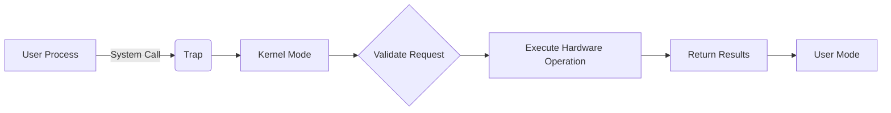

<!-- 
Generated by LectureQ
Date: 2025-08-09 22:56:54
Model: qwen3:30b
-->

<think>
I need to create comprehensive lecture notes for a student who missed class based on the provided slides and transcript. The notes should be natural, flowing, educational, and synthesize all the information without copying verbatim.

Let me break down what I'll cover:

1. **Course Introduction & Administration** (Slides 1-19)
2. **Why Operating Systems?** (Motivation section)
3. **Core Concepts: Virtualization** (Slides 30-46, transcript discussion)
4. **Processes and Threads** (Slides 47-52, transcript explanation)
5. **System Calls & Protection Mechanisms** (Slides 53-69, transcript details)

I'll structure the notes with:
- A clear title
- An overview section
- Hierarchical headers for organization
- Key insights from the instructor's spoken explanations
- Educational rephrasing of concepts

Let me start drafting:

# Week 1: Introduction to Operating Systems - Processes and Virtualization

## Overview
This lecture introduces operating systems as the fundamental layer between hardware and software. We'll cover why operating systems exist, their core functions (virtualization, process management), and how they enable modern computing through abstraction and protection mechanisms. The course emphasizes understanding design decisions behind OS implementations rather than memorizing details.

---

### Why Operating Systems? Understanding the "Why"

#### Historical Context: From Human Operators to Automated Systems
Before computers had operating systems, a **human operator** physically managed computer operations:
- Programs were loaded one at a time via punch cards or switches
- The operator manually connected hardware (like printers) for each program
- This was inefficient and expensive - the CPU would sit idle while waiting for input/output

> "The human operator's job was to optimize: maximize CPU usage, minimize memory waste, ensure security/reliability. But this manual process was too slow and error-prone."

#### The Evolution of Abstraction
Operating systems emerged as **automated operators** that:
- Optimize CPU utilization (run multiple programs efficiently)
- Manage memory resources effectively
- Ensure secure execution through isolation
- Provide consistent interfaces to hardware

> "An operating system is essentially a smart human operator, but it's built into the computer itself. It replaces the need for physical humans managing connections between programs and hardware."

---

### Core Concept: Virtualization - Creating Illusions of Control

#### What Is Virtualization?
Virtualization creates **abstractions** that make software believe it has exclusive access to resources:
- Each process thinks it runs on its own dedicated computer
- Processes don't need to know about other processes or the underlying hardware
- This is why you can run multiple programs simultaneously without worrying about how they interact

> "To make a thing, like a thing, but not actually a thing, but seem like a thing."

#### The Printer Analogy: Why Abstraction Matters
Imagine writing code that says `use printer`:
- Without OS abstraction: You'd need to specify *exactly* which printer model and its driver (EPSON Stylus S22)
- With OS abstraction: Your program just says "print" - the OS handles all hardware details

```c
// Before virtualization (manual specification):
if (printer == EPSON_Stylus_S22) {
    use_EPSON_Stylus_S22();
} else if (printer == Canon_LaserJet_500) {
    use_Canon_LaserJet_500();
}
// ...and so on for every possible printer

// With virtualization:
use_printer();  // OS handles the rest
```

#### Advantages of Virtualization
- **Code reuse**: Write once, run on multiple hardware configurations
- **Unifies interfaces**: Standardized ways to interact with different devices (printers, disks, etc.)
- **Enables higher-level functionality**: Build complex applications without worrying about low-level details

> "The operating system creates an illusion that each process has its own private universe - a unique memory space, CPU time, and hardware access."

---

### Key Insight from Transcript
> "Operating systems aren't just about making computers run faster. They're about creating the right abstractions so we don't have to worry about how things work at a low level. When you print in Word, you don't think about which printer driver is being used or what memory addresses are involved - that's all handled by the OS."

---

### Processes vs. Threads: The Building Blocks of Execution

#### What Is a Process?
A **process** is an executing instance of a program with:
- Its own *address space* (memory)
- Program counter (current instruction location)
- Stack pointer (current stack position)
- Registers (CPU state)
- Open files and communication channels

> "A process isn't just the code - it's the running context: where we are in the code, what data we're using, and how we're interacting with resources."

#### Process vs. Thread
| Feature | Process | Thread |
|---------|---------|--------|
| **Memory Space** | Isolated (each has its own) | Shared within a process |
| **State** | Independent execution context | Shares state with other threads in same process |
| **Isolation** | Strong isolation from other processes | Weak isolation (can access shared memory) |

> "Two threads in the same process can share data and communicate directly, but two separate processes cannot - they must use OS mechanisms like pipes or sockets to exchange information."

#### How Processes Are Created
When a new process starts:
1. The **loader** transfers program code from storage into memory
2. Fixes pointers (addresses change when loaded elsewhere)
3. Sets up stack layout and initializes registers
4. Creates the necessary context for execution

> "The OS must fix all pointers because programs assume they start at address 0, but in reality they're placed somewhere else in memory."

---

### Key Insight from Transcript
> "When you write a program, it's like writing instructions to be executed by an imaginary computer that has infinite resources. The OS is the translator that maps those instructions onto real hardware with limited resources - and does so safely."

---

### System Calls: The Safe Interface Between User Programs and Hardware

#### Why We Need Protection
Without protection:
- A malicious program could destroy other processes or even the OS itself
- Processes might interfere with each other's memory (e.g., overwriting critical data)
- Systems would be vulnerable to crashes from poorly written programs

> "The biggest concern is protecting the operating system from user programs - not just protecting one process from another."

#### The Two-Modes Model: User vs. Kernel Mode
| Mode | Permissions | Security Level |
|------|-------------|----------------|
| **User Mode** | Limited access (no direct hardware) | Lower security, safer for applications |
| **Kernel Mode** | Full access to all resources | Higher security, reserved for OS |

> "The mode bit controls whether a process is in user or kernel mode. User = 1, Kernel = 0."

#### How System Calls Work
When a program needs hardware access:
1. It makes a **system call** (e.g., `sys_read()`)
2. This triggers a *trap* that switches to kernel mode
3. The OS validates the request and executes it safely
4. Control returns to user mode with results



> "The system call interface is like a librarian: you can't access restricted sections directly, but you can ask the librarian to get what you need safely."

---

### Key Insight from Transcript
> "System calls are designed to be transparent - they look like regular function calls. But behind the scenes, there's a security layer that prevents malicious programs from accessing hardware directly."

---

### Process Management: The OS as Scheduler

#### How Processes Are Managed
The operating system tracks all processes using **Process Control Blocks (PCBs)** containing:
- Process ID (PID)
- Execution state (running, ready, blocked)
- Register values and program counter
- Scheduling priority
- Open files and credentials

> "A PCB is like a snapshot of the process's current state - everything needed to resume execution later."

#### The Switching Mechanism
When switching between processes:
1. Save registers for current process (to PCB)
2. Load registers for next process (from its PCB)
3. Change stack pointer and return from trap
4. Resume execution in user mode

> "The OS must save all state information before switching, because the new process needs to pick up exactly where it left off."

#### Process States
| State | Description |
|-------|-------------|
| **Running** | Currently executing on CPU |
| **Ready** | Waiting for CPU time (in queue) |
| **Blocked** | Waiting for I/O or other resource |

> "The OS maintains two queues: one for ready processes and another for blocked processes waiting for resources."

---

### Key Insight from Transcript
> "Operating systems are all about trade-offs. You could make a system that's super fast but insecure, or very secure but slow. The design choices you make determine how the system behaves - there's no single 'right' way to build an OS."

---

## Summary: Core Concepts of Operating Systems

### What Is an Operating System?
- **Role**: High-level interface between software and hardware
- **Function**: Manages processes, memory, I/O resources
- **Abstraction**: Creates illusion that each process has exclusive access to system resources
- **Design Philosophy**: Every component is a trade-off decision (performance vs. security, simplicity vs. functionality)

### Key Takeaways from Lecture 1
1. Operating systems replaced human operators by automating resource management
2. Virtualization creates the illusion of dedicated hardware for each process
3. Processes are isolated execution contexts with their own memory and state
4. System calls provide a secure interface to hardware through kernel mode
5. The OS manages processes using PCBs, tracking states between running, ready, and blocked

> "Operating systems aren't about memorizing facts - they're about understanding the design decisions behind how computers manage resources. Think like an OS designer: what would you build if you were creating this system from scratch?"

---

### Course Logistics & Expectations
- **Assessment**: 50% exam (likely hurdle), 38% assignments, 6% quizzes, 6% tutorials
- **Key Resources**: Textbook ("Operating Systems: Three Easy Pieces"), Echo360 lectures, Piazza
- **Critical Advice**:
  - Read the textbook thoroughly (it's conversational and well-written)
  - Start early (this course has significant content)
  - Practice with C programming (systems calls are a major focus)

> "This isn't like other courses where you can get by with high-level understanding. You'll need to know many specific details about how systems work, but approach it as designing an OS rather than memorizing facts."
</think>

# Week 1: Introduction to Operating Systems - Processes and Virtualization

## Overview
This lecture introduces operating systems as the fundamental layer between hardware and software. We'll explore why operating systems exist, their core functions (virtualization, process management), and how they enable modern computing through abstraction and protection mechanisms. The course emphasizes understanding design decisions behind OS implementations rather than memorizing details.

---

## Why Operating Systems? Understanding the "Why"

### Historical Context: From Human Operators to Automated Systems
Before computers had operating systems, a **human operator** physically managed computer operations:
- Programs were loaded one at a time via punch cards or switches
- The operator manually connected hardware (like printers) for each program
- This was inefficient - CPUs would sit idle while waiting for input/output

> "The human operator's job was to optimize: maximize CPU usage, minimize memory waste, ensure security/reliability. But this manual process was too slow and error-prone."

### The Evolution of Abstraction
Operating systems emerged as **automated operators** that:
- Optimize CPU utilization (run multiple programs efficiently)
- Manage memory resources effectively
- Ensure secure execution through isolation
- Provide consistent interfaces to hardware

> "An operating system is essentially a smart human operator, but it's built into the computer itself. It replaces the need for physical humans managing connections between programs and hardware."

---

## Core Concept: Virtualization - Creating Illusions of Control

### What Is Virtualization?
Virtualization creates **abstractions** that make software believe it has exclusive access to resources:
- Each process thinks it runs on its own dedicated computer
- Processes don't need to know about other processes or the underlying hardware
- This is why you can run multiple programs simultaneously without worrying about how they interact

> "To make a thing, like a thing, but not actually a thing, but seem like a thing."

### The Printer Analogy: Why Abstraction Matters
Imagine writing code that says `use printer`:
- Without OS abstraction: You'd need to specify *exactly* which printer model and its driver (EPSON Stylus S22)
- With OS abstraction: Your program just says "print" - the OS handles all hardware details

```c
// Before virtualization (manual specification):
if (printer == EPSON_Stylus_S22) {
    use_EPSON_Stylus_S22();
} else if (printer == Canon_LaserJet_500) {
    use_Canon_LaserJet_500();
}
// ...and so on for every possible printer

// With virtualization:
use_printer();  // OS handles the rest
```

### Advantages of Virtualization
- **Code reuse**: Write once, run on multiple hardware configurations
- **Unifies interfaces**: Standardized ways to interact with different devices (printers, disks, etc.)
- **Enables higher-level functionality**: Build complex applications without worrying about low-level details

> "The operating system creates an illusion that each process has its own private universe - a unique memory space, CPU time, and hardware access."

---

### Key Insight from Transcript
> "Operating systems aren't just about making computers run faster. They're about creating the right abstractions so we don't have to worry about how things work at a low level. When you print in Word, you don't think about which printer driver is being used or what memory addresses are involved - that's all handled by the OS."

---

## Processes vs. Threads: The Building Blocks of Execution

### What Is a Process?
A **process** is an executing instance of a program with:
- Its own *address space* (memory)
- Program counter (current instruction location)
- Stack pointer (current stack position)
- Registers (CPU state)
- Open files and communication channels

> "A process isn't just the code - it's the running context: where we are in the code, what data we're using, and how we're interacting with resources."

### Process vs. Thread
| Feature | Process | Thread |
|---------|---------|--------|
| **Memory Space** | Isolated (each has its own) | Shared within a process |
| **State** | Independent execution context | Shares state with other threads in same process |
| **Isolation** | Strong isolation from other processes | Weak isolation (can access shared memory) |

> "Two threads in the same process can share data and communicate directly, but two separate processes cannot - they must use OS mechanisms like pipes or sockets to exchange information."

### How Processes Are Created
When a new process starts:
1. The **loader** transfers program code from storage into memory
2. Fixes pointers (addresses change when loaded elsewhere)
3. Sets up stack layout and initializes registers
4. Creates the necessary context for execution

> "The OS must fix all pointers because programs assume they start at address 0, but in reality they're placed somewhere else in memory."

---

### Key Insight from Transcript
> "When you write a program, it's like writing instructions to be executed by an imaginary computer that has infinite resources. The OS is the translator that maps those instructions onto real hardware with limited resources - and does so safely."

---

## System Calls: The Safe Interface Between User Programs and Hardware

### Why We Need Protection
Without protection:
- A malicious program could destroy other processes or even the OS itself
- Processes might interfere with each other's memory (e.g., overwriting critical data)
- Systems would be vulnerable to crashes from poorly written programs

> "The biggest concern is protecting the operating system from user programs - not just protecting one process from another."

### The Two-Modes Model: User vs. Kernel Mode
| Mode | Permissions | Security Level |
|------|-------------|----------------|
| **User Mode** | Limited access (no direct hardware) | Lower security, safer for applications |
| **Kernel Mode** | Full access to all resources | Higher security, reserved for OS |

> "The mode bit controls whether a process is in user or kernel mode. User = 1, Kernel = 0."

### How System Calls Work
When a program needs hardware access:
1. It makes a **system call** (e.g., `sys_read()`)
2. This triggers a *trap* that switches to kernel mode
3. The OS validates the request and executes it safely
4. Control returns to user mode with results


> "The system call interface is like a librarian: you can't access restricted sections directly, but you can ask the librarian to get what you need safely."

---

### Key Insight from Transcript
> "System calls are designed to be transparent - they look like regular function calls. But behind the scenes, there's a security layer that prevents malicious programs from accessing hardware directly."

---

## Process Management: The OS as Scheduler

### How Processes Are Managed
The operating system tracks all processes using **Process Control Blocks (PCBs)** containing:
- Process ID (PID)
- Execution state (running, ready, blocked)
- Register values and program counter
- Scheduling priority
- Open files and credentials

> "A PCB is like a snapshot of the process's current state - everything needed to resume execution later."

### The Switching Mechanism
When switching between processes:
1. Save registers for current process (to PCB)
2. Load registers for next process (from its PCB)
3. Change stack pointer and return from trap
4. Resume execution in user mode

> "The OS must save all state information before switching, because the new process needs to pick up exactly where it left off."

### Process States
| State | Description |
|-------|-------------|
| **Running** | Currently executing on CPU |
| **Ready** | Waiting for CPU time (in queue) |
| **Blocked** | Waiting for I/O or other resource |

> "The OS maintains two queues: one for ready processes and another for blocked processes waiting for resources."

---

### Key Insight from Transcript
> "Operating systems are all about trade-offs. You could make a system that's super fast but insecure, or very secure but slow. The design choices you make determine how the system behaves - there's no single 'right' way to build an OS."

---

## Summary: Core Concepts of Operating Systems

### What Is an Operating System?
- **Role**: High-level interface between software and hardware
- **Function**: Manages processes, memory, I/O resources
- **Abstraction**: Creates illusion that each process has exclusive access to system resources
- **Design Philosophy**: Every component is a trade-off decision (performance vs. security, simplicity vs. functionality)

### Key Takeaways from Lecture 1
1. Operating systems replaced human operators by automating resource management
2. Virtualization creates the illusion of dedicated hardware for each process
3. Processes are isolated execution contexts with their own memory and state
4. System calls provide a secure interface to hardware through kernel mode
5. The OS manages processes using PCBs, tracking states between running, ready, and blocked

> "Operating systems aren't about memorizing facts - they're about understanding the design decisions behind how computers manage resources. Think like an OS designer: what would you build if you were creating this system from scratch?"

---

## Course Logistics & Expectations

### Assessment Structure
| Component | Weight | Details |
|-----------|--------|---------|
| Quizzes | 6% | Best 3 of 4 online quizzes |
| Tutorials | 6% | Preparation (online) + Participation (in-person) |
| Assignments | 38% | System Calls (8%), Scheduling (15%), TBD (15%) |
| Exam | 50% | Likely hurdle |

### Critical Advice for Success
- **Read the textbook thoroughly** ("Operating Systems: Three Easy Pieces" - it's conversational and well-written)
- **Start early** (this course has significant content; don't wait until week 12)
- **Practice with C programming** (systems calls are a major focus)
- **Ask for help when needed** (don't get stuck on one concept)

> "This isn't like other courses where you can get by with high-level understanding. You'll need to know many specific details about how systems work, but approach it as designing an OS rather than memorizing facts."