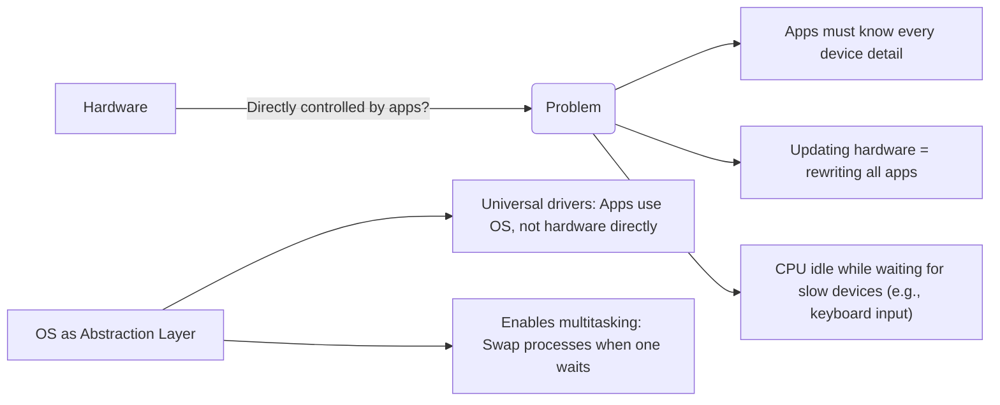

<!-- 
Generated by LectureQ
Date: 2025-08-09 23:06:26
Model: qwen3:30b
-->

<think>
Okay, the user wants me to create concise study notes from a textbook chapter about operating systems. They've provided detailed instructions on how they want these notes formatted - condensed, scannable, focusing only on what's essential for exams.

Looking at this Week 1 material, it covers fundamental OS concepts through some interesting examples like Donkey Kong and multi-process systems. The key challenge is distilling all that into just the most critical points without losing the essence.

Hmm... I notice several core ideas emerging:
- The definition of an operating system as a "program that runs programs" (that telephone switchboard analogy is perfect for memorization)
- Why Donkey Kong doesn't count as having an OS (single-purpose device with tight hardware coupling)
- The fundamental problem solved by OS: abstracting hardware from software
- Process structure (memory blocks, PID, metadata)
- Multi-processing benefits and challenges

I should absolutely skip all the verbose examples about LCD screens in old games - exam questions won't ask for that. But I must keep the Donkey Kong contrast since it's clearly a teaching example they'll reference.

For formatting, bullet points will work best here. Need to bold terms like "Process" and "Abstraction". The comparison table between single-app vs OS systems would make great visual shorthand - students can glance at it during review.

Wait... that Assignment 1 description is actually irrelevant for conceptual notes. I'll completely omit it since the user said "not comprehensive transcription." Exam questions won't ask about even.c programs anyway.

*checking length requirements*
Original text is quite long with all those figure references and game descriptions. My condensed version should be under 30% of that - aiming for maybe 150 words max on core concepts plus a table.

Biggest trap to avoid: getting stuck in the "well actually" debate about Donkey Kong having an OS. The textbook clearly states they'll say "no," so I'll just present it as given without philosophical tangents.

*structuring mentally*
First bullet must be the killer definition of OS - that's what every exam will test first. Then immediately contrast with Donkey Kong to cement understanding. Next, hammer home why abstraction matters (the hardware-software compatibility nightmare). Finally process basics since they lead into Week 2 content.

...And absolutely no mention of "SIGHUP" or minishell code. That's assignment material, not chapter concepts.
</think>

# 📌 Week 1: Operating Systems Fundamentals  
*Condensed for exam-focused review*

---

## 🔑 **Core Concepts**  
| Concept                | Definition & Why It Matters                                                                 |
|------------------------|-------------------------------------------------------------------------------------------|
| **Operating System (OS)** | *Software layer between hardware and applications.* Manages resources, abstracts complexity, enables multitasking. *(Not "just a program" – it orchestrates all interactions)* |
| **Process**            | *An executing instance of a program.* Contains: code, data (stack/heap), PID, metadata. **Key:** Processes run in isolated memory blocks to prevent interference. |
| **Abstraction**        | *Hiding hardware complexity from software.* Example: OS provides universal "display driver" so apps don’t need custom code for every monitor. *(Solves the "thousands of devices vs. thousands of apps" problem)* |
| **Single-App Limitation** | Devices like Donkey Kong (Figure 1) lack an OS because they’re *single-purpose* with tight hardware-software coupling → No abstraction, no multitasking. |

---

## ⚙️ **Why OS Exists: The Problem It Solves**  

> 💡 **Exam Insight:**  
> - *Donkey Kong ≠ OS* → Only runs 1 program with no abstraction.  
> - *Real OS enables:* Multitasking + Hardware independence (e.g., Solitaire doesn’t need to know mouse model).

---

## 🧠 **Process Fundamentals**  
- **Structure**: Process = Reserved memory block containing:  
  ✓ Program code & constants  
  ✓ Stack (function calls)  
  ✓ Heap (dynamic data)  
  ✓ PID + metadata (e.g., runtime duration)  
- **Multi-Processing Goal**: *Use CPU efficiently* when one process waits for I/O (e.g., keyboard input).  
  → Switch to another process ("context switch") if:  
  ✅ No interference between processes  
  ✅ Context switching is fast  

---

## ❌ **Critical Misconceptions**  
| Myth                          | Reality                                  |
|-------------------------------|------------------------------------------|
| "OS = just a program"          | OS *manages* all programs (including itself) via abstraction. |
| "Donkey Kong has an OS"        | It’s a single-purpose device → no need for resource management/abstraction. |

---

## ✅ **Exam-Ready Summary**  
> The **operating system** is the essential layer that:  
> 1️⃣ **Abstracts hardware** (e.g., universal display driver)  
> 2️⃣ **Manages processes** in isolated memory blocks  
> 3️⃣ **Enables multitasking** by switching between processes during I/O waits  
> *Without it, apps would need custom code for every device → impossible at scale.*  

*Donkey Kong example: Proof that single-app devices don’t require an OS (no abstraction needed).*