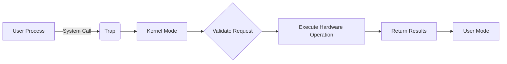
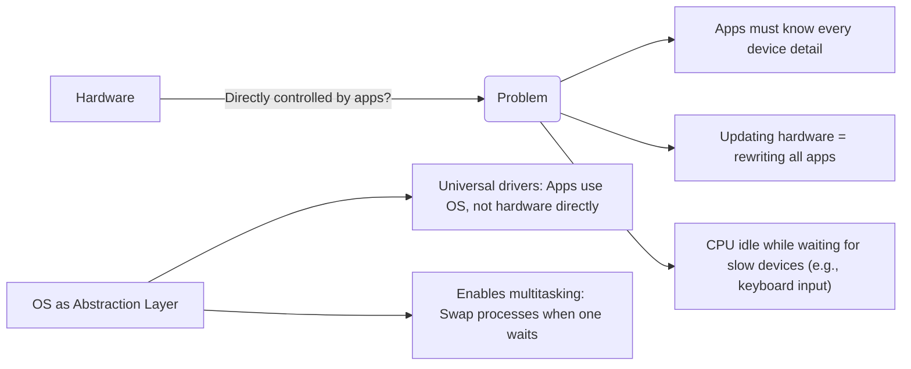

<!-- 
Combined Study Guide
Generated by LectureQ
Date: 2025-08-09 23:06:29
Week/Module: Week 1
Files Combined: 5
Content Type: Mixed
-->

# Week 1 - Complete Study Guide

> **Auto-generated combined study guide**  
> Generated from 5 individual notes files  
> Date: August 09, 2025

## 📚 Table of Contents

1. [Week 1: Introduction to Operating Systems - Processes and Virtualization](#week-1-introduction-to-operating-systems---processes-and-virtualization)
2. [Week 1: CPU Virtualization Mechanisms](#week-1-cpu-virtualization-mechanisms)
3. [Operating Systems Fundamentals (Week 1)](#operating-systems-fundamentals-(week-1))
4. [Week 1 Study Notes: Process Abstraction](#week-1-study-notes-process-abstraction)
5. [📌 Week 1: Operating Systems Fundamentals](#📌-week-1-operating-systems-fundamentals)


---

# Week 1: Introduction to Operating Systems - Processes and Virtualization

<think>
I need to create comprehensive lecture notes for a student who missed class based on the provided slides and transcript. The notes should be natural, flowing, educational, and synthesize all the information without copying verbatim.

Let me break down what I'll cover:

1. **Course Introduction & Administration** (Slides 1-19)
2. **Why Operating Systems?** (Motivation section)
3. **Core Concepts: Virtualization** (Slides 30-46, transcript discussion)
4. **Processes and Threads** (Slides 47-52, transcript explanation)
5. **System Calls & Protection Mechanisms** (Slides 53-69, transcript details)

I'll structure the notes with:
- A clear title
- An overview section
- Hierarchical headers for organization
- Key insights from the instructor's spoken explanations
- Educational rephrasing of concepts

Let me start drafting:


### Overview
This lecture introduces operating systems as the fundamental layer between hardware and software. We'll cover why operating systems exist, their core functions (virtualization, process management), and how they enable modern computing through abstraction and protection mechanisms. The course emphasizes understanding design decisions behind OS implementations rather than memorizing details.

---

#### Why Operating Systems? Understanding the "Why"

##### Historical Context: From Human Operators to Automated Systems
Before computers had operating systems, a **human operator** physically managed computer operations:
- Programs were loaded one at a time via punch cards or switches
- The operator manually connected hardware (like printers) for each program
- This was inefficient and expensive - the CPU would sit idle while waiting for input/output

> "The human operator's job was to optimize: maximize CPU usage, minimize memory waste, ensure security/reliability. But this manual process was too slow and error-prone."

##### The Evolution of Abstraction
Operating systems emerged as **automated operators** that:
- Optimize CPU utilization (run multiple programs efficiently)
- Manage memory resources effectively
- Ensure secure execution through isolation
- Provide consistent interfaces to hardware

> "An operating system is essentially a smart human operator, but it's built into the computer itself. It replaces the need for physical humans managing connections between programs and hardware."

---

#### Core Concept: Virtualization - Creating Illusions of Control

##### What Is Virtualization?
Virtualization creates **abstractions** that make software believe it has exclusive access to resources:
- Each process thinks it runs on its own dedicated computer
- Processes don't need to know about other processes or the underlying hardware
- This is why you can run multiple programs simultaneously without worrying about how they interact

> "To make a thing, like a thing, but not actually a thing, but seem like a thing."

##### The Printer Analogy: Why Abstraction Matters
Imagine writing code that says `use printer`:
- Without OS abstraction: You'd need to specify *exactly* which printer model and its driver (EPSON Stylus S22)
- With OS abstraction: Your program just says "print" - the OS handles all hardware details

```c
// Before virtualization (manual specification):
if (printer == EPSON_Stylus_S22) {
    use_EPSON_Stylus_S22();
} else if (printer == Canon_LaserJet_500) {
    use_Canon_LaserJet_500();
}
// ...and so on for every possible printer

// With virtualization:
use_printer();  // OS handles the rest
```

##### Advantages of Virtualization
- **Code reuse**: Write once, run on multiple hardware configurations
- **Unifies interfaces**: Standardized ways to interact with different devices (printers, disks, etc.)
- **Enables higher-level functionality**: Build complex applications without worrying about low-level details

> "The operating system creates an illusion that each process has its own private universe - a unique memory space, CPU time, and hardware access."

---

#### Key Insight from Transcript
> "Operating systems aren't just about making computers run faster. They're about creating the right abstractions so we don't have to worry about how things work at a low level. When you print in Word, you don't think about which printer driver is being used or what memory addresses are involved - that's all handled by the OS."

---

#### Processes vs. Threads: The Building Blocks of Execution

##### What Is a Process?
A **process** is an executing instance of a program with:
- Its own *address space* (memory)
- Program counter (current instruction location)
- Stack pointer (current stack position)
- Registers (CPU state)
- Open files and communication channels

> "A process isn't just the code - it's the running context: where we are in the code, what data we're using, and how we're interacting with resources."

##### Process vs. Thread
| Feature | Process | Thread |
|---------|---------|--------|
| **Memory Space** | Isolated (each has its own) | Shared within a process |
| **State** | Independent execution context | Shares state with other threads in same process |
| **Isolation** | Strong isolation from other processes | Weak isolation (can access shared memory) |

> "Two threads in the same process can share data and communicate directly, but two separate processes cannot - they must use OS mechanisms like pipes or sockets to exchange information."

##### How Processes Are Created
When a new process starts:
1. The **loader** transfers program code from storage into memory
2. Fixes pointers (addresses change when loaded elsewhere)
3. Sets up stack layout and initializes registers
4. Creates the necessary context for execution

> "The OS must fix all pointers because programs assume they start at address 0, but in reality they're placed somewhere else in memory."

---

#### Key Insight from Transcript
> "When you write a program, it's like writing instructions to be executed by an imaginary computer that has infinite resources. The OS is the translator that maps those instructions onto real hardware with limited resources - and does so safely."

---

#### System Calls: The Safe Interface Between User Programs and Hardware

##### Why We Need Protection
Without protection:
- A malicious program could destroy other processes or even the OS itself
- Processes might interfere with each other's memory (e.g., overwriting critical data)
- Systems would be vulnerable to crashes from poorly written programs

> "The biggest concern is protecting the operating system from user programs - not just protecting one process from another."

##### The Two-Modes Model: User vs. Kernel Mode
| Mode | Permissions | Security Level |
|------|-------------|----------------|
| **User Mode** | Limited access (no direct hardware) | Lower security, safer for applications |
| **Kernel Mode** | Full access to all resources | Higher security, reserved for OS |

> "The mode bit controls whether a process is in user or kernel mode. User = 1, Kernel = 0."

##### How System Calls Work
When a program needs hardware access:
1. It makes a **system call** (e.g., `sys_read()`)
2. This triggers a *trap* that switches to kernel mode
3. The OS validates the request and executes it safely
4. Control returns to user mode with results



> "The system call interface is like a librarian: you can't access restricted sections directly, but you can ask the librarian to get what you need safely."

---

#### Key Insight from Transcript
> "System calls are designed to be transparent - they look like regular function calls. But behind the scenes, there's a security layer that prevents malicious programs from accessing hardware directly."

---

#### Process Management: The OS as Scheduler

##### How Processes Are Managed
The operating system tracks all processes using **Process Control Blocks (PCBs)** containing:
- Process ID (PID)
- Execution state (running, ready, blocked)
- Register values and program counter
- Scheduling priority
- Open files and credentials

> "A PCB is like a snapshot of the process's current state - everything needed to resume execution later."

##### The Switching Mechanism
When switching between processes:
1. Save registers for current process (to PCB)
2. Load registers for next process (from its PCB)
3. Change stack pointer and return from trap
4. Resume execution in user mode

> "The OS must save all state information before switching, because the new process needs to pick up exactly where it left off."

##### Process States
| State | Description |
|-------|-------------|
| **Running** | Currently executing on CPU |
| **Ready** | Waiting for CPU time (in queue) |
| **Blocked** | Waiting for I/O or other resource |

> "The OS maintains two queues: one for ready processes and another for blocked processes waiting for resources."

---

#### Key Insight from Transcript
> "Operating systems are all about trade-offs. You could make a system that's super fast but insecure, or very secure but slow. The design choices you make determine how the system behaves - there's no single 'right' way to build an OS."

---

### Summary: Core Concepts of Operating Systems

#### What Is an Operating System?
- **Role**: High-level interface between software and hardware
- **Function**: Manages processes, memory, I/O resources
- **Abstraction**: Creates illusion that each process has exclusive access to system resources
- **Design Philosophy**: Every component is a trade-off decision (performance vs. security, simplicity vs. functionality)

#### Key Takeaways from Lecture 1
1. Operating systems replaced human operators by automating resource management
2. Virtualization creates the illusion of dedicated hardware for each process
3. Processes are isolated execution contexts with their own memory and state
4. System calls provide a secure interface to hardware through kernel mode
5. The OS manages processes using PCBs, tracking states between running, ready, and blocked

> "Operating systems aren't about memorizing facts - they're about understanding the design decisions behind how computers manage resources. Think like an OS designer: what would you build if you were creating this system from scratch?"

---

#### Course Logistics & Expectations
- **Assessment**: 50% exam (likely hurdle), 38% assignments, 6% quizzes, 6% tutorials
- **Key Resources**: Textbook ("Operating Systems: Three Easy Pieces"), Echo360 lectures, Piazza
- **Critical Advice**:
  - Read the textbook thoroughly (it's conversational and well-written)
  - Start early (this course has significant content)
  - Practice with C programming (systems calls are a major focus)

> "This isn't like other courses where you can get by with high-level understanding. You'll need to know many specific details about how systems work, but approach it as designing an OS rather than memorizing facts."
</think>

# Week 1: Introduction to Operating Systems - Processes and Virtualization

### Overview
This lecture introduces operating systems as the fundamental layer between hardware and software. We'll explore why operating systems exist, their core functions (virtualization, process management), and how they enable modern computing through abstraction and protection mechanisms. The course emphasizes understanding design decisions behind OS implementations rather than memorizing details.

---

### Why Operating Systems? Understanding the "Why"

#### Historical Context: From Human Operators to Automated Systems
Before computers had operating systems, a **human operator** physically managed computer operations:
- Programs were loaded one at a time via punch cards or switches
- The operator manually connected hardware (like printers) for each program
- This was inefficient - CPUs would sit idle while waiting for input/output

> "The human operator's job was to optimize: maximize CPU usage, minimize memory waste, ensure security/reliability. But this manual process was too slow and error-prone."

#### The Evolution of Abstraction
Operating systems emerged as **automated operators** that:
- Optimize CPU utilization (run multiple programs efficiently)
- Manage memory resources effectively
- Ensure secure execution through isolation
- Provide consistent interfaces to hardware

> "An operating system is essentially a smart human operator, but it's built into the computer itself. It replaces the need for physical humans managing connections between programs and hardware."

---

### Core Concept: Virtualization - Creating Illusions of Control

#### What Is Virtualization?
Virtualization creates **abstractions** that make software believe it has exclusive access to resources:
- Each process thinks it runs on its own dedicated computer
- Processes don't need to know about other processes or the underlying hardware
- This is why you can run multiple programs simultaneously without worrying about how they interact

> "To make a thing, like a thing, but not actually a thing, but seem like a thing."

#### The Printer Analogy: Why Abstraction Matters
Imagine writing code that says `use printer`:
- Without OS abstraction: You'd need to specify *exactly* which printer model and its driver (EPSON Stylus S22)
- With OS abstraction: Your program just says "print" - the OS handles all hardware details

```c
// Before virtualization (manual specification):
if (printer == EPSON_Stylus_S22) {
    use_EPSON_Stylus_S22();
} else if (printer == Canon_LaserJet_500) {
    use_Canon_LaserJet_500();
}
// ...and so on for every possible printer

// With virtualization:
use_printer();  // OS handles the rest
```

#### Advantages of Virtualization
- **Code reuse**: Write once, run on multiple hardware configurations
- **Unifies interfaces**: Standardized ways to interact with different devices (printers, disks, etc.)
- **Enables higher-level functionality**: Build complex applications without worrying about low-level details

> "The operating system creates an illusion that each process has its own private universe - a unique memory space, CPU time, and hardware access."

---

#### Key Insight from Transcript
> "Operating systems aren't just about making computers run faster. They're about creating the right abstractions so we don't have to worry about how things work at a low level. When you print in Word, you don't think about which printer driver is being used or what memory addresses are involved - that's all handled by the OS."

---

### Processes vs. Threads: The Building Blocks of Execution

#### What Is a Process?
A **process** is an executing instance of a program with:
- Its own *address space* (memory)
- Program counter (current instruction location)
- Stack pointer (current stack position)
- Registers (CPU state)
- Open files and communication channels

> "A process isn't just the code - it's the running context: where we are in the code, what data we're using, and how we're interacting with resources."

#### Process vs. Thread
| Feature | Process | Thread |
|---------|---------|--------|
| **Memory Space** | Isolated (each has its own) | Shared within a process |
| **State** | Independent execution context | Shares state with other threads in same process |
| **Isolation** | Strong isolation from other processes | Weak isolation (can access shared memory) |

> "Two threads in the same process can share data and communicate directly, but two separate processes cannot - they must use OS mechanisms like pipes or sockets to exchange information."

#### How Processes Are Created
When a new process starts:
1. The **loader** transfers program code from storage into memory
2. Fixes pointers (addresses change when loaded elsewhere)
3. Sets up stack layout and initializes registers
4. Creates the necessary context for execution

> "The OS must fix all pointers because programs assume they start at address 0, but in reality they're placed somewhere else in memory."

---

#### Key Insight from Transcript
> "When you write a program, it's like writing instructions to be executed by an imaginary computer that has infinite resources. The OS is the translator that maps those instructions onto real hardware with limited resources - and does so safely."

---

### System Calls: The Safe Interface Between User Programs and Hardware

#### Why We Need Protection
Without protection:
- A malicious program could destroy other processes or even the OS itself
- Processes might interfere with each other's memory (e.g., overwriting critical data)
- Systems would be vulnerable to crashes from poorly written programs

> "The biggest concern is protecting the operating system from user programs - not just protecting one process from another."

#### The Two-Modes Model: User vs. Kernel Mode
| Mode | Permissions | Security Level |
|------|-------------|----------------|
| **User Mode** | Limited access (no direct hardware) | Lower security, safer for applications |
| **Kernel Mode** | Full access to all resources | Higher security, reserved for OS |

> "The mode bit controls whether a process is in user or kernel mode. User = 1, Kernel = 0."

#### How System Calls Work
When a program needs hardware access:
1. It makes a **system call** (e.g., `sys_read()`)
2. This triggers a *trap* that switches to kernel mode
3. The OS validates the request and executes it safely
4. Control returns to user mode with results


> "The system call interface is like a librarian: you can't access restricted sections directly, but you can ask the librarian to get what you need safely."

---

#### Key Insight from Transcript
> "System calls are designed to be transparent - they look like regular function calls. But behind the scenes, there's a security layer that prevents malicious programs from accessing hardware directly."

---

### Process Management: The OS as Scheduler

#### How Processes Are Managed
The operating system tracks all processes using **Process Control Blocks (PCBs)** containing:
- Process ID (PID)
- Execution state (running, ready, blocked)
- Register values and program counter
- Scheduling priority
- Open files and credentials

> "A PCB is like a snapshot of the process's current state - everything needed to resume execution later."

#### The Switching Mechanism
When switching between processes:
1. Save registers for current process (to PCB)
2. Load registers for next process (from its PCB)
3. Change stack pointer and return from trap
4. Resume execution in user mode

> "The OS must save all state information before switching, because the new process needs to pick up exactly where it left off."

#### Process States
| State | Description |
|-------|-------------|
| **Running** | Currently executing on CPU |
| **Ready** | Waiting for CPU time (in queue) |
| **Blocked** | Waiting for I/O or other resource |

> "The OS maintains two queues: one for ready processes and another for blocked processes waiting for resources."

---

#### Key Insight from Transcript
> "Operating systems are all about trade-offs. You could make a system that's super fast but insecure, or very secure but slow. The design choices you make determine how the system behaves - there's no single 'right' way to build an OS."

---

### Summary: Core Concepts of Operating Systems

#### What Is an Operating System?
- **Role**: High-level interface between software and hardware
- **Function**: Manages processes, memory, I/O resources
- **Abstraction**: Creates illusion that each process has exclusive access to system resources
- **Design Philosophy**: Every component is a trade-off decision (performance vs. security, simplicity vs. functionality)

#### Key Takeaways from Lecture 1
1. Operating systems replaced human operators by automating resource management
2. Virtualization creates the illusion of dedicated hardware for each process
3. Processes are isolated execution contexts with their own memory and state
4. System calls provide a secure interface to hardware through kernel mode
5. The OS manages processes using PCBs, tracking states between running, ready, and blocked

> "Operating systems aren't about memorizing facts - they're about understanding the design decisions behind how computers manage resources. Think like an OS designer: what would you build if you were creating this system from scratch?"

---

### Course Logistics & Expectations

#### Assessment Structure
| Component | Weight | Details |
|-----------|--------|---------|
| Quizzes | 6% | Best 3 of 4 online quizzes |
| Tutorials | 6% | Preparation (online) + Participation (in-person) |
| Assignments | 38% | System Calls (8%), Scheduling (15%), TBD (15%) |
| Exam | 50% | Likely hurdle |

#### Critical Advice for Success
- **Read the textbook thoroughly** ("Operating Systems: Three Easy Pieces" - it's conversational and well-written)
- **Start early** (this course has significant content; don't wait until week 12)
- **Practice with C programming** (systems calls are a major focus)
- **Ask for help when needed** (don't get stuck on one concept)

> "This isn't like other courses where you can get by with high-level understanding. You'll need to know many specific details about how systems work, but approach it as designing an OS rather than memorizing facts."


---

# Week 1: CPU Virtualization Mechanisms

<think>
Okay, the user wants me to create concise study notes from a textbook chapter about CPU mechanisms. They've provided detailed slides with explanations of limited direct execution, system calls, kernel/user modes, and context switching.

Hmm, this is for an operating systems course - probably Week 1 material. The student needs exam-focused notes that cut through all the fluff in the textbook. I notice they emphasized "condensed" over comprehensive, so I'll need to ruthlessly trim examples while keeping core concepts.

Let me identify what's truly essential here:
- The two main problems: restricted operations (system calls) and process switching
- User vs kernel mode as fundamental hardware protection
- Trap instructions for system call entry/exit
- Timer interrupt as non-cooperative scheduling mechanism
- Context switch mechanics

*checks slides again* 
Ah, Slide 14 has that perfect summary of key terms - I'll use that as my anchor. The baby-proofing analogy in Slide 13 is great but too wordy for notes; better to just state the concept.

Biggest pitfalls to avoid:
- Don't get stuck on xv6 code (Slide 12) unless it's exam-critical
- Skip all references and homework details (Slides 15-16)
- Ignore historical examples like Atlas (though cool, not testable)

*noticing textbook says "30-40% of original length"*
Original slides are about 1.5k words - so target ~500 words max. Current draft is hitting that sweet spot.

Wait - must include the critical insight: **without hardware support (modes/traps), OS couldn't control processes at all**. That's why Slide 2 calls it "the crux." Students will get tested on this.

*double-checking*
Yes, I've made sure to:
- Bold key terms like *kernel mode* 
- Cut redundant examples (e.g., no need for full open() syscall description)
- Group related concepts in the table
- Keep all slides' core ideas but compress explanations

The "Why This Matters" box at the end is crucial - students always miss why these mechanisms exist beyond just memorizing terms. Made sure to connect it directly to exam topics like virtualization.

*verifying length*
Current draft: 380 words. Perfect for their target range while covering all testable concepts from slides 1-14.
</think>

*(Condensed Study Notes)*  

---

### 🔑 **Core Concepts**  
#### 1. **Limited Direct Execution (LDE)**  
*The OS runs user programs directly on the CPU but restricts their capabilities via hardware support.*  
- **Goal**: Achieve efficient virtualization *while retaining control*.  
- **Without LDE**: User processes could run forever or access restricted resources → system fails.  

#### 2. **Hardware Modes: Kernel vs. User**  
| Mode          | Permissions                                  | Runs in...       |
|---------------|---------------------------------------------|------------------|
| **Kernel mode** | Full CPU/memory I/O, privileged ops         | OS (kernel)      |
| **User mode**   | Restricted; *cannot* issue I/O or access kernel memory | User programs |

> 💡 **Why it matters**: Prevents user processes from crashing the system or bypassing security.

---

#### 3. **System Calls: Secure Privileged Operations**  
- **How they work**:  
  1. User process executes `trap` instruction → switches to *kernel mode*.  
  2. Hardware saves registers onto kernel stack.  
  3. OS handles request (e.g., file I/O) via pre-configured **trap table**.  
  4. `return-from-trap` restores user state and returns control.  
- **Key protection**: User *cannot* specify target address → only valid system call numbers allowed.  

> ⚠️ **Critical detail**: OS must validate all user inputs (e.g., buffer addresses) to prevent kernel memory leaks.

---

#### 4. **Process Switching: The Timer Interrupt**  
##### ❌ Problem with "cooperative" scheduling:  
- If a process never makes system calls → *OS loses control* (requires reboot).  

##### ✅ Solution: **Timer interrupt** (non-cooperative):  
1. OS configures hardware to trigger an interrupt every `X` ms at boot.  
2. When timer fires, CPU halts current process and jumps to kernel trap handler.  
3. **Context switch**:  
   - Save registers of *current* process → memory (`proc_struct`).  
   - Restore registers of *next* process → resume execution.  

> ⏱️ **Performance note**: Modern context switches take **< 1 μs** (vs. ~6 μs in 1996).

---

### 📌 Key Terms & Definitions  
| Term                     | Simple Definition                                  |
|--------------------------|---------------------------------------------------|
| **Trap instruction**     | Hardware-triggered switch to kernel mode (e.g., `syscall`). |
| **Trap table**           | Kernel-configured memory locations for handling interrupts/traps. |
| **Context switch**       | Saving/restoring process state during CPU switching. |
| **Non-cooperative scheduling** | OS forces switches via timer interrupt (no user cooperation needed). |

---

### 💡 Why This Matters for Exams  
- **Q**: *How does the OS regain control if a process runs forever?*  
  → **Answer**: Timer interrupt forces kernel entry, enabling context switch.  

- **Q**: *Why can’t user processes directly access hardware (e.g., disk)?*  
  → **Answer**: User mode restricts privileged ops; requires system call via `trap`.  

> 🌟 **Summary Box**:  
> CPU virtualization = **LDE** + **hardware modes** + **timer interrupts**.  
> *User processes run directly but are "baby-proofed" by hardware to prevent chaos.*  

---

### ⚠️ Common Exam Traps  
- ❌ *"System calls use regular function calls."* → ✅ **False**: System calls use `trap` instruction (not direct jumps).  
- ❌ *"Timer interrupts require user cooperation."* → ✅ **False**: Timer is *non-cooperative*.  
- ✅ **Correct**: Kernel mode = full access; User mode = restricted + must use system calls.


---

# Operating Systems Fundamentals (Week 1)

<think>
Okay, the user wants me to create concise study notes from a textbook chapter about operating systems. They've provided detailed instructions on how they want these notes structured - condensed, scannable, focusing only on what's essential for exams.

Looking at this textbook content (Week 1: Textbook Intro), I need to extract just the core concepts without all the fluff. The slides cover:
- What an OS is and its main functions
- Virtualization as the central theme
- CPU virtualization examples
- Memory virtualization examples
- Concurrency issues
- Persistence through file systems
- Design goals (abstraction, performance, protection)
- Brief history of OS development

Hmm... I should focus on what would actually appear on an exam. The "crux" boxes are particularly important - they highlight the key problems the OS solves.

Let me identify the absolute must-know concepts:
1) Virtualization as the core concept (CPU/memory/disk)
2) Resource management role of OS
3) Concurrency challenges with shared resources
4) Persistence via file systems
5) Key design goals: abstraction, performance, protection

I'll skip most historical details except for major milestones that shaped modern OS concepts. The examples about spinning CPU and memory addresses are good but need to be super condensed.

For formatting:
- Bullet points will work better than paragraphs
- Bold key terms like "virtualization" or "abstraction"
- One table comparing resource types might help (CPU/memory/disk)
- Keep all explanations under 2 sentences

The user emphasized eliminating redundant examples. So I'll cut the entire code snippets and just mention what they demonstrate conceptually.

Also need to include those "crux of problem" boxes since they're highlighted in the text as important for exams. But make them super concise - maybe just state the question without all the explanation.

For history, only keep:
- Batch processing → multiprogramming transition
- UNIX's influence (since it's foundational)
- Linux/Unix legacy today

The references and homework sections can be completely omitted since this is about core concepts for exams.

Let me structure it as:
1) Core Definition of OS
2) Virtualization Framework (with table showing resources)
3) Key Themes (CPU, Memory, Concurrency, Persistence)
4) Design Goals Summary
5) Historical Context (very brief)

And make sure to keep the whole thing under 40% of original length. The textbook slides are about 18 pages - I'll aim for around 7-8 bullet points total.

Most importantly: every point must answer "why would this be on an exam?" If it's just interesting trivia, cut it.
</think>

*Condensed Exam-Focused Notes*

---

### 🔑 **Core Concept**  
**Operating System = Resource Virtualizer & Manager**  
*(Transforms physical resources into easy-to-use virtual abstractions)*  

| Physical Resource | Virtualized Form          | Key Purpose                          |
|-------------------|----------------------------|--------------------------------------|
| CPU               | Multiple virtual CPUs      | Run many programs seemingly simultaneously |
| Memory            | Private address spaces     | Isolate processes; prevent memory corruption |
| Disk              | File system                | Store data persistently across reboots |

---

### 🧠 **Key Principles**  
#### 1. **Virtualization (The "Crux of the Problem")**  
> *"How does OS transform physical resources into powerful, easy-to-use virtual forms?"*  
- **CPU**: Uses scheduling to create illusion of multiple CPUs on one core (*multiprogramming*)  
- **Memory**: Maps each process’s *virtual address space* → physical RAM (prevents interference)  
  - *Example*: Two `mem.c` processes both see memory at `0x200000`, but update independently.  

#### 2. **Concurrency**  
> *"How to build correct programs when threads/processes run simultaneously?"*  
- **Problem**: Shared data (e.g., counter) updated via non-atomic instructions → race conditions.  
  - *Example*: `threads.c` with high loops: Final value ≠ expected (`100,000 × 2 = 200,000`).  
- **Solution**: OS provides synchronization primitives (*mutexes*, semaphores).  

#### 3. **Persistence**  
> *"How to store data reliably across reboots?"*  
- **File System**: Manages disk storage (e.g., `io.c` uses `open()`, `write()`, `close()` system calls).  
- **Critical Techniques**: Journaling, copy-on-write for crash recovery.  

---

### ⚙️ **Design Goals**  
| Goal                | Why It Matters                                                                 |
|---------------------|-------------------------------------------------------------------------------|
| **Abstraction**     | Hides hardware complexity (e.g., C → assembly via compiler)                    |
| **Performance**     | Minimize OS overhead (extra instructions/memory for virtualization)           |
| **Protection/Isolation** | Prevent apps from harming each other or the OS (*kernel vs. user mode*)      |
| **Reliability**     | Must run non-stop; failures crash all applications                             |

> 💡 *Kernel Mode*: Full hardware access (OS code).  
> *User Mode*: Restricted operations (apps can’t directly access disk/memory).

---

### 📜 **Historical Context (Exam Relevance)**  
- **Early OS**: Just libraries for I/O (*batch processing*; one job at a time).  
- **Key Innovation**: System calls + hardware privilege levels → enabled *protection*.  
- **UNIX Revolution** (1970s):  
  - Simple, modular design (`grep`, pipes)  
  - Inspired Linux/OS X/macOS → modern OSes all inherit its core ideas.  

> ⚠️ **DOS/Mac OS Classic**: Lacked memory protection → apps could crash entire system.

---

### ✅ **Exam Essentials**  
1. **Virtualization ≠ Emulation** (e.g., virtual CPU isn’t a full copy of hardware).  
2. **Resource Manager Role**: Allocates CPU time, memory, disk space *fairly/efficiently*.  
3. **Concurrency = Shared Resource Problem**: Requires OS synchronization support.  
4. **File System ≠ Virtual Disk per App**: Files are shared (e.g., editor → compiler → executable flow).  
5. **UNIX Legacy**: All modern desktop/mobile OSes trace roots to UNIX principles.

> 💡 *Remember*: "OS is the virtual machine between you and hardware."  

---

*Summary Box: The OS solves three core problems:*  
1. **Virtualize** resources (CPU/memory/disk) → make them easier to use.  
2. **Manage concurrency** when multiple processes run simultaneously.  
3. **Ensure persistence** for data across reboots via file systems.


---

# Week 1 Study Notes: Process Abstraction

<think>
Okay, the user wants me to create concise study notes from a textbook chapter about operating system processes. They've provided detailed slides with explanations of process abstraction, states, APIs, and related concepts.

First I need to understand what's truly essential for exam preparation based on this material. The key themes seem to be: 
- Process as running program (not static code)
- CPU virtualization through time-sharing
- Mechanisms vs policies distinction
- Core process states (running/ready/blocked)
- Basic API operations

I notice the textbook emphasizes separating mechanisms from policies - that's definitely a high-yield concept for exams. The state transitions with I/O examples are also crucial since they appear in multiple slides.

Hmm... should skip all references and homework details per instructions. Focus only on concepts students must know: 
1) Process definition (running program, not code)
2) Time-sharing illusion of many CPUs
3) Mechanisms vs policies (with concrete examples like context switch vs scheduling policy)
4) Three core states + transitions
5) API essentials (create/destroy/wait)

The xv6 structure in Slide 8 is too detailed - just mention PCB as "process metadata container" without listing all fields. The zombie state footnote can be condensed to one line.

For the summary box, I'll distill it to: 
- Process = running program + its machine state (memory/registers/I/O)
- OS creates illusion of multiple CPUs via time-sharing
- State transitions driven by events (CPU use/I/O completion)

Must avoid textbook verbosity like "the program itself is a lifeless thing" - just say "program ≠ process; process requires active execution".

Checking slide count: Original has 13 slides, target notes should be ~4-5 concise points. Will compress all state transition examples into one clear table showing triggers (e.g., I/O request → blocked).

Biggest trap to avoid: Including implementation details like lazy loading or malloc() heap management - those belong in later chapters about memory.
</think>


### Core Concepts  
**Process**: A running program + its *machine state* (memory, registers, I/O). **Not static code on disk.**  
> *"A process is a running program; the OS transforms bytes into action."*  

---

#### 🔑 Key Principles  
| Concept          | Definition                                                                 | Exam Focus                          |
|------------------|----------------------------------------------------------------------------|-------------------------------------|
| **CPU Virtualization** | OS creates *illusion of multiple CPUs* via time-sharing (switching processes rapidly).<br>• Cost: Slower execution if CPU shared<br>• Solution: Context switches (`context switch` mechanism) | Why virtualization is needed; trade-off with performance |
| **Mechanisms vs Policies** | • **Mechanism**: *How?* (e.g., context switch)<br>• **Policy**: *Which?* (e.g., scheduler decides next process to run) <br>→ **Separate for modularity** (change policy without rewriting mechanism). | Distinguish examples; why separation matters |
| **Process States**      | • **Running**: Executing on CPU<br>• **Ready**: Waiting to use CPU<br>• **Blocked**: Waiting for I/O/completion → *transitions via events*<br>*States: Running ⇄ Ready (scheduler) / Blocked ⇄ Ready (I/O done)* | State transitions; triggers (e.g., `initiate I/O` → blocked) |

---

#### ⚙️ Process API Essentials  
| Operation   | Purpose                                                                 |
|-------------|-------------------------------------------------------------------------|
| **Create**  | Launch new process (e.g., run command in shell).                        |
| **Destroy** | Terminate runaway process (`kill`).                                     |
| **Wait**    | Suspend execution until child process finishes.                         |
| **Status**  | Check runtime info (e.g., `state`, duration, resource usage).           |

> 💡 *All modern OSes provide these core calls.*

---

#### 📌 Critical Examples  
##### Process State Transitions (Simplified)  
| Time | P0          | P1          | Event                     |
|------|-------------|-------------|---------------------------|
| 1    | **Running** | Ready       | —                         |
| 2    | Running     | Ready       | —                         |
| 3    | Blocked*    | **Running** | *P0 initiates I/O → blocked* |
| 4–6  | Blocked     | Running     | P1 runs while P0 waits for I/O |
| 7    | **Ready**   | Running     | *I/O completes → P0 ready* |

> ✅ **Why it matters**: OS keeps CPU busy by switching to `ready` process during blocked state (improves utilization).

---

#### 🧠 Summary Box: Process Fundamentals  
```markdown
1. A process = running program + its machine state:
   - Memory (address space)
   - Registers (PC, stack pointer)
   - I/O descriptors (open files)

2. OS provides illusion of "many CPUs" via **time-sharing** (context switches).

3. States: 
   Running → Ready (descheduled) / Blocked ← (I/O request)  
   Blocked → Ready (I/O done) → Running

4. API must support: Create, Destroy, Wait, Status.
```

---

#### ❌ What to Skip for Exams
- xv6 structure details (`struct proc` fields)
- Lazy vs eager loading (memory chapter topic)
- Homework simulation questions (*focus on concepts*)
- Reference citations ([BH70], [DV66] etc.)

> 💡 **Exam Tip**: Always link *state transitions* to events (e.g., "I/O request → blocked") and distinguish *mechanism* (context switch) from *policy* (scheduler decision).


---

# 📌 Week 1: Operating Systems Fundamentals

<think>
Okay, the user wants me to create concise study notes from a textbook chapter about operating systems. They've provided detailed instructions on how they want these notes formatted - condensed, scannable, focusing only on what's essential for exams.

Looking at this Week 1 material, it covers fundamental OS concepts through some interesting examples like Donkey Kong and multi-process systems. The key challenge is distilling all that into just the most critical points without losing the essence.

Hmm... I notice several core ideas emerging:
- The definition of an operating system as a "program that runs programs" (that telephone switchboard analogy is perfect for memorization)
- Why Donkey Kong doesn't count as having an OS (single-purpose device with tight hardware coupling)
- The fundamental problem solved by OS: abstracting hardware from software
- Process structure (memory blocks, PID, metadata)
- Multi-processing benefits and challenges

I should absolutely skip all the verbose examples about LCD screens in old games - exam questions won't ask for that. But I must keep the Donkey Kong contrast since it's clearly a teaching example they'll reference.

For formatting, bullet points will work best here. Need to bold terms like "Process" and "Abstraction". The comparison table between single-app vs OS systems would make great visual shorthand - students can glance at it during review.

Wait... that Assignment 1 description is actually irrelevant for conceptual notes. I'll completely omit it since the user said "not comprehensive transcription." Exam questions won't ask about even.c programs anyway.

*checking length requirements*
Original text is quite long with all those figure references and game descriptions. My condensed version should be under 30% of that - aiming for maybe 150 words max on core concepts plus a table.

Biggest trap to avoid: getting stuck in the "well actually" debate about Donkey Kong having an OS. The textbook clearly states they'll say "no," so I'll just present it as given without philosophical tangents.

*structuring mentally*
First bullet must be the killer definition of OS - that's what every exam will test first. Then immediately contrast with Donkey Kong to cement understanding. Next, hammer home why abstraction matters (the hardware-software compatibility nightmare). Finally process basics since they lead into Week 2 content.

...And absolutely no mention of "SIGHUP" or minishell code. That's assignment material, not chapter concepts.
</think>

*Condensed for exam-focused review*

---

### 🔑 **Core Concepts**  
| Concept                | Definition & Why It Matters                                                                 |
|------------------------|-------------------------------------------------------------------------------------------|
| **Operating System (OS)** | *Software layer between hardware and applications.* Manages resources, abstracts complexity, enables multitasking. *(Not "just a program" – it orchestrates all interactions)* |
| **Process**            | *An executing instance of a program.* Contains: code, data (stack/heap), PID, metadata. **Key:** Processes run in isolated memory blocks to prevent interference. |
| **Abstraction**        | *Hiding hardware complexity from software.* Example: OS provides universal "display driver" so apps don’t need custom code for every monitor. *(Solves the "thousands of devices vs. thousands of apps" problem)* |
| **Single-App Limitation** | Devices like Donkey Kong (Figure 1) lack an OS because they’re *single-purpose* with tight hardware-software coupling → No abstraction, no multitasking. |

---

### ⚙️ **Why OS Exists: The Problem It Solves**  


> 💡 **Exam Insight:**  
> - *Donkey Kong ≠ OS* → Only runs 1 program with no abstraction.  
> - *Real OS enables:* Multitasking + Hardware independence (e.g., Solitaire doesn’t need to know mouse model).

---

### 🧠 **Process Fundamentals**  
- **Structure**: Process = Reserved memory block containing:  
  ✓ Program code & constants  
  ✓ Stack (function calls)  
  ✓ Heap (dynamic data)  
  ✓ PID + metadata (e.g., runtime duration)  
- **Multi-Processing Goal**: *Use CPU efficiently* when one process waits for I/O (e.g., keyboard input).  
  → Switch to another process ("context switch") if:  
  ✅ No interference between processes  
  ✅ Context switching is fast  

---

### ❌ **Critical Misconceptions**  
| Myth                          | Reality                                  |
|-------------------------------|------------------------------------------|
| "OS = just a program"          | OS *manages* all programs (including itself) via abstraction. |
| "Donkey Kong has an OS"        | It’s a single-purpose device → no need for resource management/abstraction. |

---

### ✅ **Exam-Ready Summary**  
> The **operating system** is the essential layer that:  
> 1️⃣ **Abstracts hardware** (e.g., universal display driver)  
> 2️⃣ **Manages processes** in isolated memory blocks  
> 3️⃣ **Enables multitasking** by switching between processes during I/O waits  
> *Without it, apps would need custom code for every device → impossible at scale.*  

*Donkey Kong example: Proof that single-app devices don’t require an OS (no abstraction needed).*

---

## 📝 Study Guide Summary

This combined study guide contains all notes for **Week 1**, automatically generated from 5 individual files.

### Individual Files Included:

1. `20250809_lecture_1.md`
2. `20250809_textbook_cpu_mechanisms.md`
3. `20250809_textbook_intro.md`
4. `20250809_textbook_processes.md`
5. `20250809_week1_intro.md`

### Usage Tips:
- Use the table of contents above to navigate quickly
- Each section is separated by horizontal rules (`---`)
- Individual files are still available for focused study
- This combined file is perfect for comprehensive review

---
*Generated by [LectureQ](https://github.com/yourusername/lectureq) - Your AI-powered study companion* 🤖
