<!-- 
Generated by LectureQ (Enhanced Comprehensive Version)
Date: 2025-08-16 01:46:53
Model: qwen3:30b
Output Mode: Comprehensive
-->

<think>
We are creating comprehensive study notes for Week 1: Textbook CPU Mechanisms (Slide 1 to Slide 16).
 The goal is to cover ALL content from the slides with detailed explanations, definitions of all key terms, inclusion of every example and case study, and a focus on deep understanding.

 We'll structure the notes as follows:

 # Chapter Title
 ## Introduction/Overview

 Then we break down by major sections (based on slide numbers and topics):

 - **Mechanism: Limited Direct Execution** (Slide 1-2)
   * Subsections for each problem area (Problem #1, Problem #2)

 We'll cover:
   - All concepts (user mode, kernel mode, system calls, traps, context switches, timer interrupts, etc.)
   - Every example and case study mentioned
   - The timeline diagrams (Figure 6.1 to Figure 6.4) with explanations

 Important: Include all the "TIP" boxes as they are part of the content.

 We'll also include:
   - A comprehensive summary at the end
   - 15-20 study questions for exam preparation

 Let's start by extracting and organizing every piece of information from the slides.

 Note: The textbook is called "Operating Systems: Three Easy Pieces" (OSTEP), version 1.10, available at ostep.org.

 We'll go slide-by-slide to ensure we don't miss anything.

 Slide 1:
   - Title: Mechanism: Limited Direct Execution
   - Key points: 
        * Virtualizing the CPU by sharing among many jobs (time-sharing).
        * Challenges: performance and control.
        * The crux: "HOW TO EFFICIENTLY VIRTUALIZE THE CPU WITH CONTROL"

 Slide 2:
   - Basic Technique: Limited Direct Execution
   - Figure 6.1: Direct Execution Protocol (Without Limits) showing steps without limits.

 Slide 3:
   - Problem #1: Restricted Operations
        * Crux: "HOW TO PERFORM RESTRICTED OPERATIONS"
        * Solution: Introduce user mode and kernel mode.
        * System calls as a mechanism to perform restricted operations (I/O, etc.)
        * ASIDE on how system calls look like procedure calls (using trap instruction)

 Slide 4:
   - More details on system calls and traps
        * User mode vs. Kernel mode
        * Trap instruction: jumps into kernel and raises privilege level.
        * Return-from-trap instruction to return to user mode.
        * Hardware saves registers during trap (onto kernel stack).
        * Trap table setup at boot time by OS.

 Slide 5:
   - Figure 6.2: Limited Direct Execution Protocol (timeline)

 Slide 6:
   - Tip on being wary of user inputs in insecure systems
   - How system call numbers work to prevent jumping to arbitrary addresses.
   - Privileged instruction for setting up trap table.

 Slide 7:
   - Problem #2: Switching Between Processes
        * Crux: "HOW TO REGAIN CONTROL OF THE CPU"
        * Cooperative approach (wait for system calls or illegal operations) and its flaws (infinite loops).
        * Non-cooperative approach using timer interrupt.

 Slide 8:
   - Details on timer interrupt as a non-cooperative method.
   - How the OS sets up the trap table for timer interrupts at boot time.
   - Tip: Dealing with application misbehavior by terminating offending processes.

 Slide 9:
   - Saving and restoring context during context switch.
        * Context switch defined: saving registers of current process, restoring for next.
        * Figure 6.3 shows timeline (Process A interrupted by timer, then switched to B).

 Slide 10:
   - Tip on reboot being useful (reboot as a tool for robustness).
   - More details on context switch and the two types of register saves.

 Slide 11:
   - Context switch code example from xv6 (Figure 6.4) with assembly explanation.

 Slide 12:
   - Addressing concurrency concerns: what happens during interrupts? 
        * Disable interrupts temporarily to avoid nested interrupt issues.
        * But be careful not to disable too long.

 Slide 13:
   - Summary of limited direct execution and the baby-proofing analogy (baby proofing a room).

 Slide 14:
   - Key terms for CPU virtualization mechanisms (a summary list)

 Slide 15:
   - References

 Slide 16:
   - Homework: Measurement homework on system call cost and context switch.

 Now, we'll create detailed notes covering all these points in order.

 Important: We must include every example and case study. The examples are:
   - Figure 6.1 (Direct Execution Protocol)
   - Figure 6.2 (Limited Direct Execution Protocol timeline)
   - Figure 6.3 (Timer interrupt context switch)
   - Figure 6.4 (xv6 context switch code)

 We'll explain each figure in detail.

 Let's structure the notes accordingly.
</think>

# Comprehensive Study Notes: CPU Mechanisms – Limited Direct Execution  

---

## **1. Core Challenge of CPU Virtualization**  
### **The Crux Problem**  
> *How to efficiently virtualize the CPU with control?*  

- **Virtualization Goal**: Share physical CPU among multiple processes simultaneously (time-sharing).  
- **Key Challenges**:  
  - **Performance**: Minimize overhead from OS intervention.  
  - **Control**: Prevent rogue processes from monopolizing resources or violating security boundaries.  
- **Critical Insight**: Without control, the OS becomes "just a library" – incapable of managing system resources safely.  

> 💡 *Why this matters*: Modern operating systems must balance speed (direct execution) with safety (hardware-enforced restrictions).  

---

## **2. Limited Direct Execution: The Core Mechanism**  
### **Concept Overview**  
- **Basic Idea**: Run user programs directly on the CPU for maximum performance, but restrict their capabilities via hardware support to retain OS control.  
- **"Limited" Explained**: Processes run natively (fast), but *only* within strict boundaries defined by hardware modes and system calls.  

### **Key Components**  
| Component          | Description                                                                 | Purpose                                  |
|--------------------|-----------------------------------------------------------------------------|------------------------------------------|
| **User Mode**      | Restricted execution mode for user processes                                | Prevents direct access to privileged resources (e.g., I/O, memory management) |
| **Kernel Mode**    | Privileged mode for OS kernel                                               | Allows full hardware access (I/O, interrupts, trap table setup) |
| **Trap Instruction** | Hardware instruction triggering a system call                               | Jumps into kernel *and* switches to kernel mode |
| **Return-from-Trap** | Special instruction returning from kernel                                   | Restores user mode and resumes execution |

> 📌 **Why traps?**: Without hardware support, processes could bypass OS security (e.g., jump directly to I/O routines).  

---

## **3. Problem #1: Restricted Operations (System Calls)**  
### **The Crux**  
> *How can a process perform restricted operations (I/O, memory allocation) without full system control?*  

#### **Solution Architecture**  
```mermaid
graph LR
    A[User Process] -->|Traps via trap instruction| B(Trap Handler)
    B --> C{Valid System Call?}
    C -->|Yes| D[Kernel Performs Operation]
    D --> E(Return-from-Trap to User Mode)]
```

#### **Step-by-Step Workflow**  
1. **Process Prepares Arguments**: Places system call number and arguments in registers (e.g., `eax` for x86).  
2. **Traps into Kernel**: Executes `trap` instruction → hardware saves state, switches to kernel mode.  
3. **Kernel Validates & Processes**: Checks if syscall is valid; executes privileged operation (e.g., disk I/O).  
4. **Returns Control**: Uses `return-from-trap` → restores user registers/state and re-enters user mode.  

#### **Critical Security Details**  
| Risk                          | Mitigation Strategy                                      |
|-------------------------------|----------------------------------------------------------|
| User passes invalid memory address (e.g., kernel space) | OS checks arguments *before* executing syscall; rejects if unsafe |
| Malicious process tries to jump directly into kernel code | System call number forces indirection → no direct jumps allowed |

> 🔐 **Example**: `write()` system call  
> - User specifies buffer address.  
> - Kernel verifies address is in user space (not kernel memory).  
> - *If invalid*: Rejects syscall immediately – prevents reading kernel memory.  

#### **Why System Calls Look Like Normal Functions**  
- C library hides trap instruction:  
  ```c
  // Example of open() call
  int fd = open("file.txt", O_RDONLY); 
  ```
  - Under the hood, `open()` uses assembly to set up arguments and trigger a `trap`.  

> 💡 **Historical Note**: Pioneered on IBM Atlas (1960s), now standard in all modern OSes.  

---

## **4. Problem #2: Switching Between Processes**  
### **The Crux**  
> *How can the OS regain control of the CPU when a process refuses to cooperate?*  

#### **Cooperative Approach (Flawed)**  
- **Mechanism**: Rely on processes voluntarily yielding via system calls or illegal operations.  
  - *Example*: `yield()` syscall, file I/O, division by zero trap.  
- **Critical Flaw**: Processes can run infinite loops without making syscalls → OS loses control forever.  
  > ⚠️ *"The only solution to infinite loops under cooperative preemption is reboot."*  

#### **Non-Cooperative Approach (Hardware Solution)**  
| Component               | Role                                                                 |
|-------------------------|----------------------------------------------------------------------|
| **Timer Interrupt**     | Hardware device triggering interrupts at fixed intervals (e.g., every 10ms) |
| **Interrupt Handler**   | Pre-configured kernel code executed on timer interrupt                |

#### **Workflow with Timer Interrupts**  

```mermaid
sequenceDiagram
    Process A->>Hardware: Runs in user mode
    Hardware->>OS: Timer expires (interrupt)
    OS->>Process A: Saves registers to kernel stack
    OS->>Scheduler: Decides to switch to Process B
    OS->>Context Switcher: Save state of A, restore state of B
    Context Switcher->>Hardware: Returns from trap → resumes Process B in user mode
```


#### **Key Steps**  
1. **OS Configures Timer at Boot**: Sets up interrupt handler (via privileged instruction).  
2. **Timer Fires**: Halts current process; hardware saves registers to kernel stack + switches to kernel mode.  
3. **Scheduler Decides Switch**: If Process A has run too long, OS initiates context switch.  
4. **Context Switch Execution**:  
   - Save all register values of *current* process (Process A) onto its kernel stack.  
   - Restore registers of *next* process (Process B) from its kernel stack.  
5. **Return to User Mode**: `return-from-trap` resumes Process B in user mode.  

> 💡 **Why this works**: Hardware forces OS control regardless of process behavior.  

---

## **5. Context Switching: Deep Dive**  
### **What Happens During a Context Switch?**  
| Phase                     | Action                                                                 |
|---------------------------|------------------------------------------------------------------------|
| **Hardware Saves State**  | On interrupt, hardware saves user registers to kernel stack (implicit)   |
| **OS Explicitly Saves**   | OS stores additional state in process control block (PCB)               |
| **Switches Stacks**       | Changes stack pointer from Process A’s kernel stack → Process B’s kernel stack |

#### **xv6 Context Switch Code (Figure 6.4)**  
```assembly
swtch:
    # Save old registers to 'old' context structure
    movl %esp, 4(%eax)   ; save ESP (stack pointer)
    movl %ebx, 8(%eax)   ; save EBX
    ...                  ; repeat for all critical registers

    # Load new registers from 'new' context structure
    movl 28(%eax), %ebp  ; restore EBP
    ...
    
    ret                   ; return to Process B's code (via return-from-trap)
```
> 🔍 **Key Insight**: Context switch is *not* a system call – it’s triggered by hardware interrupts.  

---

## **6. Critical Concepts & Terminology**  
| Term                          | Definition                                                                 |
|-------------------------------|----------------------------------------------------------------------------|
| **User Mode**                 | Execution mode where processes cannot perform privileged operations (e.g., I/O) → triggers trap on violation |
| **Kernel Mode**               | Privileged execution mode for OS; allows all hardware access              |
| **Trap Table**                | Hardware-mapped table storing addresses of kernel handlers (syscalls, interrupts); set up at boot by OS |
| **System Call Number**        | Unique identifier passed to trap handler → ensures no direct jumps into kernel code |
| **Context Switch**            | Low-level operation saving current process state and restoring next process’s state |
| **Timer Interrupt**           | Hardware mechanism forcing periodic CPU control transfer to OS (non-cooperative) |

---

## **7. Why Limited Direct Execution? The "Baby-Proofing" Analogy**  
> *Just as baby-proofing a room restricts access to dangerous objects while allowing free movement, the OS:*  
> 1. Sets up hardware restrictions at boot (`trap table`, `timer`).  
> 2. Runs processes in restricted user mode (like babies roaming safely).  
> 3. Only intervenes for privileged operations or when process monopolizes CPU.  

---

## **8. Performance Considerations**  
| Operation               | Historical Cost (1996)       | Modern Cost (2024)          |
|-------------------------|------------------------------|-----------------------------|
| System Call             | ~4 microseconds              | < 1 microsecond             |
| Context Switch          | ~6 microseconds              | < 1 microsecond             |

> ⚠️ **Important Caveat**:  
> - OS performance is often *memory-bound*, not CPU-bound (Ousterhout, 1990).  
> - Faster CPUs don’t always speed up the OS if memory bandwidth lags.  

---

## **9. Concurrency & Interrupt Handling**  
### **Challenge: Nested Interrupts During Syscalls/Interrupts**  
- *Example*: Timer interrupt occurs while handling a disk I/O syscall.  
- **Solution**:  
  - Disable interrupts during critical kernel sections (e.g., in trap handler).  
  - Use locking schemes for complex concurrency (deferred to later chapters).  

> 💡 **Trade-off**: Disabling interrupts too long risks lost interrupts → must balance safety and responsiveness.  

---

## **10. Summary: Limited Direct Execution Protocol**  
### **Timeline of Process Execution & Switching**  


---

## **11. Key Takeaways for Exams**  
| Concept                          | Why It Matters                                                                 |
|----------------------------------|--------------------------------------------------------------------------------|
| **User vs. Kernel Mode**         | Foundation of OS security; user mode prevents direct hardware access           |
| **Trap Instruction**             | Enables safe transition to kernel without allowing arbitrary code execution     |
| **Timer Interrupts**             | Only reliable way for non-cooperative scheduling (prevents infinite loops)      |
| **Context Switch vs. Syscall**    | Context switch is *hardware-triggered*; syscall is *software-requested*        |

---

## **12. 15-20 Study Questions**  
### **Core Concepts & Definitions**  
1. What are the two fundamental challenges in CPU virtualization? How does limited direct execution address them?  
2. Define "user mode" and "kernel mode." Why is user mode necessary for security?  
3. Explain why a system call *must* use an indirection (system call number) instead of jumping to a fixed kernel address.  
4. What happens when a process in user mode tries to perform I/O without using a system call?  

### **Mechanism Workflows**  
5. Describe the exact sequence of events during a `read()` system call from start to finish.  
6. How does a timer interrupt force OS control over CPU execution? Why is this non-cooperative approach superior to cooperative scheduling?  
7. Draw and explain Figure 6.3 (Limited Direct Execution Protocol with Timer Interrupt).  

### **Critical Analysis**  
8. *Scenario*: A process passes an invalid memory address in `write()`. How does the OS prevent kernel memory exposure?  
9. Why is reboot a "time-tested approach" for robust systems (per Slide 10)? Cite two technical reasons beyond just restarting.  
10. If you could install your own trap table, what catastrophic action would be possible? Explain why this requires hardware protection.  

### **Performance & Design**  
11. Why do modern system calls and context switches take <1 microsecond despite being "slow" operations?  
12. How does the xv6 `swtch()` function save/restore registers during a context switch? (Reference Figure 6.4)  
13. *True or False*: Context switching is triggered by user processes making system calls. Justify your answer.  

### **Advanced Application**  
14. In what scenario would disabling interrupts for too long cause problems in the kernel? How does this relate to concurrency?  
15. Why can't a cooperative scheduling system handle malicious infinite loops without rebooting? What is the fundamental flaw here?  
16. *Critical Thinking*: If hardware didn’t support multiple execution modes, how might OS security be compromised? Give one concrete example.  

---

## **Appendix: Key References**  
| Reference | Significance                                                                 |
|-----------|-----------------------------------------------------------------------------|
| [K+61]    | Atlas computer pioneered system calls (early 1960s)                          |
| [M+63]    | First paper describing timer interrupts for time-sharing                     |
| [O90]     | Ousterhout’s analysis of OS performance bottlenecks (memory vs. CPU speed)   |
| [S07]     | Return-to-libc attacks – shows why arbitrary code jumps are dangerous        |

> 💡 **Exam Tip**: Always link concepts to the *crux* questions ("How does this solve control/performance?").  
> Example: *"Timer interrupts solve non-cooperative scheduling by forcing hardware-controlled context switches."*  

--- 

**Final Note for Mastery**: The entire OS architecture hinges on these low-level mechanisms. Every process switch, system call, and security boundary relies on the principles of **limited direct execution**, **hardware-enforced modes**, and **timed interrupt control**. Master this chapter – it’s foundational to all subsequent topics (scheduling, memory management).