<!-- 
Combined Study Guide
Generated by LectureQ
Date: 2025-08-16 02:07:00
Week/Module: Week 1
Files Combined: 5
Content Type: Mixed
-->

# Week 1 - Complete Study Guide

> **Auto-generated combined study guide**  
> Generated from 5 individual notes files  
> Date: August 16, 2025

## 📚 Table of Contents

1. [Comprehensive Study Notes: Week 1 - Operating Systems Fundamentals](#comprehensive-study-notes-week-1---operating-systems-fundamentals)
2. [Week 1: Introduction to Operating Systems - Processes and Virtualization](#week-1-introduction-to-operating-systems---processes-and-virtualization)
3. [Comprehensive Study Notes: CPU Mechanisms – Limited Direct Execution](#comprehensive-study-notes-cpu-mechanisms--limited-direct-execution)
4. [Comprehensive Study Notes: Introduction to Operating Systems (Week 1)](#comprehensive-study-notes-introduction-to-operating-systems-week-1)
5. [Comprehensive Study Notes: Chapter 4 - The Abstraction: The Process](#comprehensive-study-notes-chapter-4---the-abstraction-the-process)


---

# Comprehensive Study Notes: Week 1 - Operating Systems Fundamentals


---

### **I. Core Terminology & Foundational Concepts**  
*All definitions extracted verbatim from textbook with contextual expansion.*  

#### **A. Hardware vs. Software**  
| Term          | Definition                                                                 | Contextual Example                                  |
|---------------|----------------------------------------------------------------------------|-----------------------------------------------------|
| **Hardware**  | Physical components of a computer system (tangible devices).               | Keyboard, mouse, hard drive, USB stick, LCD screen   |
| **Software**  | Programs and data that run on hardware; "instructions for hardware."       | Donkey Kong game code, OS kernel, application programs |

> 💡 **Key Insight**: Hardware is *what* the computer consists of (e.g., CPU, memory), while software is *how it operates*.  
> > *"Your hard-drive is a form of memory as is a USB stick or data you store on the cloud."*

---

#### **B. Process**  
##### Definition & Components  
A **process** is:  
> *"a block of reserved memory (i.e., address space) where there is program code, constants, the stack and heap. It also has a process ID... some extra 'metadata' properties."*  

| Component      | Purpose                                                                 |
|----------------|-------------------------------------------------------------------------|
| Program Code   | Instructions to execute (e.g., game logic in Donkey Kong).               |
| Constants      | Fixed values used by the program (e.g., `MAX_LIVES = 3`).                |
| Stack          | Manages function calls and local variables (LIFO structure).             |
| Heap           | Dynamic memory allocation for data structures during runtime.            |
| Process ID     | Unique identifier assigned by OS to track processes.                     |
| Metadata       | Additional info: execution time, priority, resource usage, etc.          |

> ⚠️ **Critical Clarification**:  
> - A *program* is static code (e.g., `Donkey_Kong.exe`).  
> - A *process* is the program in active memory with allocated resources and state.

---

### **II. The Operating System: Core Purpose**  

#### **A. What an OS Is NOT**  
- ❌ *"Sits between all things"* → Too vague (textbook explicitly rejects this).  
- ✅ **Actual Role**: *Abstraction layer* that manages hardware-software interactions to solve the "cross-compatibility problem."  

##### The Cross-Compatibility Problem (Fig 2)  
| Scenario                          | Issue                                                                 |
|-----------------------------------|-----------------------------------------------------------------------|
| Thousands of monitors             | Each application must know intricate details of every monitor model.   |
| Solitaire app + new mouse         | Solitaire would need reprogramming for each new mouse interface.       |

> 💡 **Textbook Insight**:  
> *"Why should Solitaire need to know the intricate details of every mouse that has ever been manufactured?"*  

---

#### **B. OS as a "Program That Runs Programs"**  
##### Architecture (Fig 3)  
```plaintext
[Hardware: CPU, Memory, Devices] 
        ↓
[Operating System Kernel]
        ↓
[User Applications / Processes]
```

- **OS Function**: Manages hardware access *for all processes* via standardized interfaces.  
- **Historical Analogy** (Fig 4):  
  > *"Like telephone operators who manually connected phone lines."*  

> 🌟 **Key Takeaway**: The OS is a specialized program that abstracts hardware complexity, enabling applications to interact with devices without knowing their specifics.

---

### **III. Case Study: Donkey Kong vs. Modern Systems**  

#### **A. Donkey Kong (1980s Handheld Game)**  
##### Why It Lacks an Operating System  
| Feature                | Donkey Kong                                  | Modern OS-Driven Device               |
|------------------------|---------------------------------------------|---------------------------------------|
| Purpose                | Single-purpose: *only* play Donkey Kong     | Multi-purpose: run apps, games, etc.  |
| Hardware Coupling      | Tight coupling (e.g., buttons → game logic) | Abstracted interfaces (buttons → OS driver) |
| Memory Management      | Hardcoded state machine; no dynamic allocation | Dynamic memory for processes/heap    |
| Process Isolation      | No isolation (one program = entire system)  | Processes run in separate address spaces |

> 💡 **Textbook Conclusion**:  
> *"It doesn't have an operating system because it only does one thing, and that thing has a strong 'end-user' purpose with tight coupling."*  

##### Architecture Diagram (Fig 2 Simplified):  
```plaintext
[Buttons] → [Game Logic State Machine] → [LCD Display]
          ↑___________(Hardcoded)_____________↓
```

---

#### **B. Evolution: From Single-App to Multi-Process Systems**  
| System Type              | Architecture Approach                     | Limitation                          |
|--------------------------|-------------------------------------------|-------------------------------------|
| Donkey Kong (Single App) | Hardcoded hardware interaction            | Cannot run new games without redesigning entire device |
| **Multi-Game Console**   | *Option 1*: Meta-game menu                | Still limited to built-in apps      |
|                          | *Option 2*: Abstracted drivers (OS-like)  | ✅ Scales: New apps/games use universal interfaces |

> 🌟 **Why Option 2 Wins**:  
> *"All games use the same buttons and display → abstract these into universal driver methods."*  

---

### **IV. Processes & Multi-Tasking Fundamentals**  

#### **A. The Need for Multiple Processes**  
##### Problem: CPU Idle Time During I/O Wait (Fig 1)  
```plaintext
[Process A] → Waits for external device (e.g., keyboard input)
        ↓
CPU sits idle while Process B could run.
```

> 💡 **Textbook Insight**:  
> *"The outside world is slow... your program needs to wait, while all the expensive CPU space is sitting idle."*  

##### Solution: Time-Sharing with Context Switching (Fig 2)  
1. Pause active process → save state (registers, memory pointers).  
2. Load next process into hardware.  
3. Resume execution when it’s its turn.  

> ⚠️ **Critical Requirements for Success**:  
> | Requirement                | Why It Matters                                                                 |
> |----------------------------|-------------------------------------------------------------------------------|
> | No interference between processes | Prevents Process B from corrupting Process A's memory/data (e.g., overwriting kernel code). |
> | Cheap context switching    | Switches must be fast to avoid wasting CPU cycles on overhead.                 |

---

#### **B. Direct Execution: Why It Fails**  
##### The Flawed Approach ("Just Run the Code")  
```plaintext
[User Program] → Loads into memory → Runs directly on hardware.
```

##### Catastrophic Risks (Fig 1):  
| Risk                                  | Consequence                                      |
|---------------------------------------|--------------------------------------------------|
| Overwriting OS code                   | System crashes/hangs immediately.                |
| No control over resource access       | Process A could steal all CPU/memory from B.     |
| Inability to pause/resume processes   | Impossible to implement time-sharing (multi-tasking). |

> 💡 **Textbook Verdict**:  
> *"What if the code you run overwrites the operating system code? That sounds catastrophic."*  

---

### **V. Assignment 1: Key Concepts Reinforced**  
#### **A. Task 1: Signals (`even.c`)**
- **Purpose**: Illustrates process control via signals (OS mechanism for inter-process communication).  
- **Key OS Concept Demonstrated**:  
  - Processes can be interrupted by *signals* (e.g., `SIGINT` = Ctrl+C, `SIGHUP` = hangup).  
  - Default actions: Terminate on `SIGINT`, but custom handlers override this.  

```c
// Custom signal handler example:
void handle_sigint(int sig) {
    printf("Yeah!\n"); // Override default termination action.
}
```

#### **B. Task 2: Minishell (`minishell.c`)**
- **Purpose**: Teaches OS fundamentals via shell implementation (a process manager).  
- **Critical Concepts Tested**:  
  | Feature               | Underlying OS Concept                          |
  |-----------------------|-----------------------------------------------|
  | `&` for background jobs | Process creation + non-blocking I/O management. |
  | `cd` command          | Shell *process* modifying its own working directory (not the OS). |
  | `perror()` after syscalls | Error handling via system call interface (OS kernel interaction). |

> ⚠️ **Why This Matters**:  
> *"The minishell is a program that runs other programs—exactly like an OS shell."*

---

### **VI. Comprehensive Summary**  

| Concept                | Core Idea                                                                 | Why It Matters for Exams                          |
|------------------------|---------------------------------------------------------------------------|--------------------------------------------------|
| **Operating System**   | Abstraction layer managing hardware-software interactions to solve cross-compatibility. | Exam question: *"Explain why an OS is necessary."* |
| **Process**            | Running instance of a program with allocated memory (code, stack, heap).    | Exam question: *"What components make up a process?"* |
| **Donkey Kong Example**| Single-purpose device = no need for abstraction → *no OS*.                 | Essay prompt: *"Why doesn’t Donkey Kong have an OS?"* |
| **Multi-Tasking**      | Context switching enables CPU utilization during I/O waits.                | Short answer: *"How does time-sharing improve efficiency?"* |
| **Direct Execution**   | Running programs directly on hardware → catastrophic failure risk (no isolation). | Critical thinking question: *"Why can’t we use direct execution in modern OSes?"* |

---

### **VII. 18 Exam-Style Study Questions**  

#### **Recall & Definition**  
1. Define *process* using the textbook’s exact description of its components.  
2. Why does Donkey Kong not require an operating system? Cite two specific reasons from the text.  
3. What is the "cross-compatibility problem" in computing, and how does an OS solve it?  

#### **Application & Analysis**  
4. A game console has 5 built-in games. Explain why *Option 2* (abstracted drivers) scales better than *Option 1* (meta-game menu).  
5. Describe what happens during a context switch between two processes. Why must the OS save "all relevant details"?  
6. If Process B overwrites Process A’s memory, which core principle of operating systems is violated?  

#### **Critical Thinking**  
7. The textbook says Donkey Kong uses a "glorified state machine." Explain how this differs from modern process management.  
8. Why would the OS *not* run as a regular user process (e.g., in the same memory space)?  
9. How does `minishell`’s handling of `cd` demonstrate that shells are processes, not part of the OS kernel?  

#### **Case Study Application**  
10. A new printer model is released. Why doesn’t a word processor need to be updated for it if an OS exists?  
11. In 2023, could Donkey Kong’s architecture work as a modern app on iOS/Android? Justify your answer using textbook concepts.  

#### **Technical Depth**  
12. Explain the difference between *program code* (static) and *process memory layout* (dynamic). Include stack vs. heap roles.  
13. Why is "cheap context switching" critical for multi-tasking efficiency? What would happen if it were slow?  
14. Describe two risks of direct execution beyond overwriting OS code (e.g., security, resource starvation).  

#### **Assignment Connection**  
15. How does `even.c`’s signal handling (`SIGINT`, `SIGHUP`) demonstrate the OS’s role in process control?  
16. Why must `minishell` use `perror()` after every system call? What would happen without it?  

#### **Synthesis**  
17. Compare and contrast a *single-process* (Donkey Kong) vs. *multi-process* (modern OS) architecture using the terms "abstraction," "coupling," and "scalability."  
18. The textbook states: *"Operating systems are actually more complicated than [the telephone operator analogy]."* Explain why this is true in 2 sentences, referencing process management concepts.

---

> **Final Mastery Tip**: For exams, always link *every* concept back to the core problem it solves (e.g., "OS abstraction → solves cross-compatibility"). Avoid vague answers like *"It manages hardware."* Instead: *"The OS provides standardized drivers so applications don’t need custom code for every monitor model."*


---

# Week 1: Introduction to Operating Systems - Processes and Virtualization


### Overview
This comprehensive set of lecture notes synthesizes the complete content from Week 1 Lecture 1 on operating systems, covering course structure, fundamental concepts of processes and virtualization, and essential system architecture. These notes include all key concepts, examples, explanations, and instructor insights presented in both slides and transcript.

---

### Course Structure and Expectations

#### Administrative Information
**Course Coordinator**: Bernard Evans (IW 5.44)  
**Workshop Supervisors**: Anubhav Gupta, Jyothis Joy, Nithin Dharanu, Arjun Sharma  

**Key Resources**:
- **MyUni**: For lecture notes, Echo360 recordings, and Piazza
- **Piazza**: Course discussion platform (ensure you've accessed it)
- **Textbook**: *Operating Systems: Three Easy Pieces* (highly recommended)

#### Prerequisites & Assumed Knowledge
**Prerequisite Courses**:
- Algorithm Design and Data Structures  
- Programming for IT Specialists  
- Foundations of Computer Science B  

**Required Background**:
- Coding proficiency in any language
- Understanding of fundamental data structures (stacks, queues, trees)
- Basic knowledge of computer systems concepts including:
  - Logic gates
  - Registers, program counters, memory
  - Stack and heap concepts
  - Assembly language basics

**Assumed Systems Programming Knowledge** (for assignment success):
- Processes, pipes, file descriptors
- System calls
- C programming fundamentals

#### Course Learning Outcomes
The course focuses on these key areas:

1. **High-Level Interface**: Understanding the OS as an interface between software and hardware  
2. **Resource Management**: Using the OS to support multiprogramming (running multiple processes simultaneously)  
3. **Low-Level Implementation**: Explaining CPU dispatch mechanisms  
4. **Memory Management**: Understanding memory allocation strategies  
5. **Performance Trade-offs**: Evaluating design decisions in OS implementation  

> ### Key Insight from Transcript
> > "This course isn't about memorizing terms like 'first come first serve' or 'translation lookaside buffer.' Instead, you should approach it as if you're designing an operating system yourself. Ask: *What would I need to do? What trade-offs would I make?* This makes the material much more intuitive and easier to understand than trying to memorize arbitrary concepts."

> *Instructor Emphasis*: "This course is significantly different from other computer science courses in its depth and breadth of content. You'll need to engage deeply with the material rather than just skimming it for a passing grade."

---

### Why Study Operating Systems?

#### The Core Motivation
Operating systems exist because **computers are expensive** and we want them to be used as efficiently as possible at all times.

> ### Key Insight from Transcript
> > "In the early days of computing, you'd have an operator physically loading programs into a computer. Each program would run sequentially: one after another. But this was wasteful—when a process needed input (like waiting for keyboard entry), the CPU sat idle while it waited. We couldn't afford to waste expensive hardware time like that."

#### Historical Context
- **Switchboard Operator Era**: Humans manually connected phone calls by physically plugging wires into switchboards.
  - *Why?* To avoid having a dedicated wire between every house (which would be prohibitively expensive).
  
- **Computer Operator Era**: Human operators loaded programs sequentially onto computers:
  ```
  Program 1 → Run → Results → Program 2 → Run → Results
  ```

This was inefficient because when one program waited for input/output, the CPU remained idle—wasting valuable time on an expensive machine.

> ### Practical Example from Transcript
> > "Imagine you're writing a program that needs to wait for user input. While it's waiting, your computer is sitting there doing nothing. That's like having a huge factory with machines running at 10% capacity because they keep stopping while people type on keyboards."

---

### What Is an Operating System?

#### Core Definition
An operating system (OS) **abstracts hardware** to provide users and applications with a simplified interface, managing resources efficiently.

> ### Key Insight from Transcript
> > "The OS is essentially replacing the human operator. It's not just about running programs—it's about optimizing CPU usage, memory usage, time, security, and reliability."

#### The Human Operator Analogy
What did a *human* operator do?
- Optimized **CPU usage** (maximizing calculations)
- Managed **memory usage** (efficiently storing data)
- Minimized **time waste**
- Ensured **security/reliability**

The OS performs these same functions automatically.

---

### Virtualization: The Key Concept

#### Core Principle
> "Virtualization is making a thing seem like a thing, but not actually being the thing."

This means creating an illusion that each process has its own dedicated computer with all resources available—when in reality, multiple processes share hardware through the OS.

#### Why We Need Virtualization
Consider this scenario:
- **Program 1** wants to print something: `use printer`
- **Program 2** also wants to print: `use printer`

Without virtualization (abstraction), each program would need to know exactly how to control *every* type of printer. This would be inefficient and error-prone.

#### The Printer Abstraction Example
```
My Program #1
<code>
<code>
<use printer>  // Without abstraction

Operating System
Print
```

```
My Program #2
<code>
<code>
<use printer>  // With abstraction

Operating System
Print
```

The OS handles all the complexity of *which* printer to use, *how* to communicate with it, and ensures programs don't interfere with each other.

#### Key Benefits of Abstraction
- **Code reuse**: Write once for an interface; works across many devices
- **Unifies interfaces**: No need to learn different commands for every device
- **Enables higher-level functionality**: Build complex applications without worrying about hardware details

> ### Practical Example from Transcript
> > "When you print in Word, you don't specify which printer model it is. You just say 'print,' and the OS handles all the communication with the specific printer driver."

---

### Hardware Abstraction: The Illusion of a Private Universe

#### How It Works
The OS creates an **illusion** that each process has:
- Its own memory space (address space)
- Dedicated CPU time
- Exclusive access to files, sockets, and other resources

This is why processes appear to be running in their "own universe" with infinite resources.

> ### Key Insight from Transcript
> > "Every process thinks it's the only one running on a computer. It has no idea how many other processes are working at the same time—it's completely abstracted away."

#### The Hardware-Software Interface
| **Hardware Components**       | **OS Abstraction Layer**      |
|-------------------------------|-------------------------------|
| Processor                     | Threads, Processes            |
| Memory (RAM)                  | Address Space                 |
| Disks/SSDs                    | Files                         |
| Networks                      | Sockets                       |

The OS translates these low-level hardware concepts into higher-level software interfaces that applications can use without worrying about the underlying details.

---

### Process vs. Thread: Understanding Execution Units

#### What Is a Process?
A **process** is:
- A thread of control (not just a program)
- An execution environment with restricted rights
- Contains:
  - Registers
  - Program counter
  - Stack pointer
  - Visible address space
  - Open files and communication channels

> ### Key Insight from Transcript
> > "A process isn't the program itself—it's like being in the middle of executing a program. It knows which instruction it's up to (program counter), where its stack is (stack pointer), and what memory it can access."

#### Process vs. Thread: The Critical Difference

| **Process**                          | **Thread**                           |
|--------------------------------------|--------------------------------------|
| Has its own address space            | Shares address space with other threads in the same process |
| Each has separate registers          | Shares program counter, stack pointer, and registers |
| Can't directly access another process's memory | Threads can share data through shared memory |

> ### Practical Example from Transcript
> > "Imagine two processes: each thinks it owns all the memory. If you have a thread in one process, both threads see the same memory location—like sharing a single notebook where changes are visible to everyone."

---

### Protection and Security

#### Why We Need Protection
Without protection:
- A malicious program could destroy other programs or even the OS itself.
- Programs could interfere with each other's memory.

> ### Key Insight from Transcript
> > "If you're running two processes on a computer, one process shouldn't be able to access another process's memory. That would be like being in a library and having someone else read your private notes."

#### The Protection Problem: Evil Program Example
How could an evil program destroy other programs or the OS?
1. **Recursive Process Calls**: Create infinite recursion that consumes all resources.
2. **Memory Overwrite**: Access random memory locations to corrupt data.
3. **Stack Smashing**: Make a stack so large it overwrites other processes' memory.

> ### Student Question
> *"How would you be an evil person in the 1960s OS?"*

> ### Instructor Response
> > "You could write a recursive program that consumes all resources, or access random memory locations to corrupt other programs. The key is making it look like the process is behaving normally while secretly destroying everything."

---

### User Mode vs. Kernel Mode: The Security Boundary

#### Core Concept
The OS uses **two execution modes**:
- **User mode**: Processes run with restricted permissions (can't directly access hardware)
- **Kernel mode**: OS runs with full privileges (can access all hardware)

> ### Key Insight from Transcript
> > "This is like going to a library. You can ask the librarian for information, but you can't go into the restricted section yourself."

#### System Call Flow: How Processes Access Hardware Safely

```
User Process → Request Service → OS Kernel (Kernel Mode) → Execute Request → Return Result
```

1. **Process** makes a system call request (e.g., `sys_read`).
2. **System call wrapper** translates the request.
3. **OS transitions to kernel mode**.
4. **OS executes the actual hardware operation**.
5. **OS returns result and switches back to user mode**.

> ### Practical Example from Transcript
> > "When you write a program that needs to read a file, it doesn't know where in memory the 'read' function is stored. The OS handles this by having a system call interface with offsets—like asking for page 258 of a book."

#### System Call Types

| **Type**          | **Trigger**                          | **Example**                     |
|-------------------|--------------------------------------|---------------------------------|
| **System Calls**  | Process requests service (e.g., `exit`) | `sys_read`, `fork`              |
| **Interrupts**    | External event (timer, I/O device)   | Keyboard input, disk completion |
| **Exceptions**    | Internal error in process             | Divide-by-zero, segfault        |

> ### Key Insight from Transcript
> > "An interrupt is like a phone call saying 'I'm ready to talk now,' while an exception is like the computer yelling 'You can't do that!'"

---

### Memory Layout and Execution Environment

#### Process Memory Structure (Revision)
Each process has memory organized as:
- **Data**: Global variables
- **Code**: Executable instructions
- **Stack**: Current execution state (function calls, local variables)

```
Memory Layout for a Single Process:
+------------------+
|      Data        |
+------------------+
|     Code         |
+------------------+
|      Stack       |
+------------------+
```

#### Registers and Their Roles

| **Register**          | **Purpose**                              | **Example Instruction**           |
|-----------------------|------------------------------------------|-----------------------------------|
| Program Counter (PC)  | Current instruction location             | `movl %0xabc123, eax`            |
| Stack Pointer (SP)    | Location of top of stack                 | `push eax`, `pop eax`             |
| Accumulator           | Temporary storage for calculations       | `LOAD A`, `ADD B`, `STORE C`      |
| Status Register       | Tracks system state (flags, interrupts)  | Overflow flag, zero result flag   |

> ### Key Insight from Transcript
> > "Registers are faster than memory. The accumulator was an early attempt to create a fast temporary storage location—now we have general-purpose registers."

---

### Process Control and Scheduling

#### How the OS Manages Processes
The OS must:
1. **Decide when** to run each process (scheduling)
2. **How** to switch between processes (dispatching)

> ### Key Insight from Transcript
> > "You can't let a single process run forever—it would starve other processes of CPU time."

#### The Problem with Direct Execution
If the OS didn't manage this:
```
Process 1 → Runs forever → No one else gets CPU time
```

This is why we need **time slicing** and **interrupts**.

#### Time Slicing Mechanism
- Process runs for a short period (time slice)
- Hardware interrupt triggers context switch
- OS saves current process state
- OS loads next process's state
- Repeat

> ### Practical Example from Transcript
> > "Imagine you're running two processes: one that prints and one that calculates. The printer might be slow, so the CPU would run the calculator while waiting for print results."

#### Process Control Block (PCB)
The data structure storing all information about a process:
- **Process ID** (PID): Unique identifier
- **Process State**: Running, Ready, Blocked
- **Execution State**: Registers, program counter, stack pointer
- **Scheduling Priority**
- **Accounting Information**: Parent/child relationships
- **Credentials**: User permissions
- **Pointers**: Open files, resources

---

### Summary: Key Takeaways

#### Core Concepts to Master
1. **Operating System as Interface**:
   - Abstracts hardware into user-friendly interfaces (threads, address spaces, files)
   - Replaces human operator with automated resource optimization

2. **Virtualization Principle**:
   - Each process believes it has exclusive access to all resources
   - OS manages sharing through abstraction and protection

3. **Process vs. Thread**:
   - Processes have separate memory; threads share memory within a single process
   - Threads enable efficient communication between components of the same program

4. **User Mode vs. Kernel Mode**:
   - User mode: Restricted access to hardware (safe)
   - Kernel mode: Full access for OS operations (powerful but risky)

5. **System Calls as Gatekeepers**:
   - Process requests service → OS executes in kernel mode → Returns result
   - Prevents malicious processes from directly accessing hardware

#### Essential Mindset Shift
> "Don't memorize terms—think like you're designing an operating system. Ask: *What trade-offs would I make?* How would I handle memory sharing? What security boundaries are necessary?"

---

### Study Guide & Key Questions

1. **Why did we need to replace human operators with operating systems?**  
   *(Answer: To maximize CPU usage by eliminating idle time during input/output operations)*

2. **What is the difference between a process and a thread?**  
   *(Answer: Processes have separate memory spaces; threads share memory within a single process)*

3. **How does virtualization create an illusion of exclusive resource access for each process?**  
   *(Answer: The OS manages sharing through abstraction, making each process believe it has its own dedicated resources)*

4. **What is the purpose of user mode vs. kernel mode?**  
   *(Answer: User mode restricts processes from direct hardware access; kernel mode allows safe OS operations with full privileges)*

5. **Explain the system call flow when a program needs to read data from a file.**  
   *(Answer: Process calls `sys_read` → System call wrapper translates request → OS switches to kernel mode → Executes actual I/O operation → Returns result and switches back to user mode)*

6. **What are three ways an evil process could disrupt other processes or the OS?**  
   *(Answer: Recursive infinite loops, memory overwrites, stack smashing)*

7. **Why is it important for a process to have its own address space?**  
   *(Answer: To prevent one process from accidentally (or intentionally) modifying another process's data)*

8. **How does the OS manage multiple processes sharing CPU time?**  
   *(Answer: Through time slicing and periodic interrupts that trigger context switches between processes)*

9. **What is a Process Control Block (PCB), and what information does it store?**  
   *(Answer: A data structure storing all process state information including PID, execution state, scheduling priority, credentials, and resource pointers)*

10. **Why can't we just let programs directly access hardware instructions?**  
    *(Answer: It would allow malicious processes to destroy other programs or the OS itself; security boundaries are essential for system stability)*

---

### Practical Exercise
Imagine you're designing a simple operating system for a single-core processor:

1. How would you handle two processes that both want to print at the same time?
2. What information would your Process Control Block need to store for each process?
3. Describe how a context switch would work between these two printing processes.

> *Hint: Focus on the abstraction layer and security boundaries rather than specific implementation details.*


---

# Comprehensive Study Notes: CPU Mechanisms – Limited Direct Execution

---

### **1. Core Challenge of CPU Virtualization**  
#### **The Crux Problem**  
> *How to efficiently virtualize the CPU with control?*  

- **Virtualization Goal**: Share physical CPU among multiple processes simultaneously (time-sharing).  
- **Key Challenges**:  
  - **Performance**: Minimize overhead from OS intervention.  
  - **Control**: Prevent rogue processes from monopolizing resources or violating security boundaries.  
- **Critical Insight**: Without control, the OS becomes "just a library" – incapable of managing system resources safely.  

> 💡 *Why this matters*: Modern operating systems must balance speed (direct execution) with safety (hardware-enforced restrictions).  

---

### **2. Limited Direct Execution: The Core Mechanism**  
#### **Concept Overview**  
- **Basic Idea**: Run user programs directly on the CPU for maximum performance, but restrict their capabilities via hardware support to retain OS control.  
- **"Limited" Explained**: Processes run natively (fast), but *only* within strict boundaries defined by hardware modes and system calls.  

#### **Key Components**  
| Component          | Description                                                                 | Purpose                                  |
|--------------------|-----------------------------------------------------------------------------|------------------------------------------|
| **User Mode**      | Restricted execution mode for user processes                                | Prevents direct access to privileged resources (e.g., I/O, memory management) |
| **Kernel Mode**    | Privileged mode for OS kernel                                               | Allows full hardware access (I/O, interrupts, trap table setup) |
| **Trap Instruction** | Hardware instruction triggering a system call                               | Jumps into kernel *and* switches to kernel mode |
| **Return-from-Trap** | Special instruction returning from kernel                                   | Restores user mode and resumes execution |

> 📌 **Why traps?**: Without hardware support, processes could bypass OS security (e.g., jump directly to I/O routines).  

---

### **3. Problem #1: Restricted Operations (System Calls)**  
#### **The Crux**  
> *How can a process perform restricted operations (I/O, memory allocation) without full system control?*  

##### **Solution Architecture**  
```mermaid
graph LR
    A[User Process] -->|Traps via trap instruction| B(Trap Handler)
    B --> C{Valid System Call?}
    C -->|Yes| D[Kernel Performs Operation]
    D --> E(Return-from-Trap to User Mode)]
```

##### **Step-by-Step Workflow**  
1. **Process Prepares Arguments**: Places system call number and arguments in registers (e.g., `eax` for x86).  
2. **Traps into Kernel**: Executes `trap` instruction → hardware saves state, switches to kernel mode.  
3. **Kernel Validates & Processes**: Checks if syscall is valid; executes privileged operation (e.g., disk I/O).  
4. **Returns Control**: Uses `return-from-trap` → restores user registers/state and re-enters user mode.  

##### **Critical Security Details**  
| Risk                          | Mitigation Strategy                                      |
|-------------------------------|----------------------------------------------------------|
| User passes invalid memory address (e.g., kernel space) | OS checks arguments *before* executing syscall; rejects if unsafe |
| Malicious process tries to jump directly into kernel code | System call number forces indirection → no direct jumps allowed |

> 🔐 **Example**: `write()` system call  
> - User specifies buffer address.  
> - Kernel verifies address is in user space (not kernel memory).  
> - *If invalid*: Rejects syscall immediately – prevents reading kernel memory.  

##### **Why System Calls Look Like Normal Functions**  
- C library hides trap instruction:  
  ```c
  // Example of open() call
  int fd = open("file.txt", O_RDONLY); 
  ```
  - Under the hood, `open()` uses assembly to set up arguments and trigger a `trap`.  

> 💡 **Historical Note**: Pioneered on IBM Atlas (1960s), now standard in all modern OSes.  

---

### **4. Problem #2: Switching Between Processes**  
#### **The Crux**  
> *How can the OS regain control of the CPU when a process refuses to cooperate?*  

##### **Cooperative Approach (Flawed)**  
- **Mechanism**: Rely on processes voluntarily yielding via system calls or illegal operations.  
  - *Example*: `yield()` syscall, file I/O, division by zero trap.  
- **Critical Flaw**: Processes can run infinite loops without making syscalls → OS loses control forever.  
  > ⚠️ *"The only solution to infinite loops under cooperative preemption is reboot."*  

##### **Non-Cooperative Approach (Hardware Solution)**  
| Component               | Role                                                                 |
|-------------------------|----------------------------------------------------------------------|
| **Timer Interrupt**     | Hardware device triggering interrupts at fixed intervals (e.g., every 10ms) |
| **Interrupt Handler**   | Pre-configured kernel code executed on timer interrupt                |

##### **Workflow with Timer Interrupts**  

```mermaid
sequenceDiagram
    Process A->>Hardware: Runs in user mode
    Hardware->>OS: Timer expires (interrupt)
    OS->>Process A: Saves registers to kernel stack
    OS->>Scheduler: Decides to switch to Process B
    OS->>Context Switcher: Save state of A, restore state of B
    Context Switcher->>Hardware: Returns from trap → resumes Process B in user mode
```


##### **Key Steps**  
1. **OS Configures Timer at Boot**: Sets up interrupt handler (via privileged instruction).  
2. **Timer Fires**: Halts current process; hardware saves registers to kernel stack + switches to kernel mode.  
3. **Scheduler Decides Switch**: If Process A has run too long, OS initiates context switch.  
4. **Context Switch Execution**:  
   - Save all register values of *current* process (Process A) onto its kernel stack.  
   - Restore registers of *next* process (Process B) from its kernel stack.  
5. **Return to User Mode**: `return-from-trap` resumes Process B in user mode.  

> 💡 **Why this works**: Hardware forces OS control regardless of process behavior.  

---

### **5. Context Switching: Deep Dive**  
#### **What Happens During a Context Switch?**  
| Phase                     | Action                                                                 |
|---------------------------|------------------------------------------------------------------------|
| **Hardware Saves State**  | On interrupt, hardware saves user registers to kernel stack (implicit)   |
| **OS Explicitly Saves**   | OS stores additional state in process control block (PCB)               |
| **Switches Stacks**       | Changes stack pointer from Process A’s kernel stack → Process B’s kernel stack |

##### **xv6 Context Switch Code (Figure 6.4)**  
```assembly
swtch:
    # Save old registers to 'old' context structure
    movl %esp, 4(%eax)   ; save ESP (stack pointer)
    movl %ebx, 8(%eax)   ; save EBX
    ...                  ; repeat for all critical registers

    # Load new registers from 'new' context structure
    movl 28(%eax), %ebp  ; restore EBP
    ...
    
    ret                   ; return to Process B's code (via return-from-trap)
```
> 🔍 **Key Insight**: Context switch is *not* a system call – it’s triggered by hardware interrupts.  

---

### **6. Critical Concepts & Terminology**  
| Term                          | Definition                                                                 |
|-------------------------------|----------------------------------------------------------------------------|
| **User Mode**                 | Execution mode where processes cannot perform privileged operations (e.g., I/O) → triggers trap on violation |
| **Kernel Mode**               | Privileged execution mode for OS; allows all hardware access              |
| **Trap Table**                | Hardware-mapped table storing addresses of kernel handlers (syscalls, interrupts); set up at boot by OS |
| **System Call Number**        | Unique identifier passed to trap handler → ensures no direct jumps into kernel code |
| **Context Switch**            | Low-level operation saving current process state and restoring next process’s state |
| **Timer Interrupt**           | Hardware mechanism forcing periodic CPU control transfer to OS (non-cooperative) |

---

### **7. Why Limited Direct Execution? The "Baby-Proofing" Analogy**  
> *Just as baby-proofing a room restricts access to dangerous objects while allowing free movement, the OS:*  
> 1. Sets up hardware restrictions at boot (`trap table`, `timer`).  
> 2. Runs processes in restricted user mode (like babies roaming safely).  
> 3. Only intervenes for privileged operations or when process monopolizes CPU.  

---

### **8. Performance Considerations**  
| Operation               | Historical Cost (1996)       | Modern Cost (2024)          |
|-------------------------|------------------------------|-----------------------------|
| System Call             | ~4 microseconds              | < 1 microsecond             |
| Context Switch          | ~6 microseconds              | < 1 microsecond             |

> ⚠️ **Important Caveat**:  
> - OS performance is often *memory-bound*, not CPU-bound (Ousterhout, 1990).  
> - Faster CPUs don’t always speed up the OS if memory bandwidth lags.  

---

### **9. Concurrency & Interrupt Handling**  
#### **Challenge: Nested Interrupts During Syscalls/Interrupts**  
- *Example*: Timer interrupt occurs while handling a disk I/O syscall.  
- **Solution**:  
  - Disable interrupts during critical kernel sections (e.g., in trap handler).  
  - Use locking schemes for complex concurrency (deferred to later chapters).  

> 💡 **Trade-off**: Disabling interrupts too long risks lost interrupts → must balance safety and responsiveness.  

---

### **10. Summary: Limited Direct Execution Protocol**  
#### **Timeline of Process Execution & Switching**  


---

### **11. Key Takeaways for Exams**  
| Concept                          | Why It Matters                                                                 |
|----------------------------------|--------------------------------------------------------------------------------|
| **User vs. Kernel Mode**         | Foundation of OS security; user mode prevents direct hardware access           |
| **Trap Instruction**             | Enables safe transition to kernel without allowing arbitrary code execution     |
| **Timer Interrupts**             | Only reliable way for non-cooperative scheduling (prevents infinite loops)      |
| **Context Switch vs. Syscall**    | Context switch is *hardware-triggered*; syscall is *software-requested*        |

---

### **12. 15-20 Study Questions**  
#### **Core Concepts & Definitions**  
1. What are the two fundamental challenges in CPU virtualization? How does limited direct execution address them?  
2. Define "user mode" and "kernel mode." Why is user mode necessary for security?  
3. Explain why a system call *must* use an indirection (system call number) instead of jumping to a fixed kernel address.  
4. What happens when a process in user mode tries to perform I/O without using a system call?  

#### **Mechanism Workflows**  
5. Describe the exact sequence of events during a `read()` system call from start to finish.  
6. How does a timer interrupt force OS control over CPU execution? Why is this non-cooperative approach superior to cooperative scheduling?  
7. Draw and explain Figure 6.3 (Limited Direct Execution Protocol with Timer Interrupt).  

#### **Critical Analysis**  
8. *Scenario*: A process passes an invalid memory address in `write()`. How does the OS prevent kernel memory exposure?  
9. Why is reboot a "time-tested approach" for robust systems (per Slide 10)? Cite two technical reasons beyond just restarting.  
10. If you could install your own trap table, what catastrophic action would be possible? Explain why this requires hardware protection.  

#### **Performance & Design**  
11. Why do modern system calls and context switches take <1 microsecond despite being "slow" operations?  
12. How does the xv6 `swtch()` function save/restore registers during a context switch? (Reference Figure 6.4)  
13. *True or False*: Context switching is triggered by user processes making system calls. Justify your answer.  

#### **Advanced Application**  
14. In what scenario would disabling interrupts for too long cause problems in the kernel? How does this relate to concurrency?  
15. Why can't a cooperative scheduling system handle malicious infinite loops without rebooting? What is the fundamental flaw here?  
16. *Critical Thinking*: If hardware didn’t support multiple execution modes, how might OS security be compromised? Give one concrete example.  

---

### **Appendix: Key References**  
| Reference | Significance                                                                 |
|-----------|-----------------------------------------------------------------------------|
| [K+61]    | Atlas computer pioneered system calls (early 1960s)                          |
| [M+63]    | First paper describing timer interrupts for time-sharing                     |
| [O90]     | Ousterhout’s analysis of OS performance bottlenecks (memory vs. CPU speed)   |
| [S07]     | Return-to-libc attacks – shows why arbitrary code jumps are dangerous        |

> 💡 **Exam Tip**: Always link concepts to the *crux* questions ("How does this solve control/performance?").  
> Example: *"Timer interrupts solve non-cooperative scheduling by forcing hardware-controlled context switches."*  

--- 

**Final Note for Mastery**: The entire OS architecture hinges on these low-level mechanisms. Every process switch, system call, and security boundary relies on the principles of **limited direct execution**, **hardware-enforced modes**, and **timed interrupt control**. Master this chapter – it’s foundational to all subsequent topics (scheduling, memory management).


---

# Comprehensive Study Notes: Introduction to Operating Systems (Week 1)

---

### **Core Concepts of Operating Systems**

#### **The Von Neumann Model**
*   The fundamental model describing how computers execute programs
*   A running program executes instructions sequentially:
    *   Fetch instruction from memory
    *   Decode the instruction (determine what operation it performs)
    *   Execute the instruction (perform the action, e.g., add numbers, access memory)
*   Modern processors optimize this process with techniques like out-of-order execution and parallelism, but programs assume sequential execution

#### **The Operating System: Definition & Purpose**
*   The body of software responsible for making computer systems easy to use
*   Primary functions:
    *   Virtualizing physical resources (CPU, memory, disk)
    *   Managing system resources efficiently
    *   Providing interfaces/APIs for applications to interact with hardware

#### **Virtualization: Core Concept**
*   Transforming a physical resource into a more general, powerful, and easy-to-use virtual form
*   The OS acts as a "virtual machine" by providing:
    *   A seemingly infinite number of CPUs (via CPU virtualization)
    *   Private memory spaces for each process (memory virtualization)
    *   Persistent storage that survives system reboots

> **The Crux of the Problem: How to Virtualize Resources**  
> This is the central question we'll address throughout this book. The OS must transform physical resources into more usable forms while managing them efficiently.

---

### **Key Operating System Abstractions**

#### **1. CPU Virtualization**
*   Turning a single processor (or small set) into seemingly infinite CPUs
*   Allows multiple programs to run as if they have their own dedicated processors

##### *Example: Running Multiple Programs Simultaneously*
```c
// cpu.c - Simple program that loops and prints strings
#include <stdio.h>
#include <stdlib.h>
#include <sys/time.h>
#include <assert.h>
#include "common.h"

int main(int argc, char *argv[]) {
    if (argc != 2) {
        fprintf(stderr, "usage: cpu <string>\n");
        exit(1);
    }
    char*str = argv[1];
    while (1) {
        Spin(1); // Wait for one second
        printf("%s\n", str);
    }
    return 0;
}
```

**Execution Example:**
```bash
prompt> gcc -o cpu cpu.c -Wall
prompt> ./cpu "A"
A
A
A
...
^C (to terminate)
```

When running multiple instances:
```bash
prompt> ./cpu A & ./cpu B & ./cpu C & ./cpu D &
[1] 7353
[2] 7354
[3] 7355
[4] 7356
A
B
D
C
A
...
```

**Key Insight:**  
*Even with a single CPU, the OS creates an illusion that multiple programs are running simultaneously through rapid context switching.*

---

#### **2. Memory Virtualization**
*   Providing each process with its own private virtual address space (memory)
*   Physical memory is shared among processes but appears isolated to each program

##### *Example: Multiple Processes Accessing Memory*
```c
// mem.c - Program that allocates and accesses memory
#include <unistd.h>
#include <stdio.h>
#include <stdlib.h>
#include "common.h"

int main(int argc, char *argv[]) {
    int*p = malloc(sizeof(int)); // Allocate memory
    assert(p != NULL);
    printf("(%d) address pointed to by p: %p\n", getpid(), p); 
    *p = 0; // Initialize allocated memory
    
    while (1) {
        Spin(1);
        *p =*p + 1;
        printf("(%d) p: %d\n", getpid(), *p);
    }
    return 0;
}
```

**Execution Example with Multiple Instances:**
```bash
prompt> ./mem & ./mem &
[1] 24113
[2] 24114
(24113) address pointed to by p: 0x200000
(24114) address pointed to by p: 0x200000
(24113) p: 1
(24114) p: 1
...
```

**Key Insight:**  
*Each process appears to have its own memory at the same physical address (0x200000), but they're actually isolated from each other. This is achieved through virtual addressing and page tables.*

---

#### **3. Concurrency**
*   The challenge of managing multiple activities happening simultaneously within a single program or across programs
*   Key problem: Ensuring correct behavior when shared resources are accessed by concurrent entities

##### *Example: Multi-threaded Program with Race Condition*
```c
// threads.c - Multi-threaded counter increment example
#include <stdio.h>
#include <stdlib.h>
#include "common.h"
#include "common_threads.h"

volatile int counter = 0;
int loops;

void*worker(void *arg) {
    int i;
    for (i = 0; i < loops; i++) {
        counter++;
    }
    return NULL;
}

int main(int argc, char *argv[]) {
    if (argc != 2) {
        fprintf(stderr, "usage: threads <value>\n");
        exit(1);
    }
    loops = atoi(argv[1]);
    
    pthread_t p1, p2;
    printf("Initial value : %d\n", counter);
    
    Pthread_create(&p1, NULL, worker, NULL);
    Pthread_create(&p2, NULL, worker, NULL);
    
    Pthread_join(p1, NULL);
    Pthread_join(p2, NULL);
    
    printf("Final value : %d\n", counter);
    return 0;
}
```

**Expected vs. Actual Results:**
```bash
prompt> ./threads 1000
Initial value : 0
Final value : 2000

# When loops = 100,000:
prompt> ./threads 100000
Initial value : 0
Final value : 143012 // Not the expected 200,000!
```

**Why This Happens:**  
*The increment operation (`counter++`) requires three instructions:*
1. *Load counter from memory into register*
2. *Increment the register*
3. *Store result back to memory*

*These steps are not atomic (they don't happen all at once), so when multiple threads execute them concurrently, they can interfere with each other.*

> **The Crux of the Problem: How to Build Correct Concurrent Programs**  
> When many concurrent threads access shared data in the same address space, how do we ensure correct program behavior? What primitives and mechanisms are needed?

---

#### **4. Persistence**
*   The ability to store data reliably across system reboots or power failures
*   Critical because volatile memory (like DRAM) loses all data when powered off

##### *Example: File I/O Operations*
```c
// io.c - Program that creates a file with "hello world"
#include <stdio.h>
#include <unistd.h>
#include <assert.h>
#include <fcntl.h>
#include <sys/types.h>

int main(int argc, char *argv[]) {
    int fd = open("/tmp/file",
                  O_WRONLY|O_CREAT|O_TRUNC,
                  S_IRWXU);
    
    assert(fd > -1);
    int rc = write(fd, "hello world\n", 13);
    assert(rc == 13);
    close(fd);
    return 0;
}
```

**Key System Calls:**
*   `open()`: Creates or opens a file
*   `write()`: Writes data to the open file
*   `close()`: Closes the file

> **The Crux of the Problem: How to Store Data Persistently**  
> The OS must manage persistent storage correctly despite hardware failures, crashes, and performance constraints.

---

### **Operating System Design Goals**

| Goal | Explanation |
|------|-------------|
| **Abstraction** | Creating simplified interfaces that hide complexity (e.g., `open()` hides disk access details) |
| **High Performance** | Minimizing OS overheads in terms of time and memory usage |
| **Protection/Isolation** | Ensuring processes can't interfere with each other or the OS itself |
| **Reliability** | Operating systems must run continuously without failure (when they fail, all applications fail) |

#### *Why Protection Matters*
*   Without protection:
    *   A malicious application could access any file on disk
    *   An error in one program could crash the entire system
    *   Memory corruption from one process would affect others

---

### **Operating System History**

#### **Early Operating Systems: Just Libraries**
- Basic libraries of commonly-used functions (e.g., I/O routines)
- One program ran at a time, controlled by human operators
- Known as "batch processing" because jobs were run in batches by an operator
- Computers weren't used interactively due to high cost

#### **Beyond Libraries: Protection & System Calls**
*   Introduction of system calls (vs. library functions):
    *   Special hardware instructions and privilege levels for transitions between user mode and kernel mode
    *   User applications run in "user mode" with restricted access
    *   When a system call is made, the processor switches to "kernel mode"
        - Hardware raises privilege level during transition
        - OS handles request in full-access mode
        - Returns control back to application after completion

#### **The Era of Multiprogramming**
*   Enabled by minicomputers (e.g., PDP family) becoming affordable
*   Key innovation: Running multiple programs simultaneously, switching between them rapidly
*   Benefits:
    *   Better CPU utilization (while one program waits for I/O)
    *   More efficient use of system resources

#### **The UNIX Revolution**
*   Developed at Bell Labs by Ken Thompson and Dennis Ritchie
*   Borrowed ideas from Multics but simplified the design
*   Key principles:
    *   Small, powerful programs that can be combined (pipes: `grep foo file.txt|wc -l`)
    *   Friendly environment for programmers with C compiler

##### **The Importance of UNIX**
- Influenced all modern operating systems
- Pioneered concepts like pipes and the shell
- Made programming easier through a consistent interface
- Early open-source distribution model (free code sharing)

#### **Linux: The Modern Successor to UNIX**
*   Created by Linus Torvalds in 1991 as an alternative to UNIX
*   Borrowed principles but not source code, avoiding legal issues
*   Leveraged GNU tools and became the foundation for modern open-source systems

> *The computing gods should be thanked that Linux exists today. It powers most of our cloud infrastructure (Google, Amazon, Facebook), smartphones (Android), and even Apple's macOS.*

---

### **System Architecture: User Mode vs Kernel Mode**

| Feature | User Mode | Kernel Mode |
|---------|-----------|-------------|
| **Privilege Level** | Low privilege level | High privilege level |
| **Access to Hardware** | Restricted access | Full hardware access (I/O, memory management) |
| **Typical Operations** | Application execution | System calls, device drivers |
| **Failure Impact** | Only affects the application | Can crash entire system |

#### *How a System Call Works*
1. User program executes `syscall` instruction
2. Hardware transfers control to OS trap handler (raises privilege level)
3. OS performs requested operation in kernel mode
4. OS returns from trap, lowers privilege level back to user mode

---

### **Summary of Key Concepts**

| Concept | Description |
|---------|-------------|
| **Virtualization** | Transforming physical resources into more usable virtual forms |
| **Resource Manager** | The OS manages CPU, memory, and disk as shared system resources |
| **Abstraction** | Hiding complexity through simplified interfaces (e.g., `open()` instead of direct hardware access) |
| **Concurrency** | Managing multiple activities happening simultaneously; requires careful synchronization |
| **Persistence** | Storing data reliably across reboots using file systems on disks/SSDs |
| **Protection** | Isolating processes from each other to prevent interference or malicious behavior |

---

### **Study Questions**

1. What is the Von Neumann model of computing, and how does it relate to program execution?
2. Explain why virtualization is a core function of an operating system.
3. Describe what happens when you run multiple instances of `cpu.c` using `&`.
4. How does memory virtualization allow each process to have its own private address space at the same physical location (0x200000)?
5. What three instructions are involved in a simple increment operation (`counter++`) that leads to concurrency issues?
6. Why is it important for an operating system to provide protection between applications and the OS itself?
7. Explain how user mode differs from kernel mode, including their privilege levels.
8. Describe what happens during a system call (from application initiation through completion).
9. What historical development led to the creation of modern operating systems as we know them today?
10. Why was UNIX so influential in shaping modern operating systems?
11. How does multiprogramming improve CPU utilization compared to batch processing?
12. Explain why persistence is a critical function of an operating system.
13. What are two key challenges the OS must address when managing persistent storage (file systems)?
14. Describe how Linux became so important in modern computing despite its origins as a UNIX-like system.
15. Why does running `./threads 100000` not always produce an output of exactly 200,000?
16. What is the difference between a library call and a system call? How do they differ in implementation?
17. Explain why isolation (protection) is fundamental to operating systems.
18. Describe how virtualization applies specifically to CPU management versus memory management.
19. Why would an application running on a modern OS not be able to access physical disk locations directly without the OS's help?
20. What are two key design goals for operating system development, and why are they important?

---

### **Key Terms & Definitions**

| Term | Definition |
|------|------------|
| **Operating System (OS)** | Software that manages computer hardware resources and provides common services to applications; makes systems easy to use through virtualization. |
| **Virtualization** | Transforming a physical resource into a more general, powerful, and easier-to-use form of itself (e.g., turning one CPU into many virtual CPUs). |
| **Resource Manager** | The OS's role in managing system resources like the CPU, memory, and disk efficiently or fairly. |
| **System Call** | A special instruction that transfers control to the operating system while raising hardware privilege level; used for applications to request services from the OS (e.g., `open()`, `write()`). |
| **User Mode vs Kernel Mode** | User mode: Low-privilege state where applications run with restricted access. Kernel mode: High-privilege state where the OS executes code with full hardware access. |
| **Concurrency** | The ability of a system to execute multiple activities simultaneously; requires careful synchronization when shared resources are accessed by concurrent entities. |
| **Persistence** | Storing data reliably across reboots or power failures using non-volatile storage (e.g., hard drives, SSDs). |
| **File System** | Software component that manages persistent files on disk and handles operations like `open()`, `write()`, and `close()`. |
| **Abstraction** | Hiding complexity behind simplified interfaces; fundamental to computer science. |
| **Protection/Isolation** | Ensuring processes cannot interfere with each other or the OS itself, achieved through memory protection mechanisms. |

---

### **Critical Takeaways for Exams**

1. The operating system's primary purpose is virtualization: transforming physical resources into more usable forms.
2. Virtualizing CPU allows multiple programs to run seemingly simultaneously on a single processor.
3. Memory virtualization provides each process with its own private address space, even though they share the same physical memory.
4. Concurrency problems arise when shared data is accessed by multiple threads without proper synchronization (race conditions).
5. Persistence ensures that user data survives system reboots and crashes through file systems on disks/SSDs.
6. The OS provides protection between applications using isolation mechanisms, preventing one program from interfering with others or the OS itself.
7. System calls are how applications request services from the operating system; they involve a hardware transition to kernel mode.
8. UNIX's influence is pervasive in modern computing due to its design principles and open-source nature (leading to Linux).
9. The key historical shift was moving from batch processing with one program at a time, to multiprogramming where multiple programs run concurrently.

> **Remember:** Operating systems are all about making complex hardware easy for users while managing resources efficiently—through virtualization, abstraction, protection, and persistence.


---

# Comprehensive Study Notes: Chapter 4 - The Abstraction: The Process

---

### **I. Core Concept: What is a Process?**  
#### Definition & Fundamental Understanding
- A **process** is defined as *a running program* (V+65, BH70). It transforms static code on disk into an active entity that interacts with hardware.
  - **Static Program**: Instructions/data stored on disk (lifeless).
  - **Process**: Dynamic execution of the program in memory under OS control.

#### Why Processes Matter
- Modern systems run *multiple programs concurrently* (e.g., browser, email client, game).  
- **The Crux Problem**: How to provide the illusion of "many CPUs" when only a few physical CPUs exist?  
  > *"How can the OS make users believe they have unlimited CPU resources despite limited hardware?"*

---

### **II. Solving the Illusion: Time Sharing & Virtualization**  
#### Key Technique: **Time Sharing**
- The OS rapidly switches between processes on a single CPU, creating the *illusion* of parallel execution.
  - Example: Run Process A for 10ms → switch to Process B for 10ms → back to A.  
  - **Trade-off**: Performance degrades as more processes share the CPU (each runs slower).

#### Mechanism vs. Policy Separation
| **Mechanism** | **Policy** |
|---------------|------------|
| *Low-level implementation* ("how") | *High-level decision-making* ("which") |
| Example: Context switch mechanism to stop/start a process | Example: Scheduling policy (e.g., "run the most interactive process first") |
| Fixed, hardware-dependent code | Flexible, configurable rules |

> **Design Principle**: Separate mechanisms from policies for modularity ([L+75]).  
> *Example*: Changing scheduling algorithms (policy) without rewriting context-switching code (mechanism).

---

### **III. Process API: Essential Operations**  
All modern OSes provide these core operations:

| Operation | Purpose | Example Use Case |
|-----------|---------|------------------|
| **Create** | Launch a new process from an executable file | `./browser` in terminal → creates browser process |
| **Destroy** | Forcefully terminate a runaway process | `kill -9 <PID>` to halt unresponsive app |
| **Wait** | Pause execution until another process finishes | Parent waits for child process completion via `wait()` |
| **Suspend/Resume** | Temporarily stop/resume execution | Pausing a game while checking email |
| **Status Query** | Retrieve runtime info (e.g., CPU time, state) | `top` command showing process states |

> 💡 *Note*: APIs are standardized across OSes (Linux: `fork()`, Windows: `CreateProcess()`).

---

### **IV. Process Creation: From Program to Running Entity**  
#### Step-by-Step Transformation
1. **Load Code & Static Data**: Copy executable from disk → memory address space.
   - *Static data*: Initialized variables (e.g., `int x = 5;`).
2. **Allocate Stack Memory**: For runtime stack frames (local vars, function params/return addresses).  
   - Example: C program initializes `main(argc, argv)` on the stack.
3. **Initialize Heap**: Allocate memory for dynamic data (`malloc()`, `free()` in C).
4. **Setup I/O Resources**: Default file descriptors (stdin/stdout/stderr) opened by default.

#### Loading Strategies
| Strategy | Description | Modern OS Use |
|----------|-------------|----------------|
| **Eager** | Load entire program before execution | Early OSes only (inefficient for large programs) |
| **Lazy** | Load code/data *on-demand* during execution | Used in all modern systems (e.g., Linux, Windows).<br>*(Requires paging/swapping machinery)* |

> 📌 **Key Insight**: Lazy loading optimizes memory usage by avoiding unnecessary preloading.

---

### **V. Process States & State Transitions**  
#### The Three Core States
| State | Description | Trigger for Transition |
|-------|-------------|------------------------|
| **Running** | Executing instructions on CPU | Scheduled from Ready state |
| **Ready** | Waiting to use the CPU (but not blocked) | Descheduled from Running; I/O completion moves to Ready |
| **Blocked** | Waiting for an event (e.g., I/O completion) | Initiating I/O → Blocked |

#### Additional States
- **Zombie**: Process exited but parent hasn’t called `wait()` yet.  
  *Why?* Parent needs to collect exit status (return code).  
  > *"Like a real zombie: harmless until cleaned up."*
- **Embryo/Unused**: New process not fully initialized.
- **Sleeping**: Blocked waiting for an event (e.g., network packet).

#### State Transition Examples
##### Example 1: CPU-Only Execution (No I/O)
| Time | Process 0 | Process 1 | Notes |
|------|-----------|-----------|-------|
| 1    | Running   | Ready     |       |
| 2    | Running   | Ready     |       |
| ...  |           |           | CPU time-sharing |
| 4    | Running   | Ready     | Process 0 done |
| 5    | —         | Running   |       |
| 6-8  | —         | Running   | Process 1 runs |

##### Example 2: With I/O (Disk Read)
| Time | Process 0      | Process 1      | Notes |
|------|----------------|----------------|-------|
| 1    | Running        | Ready          |       |
| 2-3  | Running        | Ready          |       |
| **4**| **Blocked**<br>(initiates I/O) | **Running** | Process 0 blocked → CPU given to P1 |
| 5-6  | Blocked        | Running        |       |
| **7**| **Ready**<br>(I/O done) | **Running**   | I/O completes at time=7 |
| 8    | Ready          | **Done**       | Process 1 finishes |
| 9-10 | **Running**    | —              | Process 0 resumes |

> 💡 *Critical OS Decision*: At Time 4, why run P1 instead of waiting for I/O?  
> → To keep CPU busy (improves resource utilization).

---

### **VI. Data Structures: Tracking Processes**  
#### The Process Control Block (PCB)
- A data structure storing all runtime info about a process.
- Example from `xv6` kernel (`struct proc`):

```c
// Registers saved during context switch
struct context {
  int eip;   // Instruction pointer
  int esp;   // Stack pointer
  ...        // Other registers (ebx, ecx, etc.)
};

enum proc_state { UNUSED, EMBRYO, SLEEPING, RUNNABLE, RUNNING, ZOMBIE };

// Full PCB structure in xv6
struct proc {
  char* mem;          // Start of process memory
  uint sz;            // Size of memory (address space)
  struct context context; // Saved register state
  enum proc_state state; // Current state (RUNNING/READY/BLOCKED/etc.)
  int pid;            // Process ID
  struct file *ofile[NOFILE]; // Open files (I/O descriptors)
  ...                 // Parent, child pointers, etc.
};
```

#### Key PCB Fields Explained:
| Field | Purpose |
|-------|---------|
| `state` | Current state (`RUNNING`, `READY`, `BLOCKED`) |
| `context` | Saved CPU registers for context switching |
| `pid` | Unique process identifier (used in API calls) |
| `ofile[]` | Open file descriptors (I/O setup info) |

> 📌 **Why PCBs Matter**: The OS uses them to:
> 1. Track which processes are ready (`run queue`).
> 2. Wake blocked processes when I/O completes.
> 3. Clean up resources on process termination.

---

### **VII. Critical Concepts Summary**  
#### Core Definitions
| Term | Definition |
|------|------------|
| **Process** | A running program (dynamic entity), not the static code on disk. |
| **Address Space** | Memory region accessible to a process (code, data, heap, stack). |
| **Context Switch** | Mechanism to stop one process and start another by saving/restoring registers. |
| **Time Sharing** | Technique where CPU is shared among processes via rapid switching. |
| **Space Sharing** | Resource division in *physical space* (e.g., disk blocks assigned per file). |

#### Why Time vs Space Sharing?
- **CPU**: Shared via time sharing (one resource, multiple users over time).
- **Disk Storage**: Shared via space sharing (each file gets fixed storage area).

---

### **VIII. Study Questions for Mastery**  
*(Answers based on chapter content)*  

1. **Why is a process called an "abstraction"?**  
   > *It hides hardware complexity; the user sees a running program, not memory addresses or CPU cycles.*

2. **Explain why lazy loading improves efficiency over eager loading.**  
   > *Lazy loads only needed code/data during execution (e.g., function calls), reducing initial memory overhead and disk I/O.*

3. **What happens when a process initiates an I/O request?**  
   > *It transitions to "Blocked" state, freeing the CPU for other processes until I/O completes (then moves to Ready).*

4. **How does context switching enable time sharing?**  
   > *By saving registers of current process and restoring another’s register state, allowing rapid process switches.*

5. **Why is a zombie state necessary?**  
   > *Parent needs to collect exit status before cleanup; prevents "orphaned" processes from wasting resources.*

6. **Compare mechanisms vs policies with an example:**  
   > *Mechanism: Saving registers during context switch (how). Policy: Choosing which process runs next (which, e.g., priority-based scheduling).*

7. **What would happen if the OS never switched to another process while one was blocked on I/O?**  
   > *CPU idle time → wasted resources; system performance degrades.*

8. **Why does a new process need stack and heap initialization?**  
   > *Stack handles function calls/locals (e.g., `main()` params); heap supports dynamic memory (`malloc`).*

9. **How do the states "Ready" and "Blocked" differ?**  
   > *"Ready": Waiting for CPU; "Blocked": Waiting for I/O/event, not eligible to run.*

10. **What is the purpose of file descriptors in a PCB?**  
    > *Track open files (stdin/stdout) for process I/O without re-opening on every call.*

11. **Why does time sharing reduce per-process performance?**  
    > *CPU cycles are divided among processes → each gets less CPU time, slowing execution.*

12. **How would a system behave with `-S SWITCH ONEND` vs `-S SWITCH ONIO` in the simulation?**  
    > *-SWITCH ONEND: Wait for I/O to finish before switching (wastes CPU idle time).<br>-SWITCH ONIO: Switch immediately when blocked on I/O (keeps CPU busy).*

13. **What does `IORUNIMMEDIATE` do, and why is it beneficial?**  
    > *Immediately runs the process that completed I/O → reduces latency for interactive tasks.*

14. **Why might a system use `-I IORUNLATER` (delayed scheduling)?**  
    > *To avoid "thrashing" if many processes complete I/O simultaneously; allows current task to finish first.*

15. **How does the PCB support process termination?**  
    > *Tracks exit status in `ZOMBIE` state until parent calls `wait()`, then frees resources (e.g., memory, file descriptors).*

---

### **IX. Chapter Summary: Process Abstraction**  
- The OS provides a **process abstraction**: A running program with its own address space, registers, and I/O context.
- **Time sharing** creates the illusion of multiple CPUs via rapid process switching.
- **Mechanisms** (e.g., context switch) implement low-level functionality; **policies** (e.g., scheduling algorithms) make high-level decisions.
- Processes transition through states (`RUNNING` → `BLOCKED` on I/O, then back to `READY`) based on events.
- The **PCB** is the OS’s internal data structure tracking all process state information.

> 💡 **Exam Insight**: Process management underpins *all* multitasking. Mastering this chapter unlocks understanding of scheduling (Chapter 5), memory virtualization (Chapters 6–7), and concurrency (Chapters 10+).

---

**References Cited in Chapter:**  
- [V+65]: Multics supervisor structure (early process concepts).  
- [DV66]: Multiprogramming semantics.  
- [BH70]: Nucleus microkernel (process isolation ideas).  
- [L+75]: Policy/mechanism separation principle.

---

## 📝 Study Guide Summary

This combined study guide contains all notes for **Week 1**, automatically generated from 5 individual files.

### Individual Files Included:

1. `20250816_intro.md`
2. `20250816_lecture_1.md`
3. `20250816_textbook_cpu_mechanisms.md`
4. `20250816_textbook_intro.md`
5. `20250816_textbook_processes.md`

### Usage Tips:
- Use the table of contents above to navigate quickly
- Each section is separated by horizontal rules (`---`)
- Individual files are still available for focused study
- This combined file is perfect for comprehensive review

---
*Generated by [LectureQ](https://github.com/yourusername/lectureq) - Your AI-powered study companion* 🤖
