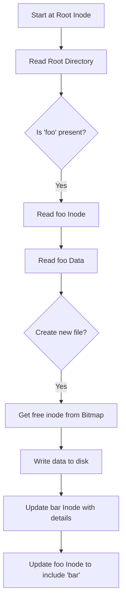

<!-- 
Generated by LectureQ (Enhanced Comprehensive Version)
Date: 2025-10-16 00:01:27
Model: qwen3:30b
Output Mode: Comprehensive
-->

I need to create comprehensive educational notes based on the provided transcript of a lecture about file systems, RAID configurations, and storage concepts. I'll structure this following all the formatting instructions provided.

Let me break down what needs to be included:

1. **H1 Title** with week/lecture information
2. **Overview section**
3. **Hierarchical headers** for organization
4. **Key Insights from Transcript** formatted as specified
5. **Content Synthesis** combining slides and transcript explanations
6. **Technical Content** with clear explanations of formulas, calculations
7. **Examples and Analogies** improved for clarity
8. **Study Materials** including summary, key takeaways, questions

Let me identify the main topics from this lecture:

1. RAID configurations (RAID 0, RAID 1, RAID 5)
2. File systems concepts
3. Physical vs logical storage 
4. Inodes and file naming
5. Directories and path structures
6. File permissions
7. Links (hard links vs symbolic links)
8. File descriptors
9. Storage allocation strategies (contiguous, extent-based, linked lists, FAT, indexed allocation)

I'll now create the notes following all the formatting instructions.

First, I need to identify key insights from the transcript and format them as specified:

### Key Insight from Transcript
> "The extension on a file does not mean anything. It literally means nothing. It is just a convention for humans to understand what kind of data might be in the file."

*Instructor Emphasis*: "This is one of those little extra things I like to throw in, just to make sure everyone knows this."

*Student Question*: What does a .txt file contain?
*Instructor Response*: "It contains bits. There's no guarantee anywhere in the universe that a .TXT file actually contains text."

Another key insight:
### Key Insight from Transcript
> "When you delete a file, all you're doing is removing the pointer to the data. The actual data remains on disk until it gets overwritten by new data."

*Instructor Emphasis*: "This is why it's dangerous now with SSDs because they constantly shift data around and can disappear quite quickly."

Now I'll structure the notes accordingly.

I need to create a comprehensive set of educational notes that flow naturally while preserving all important information. Let me organize this into sections:

1. **RAID Configurations** (RAID 0, RAID 1, RAID 5)
2. **File Systems Fundamentals**
3. **Physical vs Logical Storage**
4. **Inodes and File Naming**
5. **Directory Structures**
6. **File Permissions**
7. **Links: Hard Links vs Symbolic Links**
8. **File Descriptors**
9. **Storage Allocation Strategies**

I'll now create the notes following all formatting instructions.
</think>

# Week 12 Lecture Notes: File Systems, RAID Configurations, and Storage Management

## Overview
This lecture covers fundamental concepts of file systems, storage management techniques, and RAID configurations. We explore how operating systems organize data on physical storage devices, the differences between logical and physical storage, inode structures, directory hierarchies, permissions, and various storage allocation strategies. The lecture also examines practical implementations like RAID 5 to optimize performance while maintaining redundancy.

---

## File Systems Fundamentals

### Physical vs Logical Storage
**Physical storage** refers to actual hardware components where data is stored (hard drives, SSDs), dealing with persistence and physical addressing. **Logical storage** represents how we organize data in a structured way for the operating system (files, directories).

> "The only reason I mention that is because we're gonna use the word logical and physical. It was on the physical storage versus logical storage."

*Instructor Emphasis*: "Everything in Linux is a file—this is why it's so powerful compared to other operating systems."

### What Is a File?
A **file** has four key characteristics:
1. **Persistent**: Exists beyond program execution
2. **Modifiable**: Can be changed after creation
3. **Locatable**: Has a unique identifier (inode number)
4. **Contains data**: In the form of bytes

> "Everything in Linux is a file, right? That's the correct answer."

*Instructor Emphasis*: "If you don't know what 'everything is a file' means at this point in your university careers, I feel very bad for you."

---

## Inodes and File Naming Systems

### The Inode System
Every file has an **inode** (index node) that contains metadata about the file:
- Permissions
- Ownership
- Timestamps
- Pointers to data blocks

#### Direct vs. Indirect Block Pointers
- **Direct pointers** (typically 12) reference data blocks immediately. Ideal for small files (≤ 48 KB with 4 KB blocks).
- **Single-indirect pointer** references a block full of more block numbers. Reading data requires two disk accesses: inode → indirect block → data block.
- **Double-indirect pointer** adds another level (inode → double-indirect block → indirect block → data). Each extra hop costs another disk seek.
- **Triple-indirect pointer** supports multi-gigabyte files but may require five separate I/Os to reach a single data block if nothing is cached.

> 📈 **Performance Implication**: Small files stay fast because they fit in direct blocks. Large sequential reads amortize the extra lookups because the indirect blocks are cached after the first access.

> "The guy who invented iNodes is like, I don't know, which I found hilarious. He's like, I guess it was index, I don't know."

*Instructor Emphasis*: "Every file on a computer has an inode—this is just going to be a unique number that identifies that file."

**Viewing Inodes in Linux:**
```bash
ls -i  # Shows inode numbers for files and directories
```

### File Naming Conventions
Files are named using **paths**, which include the directory structure:
- `home/Bernard/documents/projects/report.txt`
- The root (`/`) is typically inode number 2

> "The name of the file actually includes its directory, right? Like as in this is one of the things that's not immediately obvious."

*Instructor Emphasis*: "You can have two files with the same name in different directories because they have different paths."

---

## Directory Structures and Path Resolution

### The Root Directory
- **Root** (`/`) is the top-level directory (inode 2)
- Every file path starts from root or a user's home directory
- `.` = current directory, `..` = parent directory

> "Dot is here. And dot dot is my parent."

*Instructor Emphasis*: "This is why when you run something like './even', it means 'run the executable in this directory'."

### Directory Implementation
- **Lists**: Simple implementation (can become slow with many files)
- **B-trees**: More efficient for large directories

> "If you ever want to watch Windows really struggle, what you do is create an individual directory and create millions of files in it. You put millions of files in one directory, and then Windows will be like 'ah I don't know what to do with this shit.'"

*Practical Example*: 
- **List implementation**: 10,000 files = single list requiring sequential search
- **B-tree implementation**: 10,000 files = hierarchical tree structure for faster access

---

## File Permissions and Security

### Permission Structure (9-character format)
```
rwx rwx rwx
| | |
| | +-- Other user permissions
| +---- Group permissions
+------ Owner permissions
```

*Example*: `drw-r--r--` means:
- `d`: Directory
- `rw-`: Read/write for owner
- `r--`: Read-only for group
- `r--`: Read-only for others

> "There are files that you can read but can't write. There are files that you can read, write and execute, but no one else can."

*Instructor Emphasis*: "This is why when you do 'ls -l', the first character tells you if it's a directory (d), file (-), symbolic link (l), etc."

---

## Links: Hard vs Symbolic

### Hard Links
- Multiple names pointing to the **same inode**
- Can't span filesystems
- File data remains until all links are removed

> "If I create a hard link, it's like you've got two file structures that point at the same data."

*Practical Example*:
```bash
echo "hello" > file1
ln file1 file2  # Create hard link
cat file2       # Shows "hello"
rm file1        # Deletes only one pointer
cat file2       # Still shows "hello"
```

### Symbolic Links (Soft Links)
- Point to a **path** rather than an inode
- Can span filesystems
- File data disappears if target is deleted

> "If you delete the soft link, it's like saying 'delete file one'—the actual file remains."

*Practical Example*:
```bash
echo "hello" > file1
ln -s file1 file2  # Create symbolic link
cat file2          # Shows "hello"
rm file1           # Deletes original file
cat file2          # File not found (broken link)
```

---

## Storage Allocation Strategies

### Contiguous Allocation
- Files stored in consecutive blocks on disk
- **Pros**: Fast sequential access, no metadata overhead
- **Cons**: External fragmentation, difficult to grow files

> "It's really good for reading and writing—there's no metadata overhead."

*Practical Limitation*: 
```
A A A B B C C C
     [Fragmented space]
```

### Extent-Based Allocation
- Files stored in non-contiguous blocks (extents)
- **Pros**: Better file growth, less external fragmentation than contiguous
- **Cons**: Still requires metadata to track extents

> "Extent is basically like contiguous but now we're gonna say we can have little groups of it."

*Practical Example*: 
```
File A: [Block 10-20]
File B: [Block 30-40, Block 50-60]
```

### Linked List Allocation
- Each block contains pointer to next block
- **Pros**: Easy file growth
- **Cons**: Very slow random access

> "This is obviously really, really bad because if you can imagine this is a hard drive, it's slow. Every time we ask it for a new bit of data, it's going to take forever."

*Performance Comparison*: 
| Access Type | Contiguous | Linked List |
|-------------|------------|-------------|
| Sequential  | Very Fast  | Moderate    |
| Random      | Fast       | Very Slow   |

### File Allocation Table (FAT)
- Central table mapping block numbers
- **Pros**: Faster than linked lists, simple implementation
- **Cons**: Single point of failure

> "It's pretty much analogous to paging except just here for reading from hard drives."

*Practical Example*: 
```
Block 0 → Block 15
Block 1 → Block 27
Block 2 → Block 43
...
```

### Indexed Allocation
- Each file has its own index block (like a page table)
- **Pros**: Fast random access, no external fragmentation
- **Cons**: High metadata overhead for small files

> "It's basically saying for every file, you just make a block. And in that block it's got the directory for the rest of the block."

*Performance Comparison*: 
| Strategy       | Sequential Access | Random Access |
|----------------|-------------------|---------------|
| Contiguous     | Excellent         | Excellent     |
| Extent-Based   | Good              | Moderate      |
| Linked List    | Moderate          | Poor          |
| FAT            | Good              | Moderate      |
| Indexed        | Excellent         | Excellent     |

---

## RAID Configurations

### RAID 0 (Striping)
- Data split across multiple disks
- **Pros**: Maximum performance, no redundancy
- **Cons**: No fault tolerance

> "RAID 0 is just splitting the data across multiple drives."

*Performance*: 
```
Disk 1: A B C D E F G H
Disk 2: I J K L M N O P
```

### RAID 1 (Mirroring)
- Data duplicated on two disks
- **Pros**: High fault tolerance, good read performance
- **Cons**: Low write performance, requires double storage

> "RAID 1 is just mirroring the data."

*Performance*: 
```
Disk 1: A B C D E F G H
Disk 2: A B C D E F G H
```

### RAID 5 (Distributed Parity)
- Data striped across disks with parity information distributed
- **Pros**: Good performance, fault tolerance for one disk failure
- **Cons**: Complex implementation

> "RAID 5 is basically designed to overcome this [the bottleneck of a single parity drive in RAID 4]."

*Key Insight*: 
> "In RAID 5, the parity blocks are distributed across all drives rather than being on a single dedicated drive."

**Performance Comparison**:
| Configuration | Read Performance | Write Performance | Fault Tolerance |
|---------------|------------------|-------------------|-----------------|
| RAID 0        | Excellent        | Excellent         | None            |
| RAID 1        | Good             | Poor              | One disk        |
| RAID 5        | Very Good        | Moderate          | One disk        |

---

## File Descriptors and System Calls

### The Three Standard File Descriptors
- **0**: Standard Input (stdin)
- **1**: Standard Output (stdout)
- **2**: Standard Error (stderr)

> "When you open a file, it's always gonna be number 3, usually."

*Practical Example*: 
```bash
strace cat quick_test.txt
# Shows: read(3, ...), meaning reading from descriptor 3
```

### File Descriptor Table Structure
| Process | File Descriptors (0-2) | Open Files |
|---------|------------------------|------------|
| PID 1   | stdin, stdout, stderr    | [File Table] → Inode |

> "Each process has its unique set of file descriptors and they are pointing at the same file table entries."

---

## Storage Allocation: RAID 5 Implementation

### How RAID 5 Works
- Data blocks distributed across all disks
- Parity information calculated and stored on different drives
- Allows recovery from a single disk failure

> "If I was reading from page 10, then the parity block for that page is in disc 2. And if I'm reading from page 1, the parity block might be in disc 0."

*Practical Example*: 
```
Disk 0: Data A | Parity C
Disk 1: Data B | Data D
Disk 2: Parity A | Data E
Disk 3: Data C | Parity B
```

### RAID 5 Write Performance Optimization
- **Subtractive method**: Read old data and parity, compute new values
- **Latency**: Increased from D to 2D (read + write operations)

> "For subtractive, I'm gonna read the old value, find the difference between old and new value. Then write to data block and parity block."

**Why a Small Write Needs 4 I/Os**
1. **Read old data block** to know what is changing.
2. **Read old parity block** so we can update it without touching other stripes.
3. **Write new data block** with the updated payload.
4. **Write new parity block** computed as `old_parity ⊕ old_data ⊕ new_data`.

> 🔁 Reading the remaining data blocks would cost even more I/O, so this read-modify-write sequence is the cheapest way to keep parity consistent for a single-block update.

*Performance Impact*:
```
RAID 5 Random Write: N/4 * R
(Where N = number of disks, R = random access speed)
```

---

## File System Implementation

### Key Components in a File System
1. **Block Bitmap**: Tracks which blocks are free
2. **Inode Bitmap**: Tracks which inodes are available
3. **Inode Table**: Maps files to inode numbers
4. **Data Blocks**: Actual file content storage

> "We're gonna have a block bitmap and an inode bitmap, and an inode table."

*Practical Example*: 
```
Block 0: Superblock (file system metadata)
Blocks 1-100: Block Bitmap
Blocks 101-200: Inode Bitmap
Blocks 201-300: Inode Table
Blocks 301+: Data Blocks
```

---

## File Operations in Practice

### Creating a New File (Example)


> "We're gonna start with the root inode, read it to find what's in it."

### Writing to a File
1. Read file's inode (to get data block pointers)
2. Update data bitmap (mark blocks as used)
3. Write new data to appropriate blocks
4. Update inode with new metadata

> "When you close a file, nothing actually happens—just tell the operating system 'done'."

---

## Key Takeaways and Study Questions

### Summary of Key Concepts
- **Everything in Linux is a file** (a fundamental design principle)
- **Inodes** provide unique identifiers for files with associated metadata
- **File extensions are meaningless**; they're just conventions
- **RAID 5 distributes parity information across all disks**, improving performance over RAID 4
- **Hard links** point to the same inode, while **symbolic links** point to paths
- **Contiguous allocation** is simple but suffers from fragmentation
- **Indexed allocation** provides fast random access at the cost of metadata overhead

### Study Questions
1. Explain why file extensions are meaningless in Linux.
2. Describe how a hard link differs from a symbolic link, and provide an example where each would be useful.
3. Why does RAID 5 have better performance than RAID 4 for write operations?
4. How does the inode system solve the problem of fragmentation that occurs with contiguous allocation?
5. Explain why deleting a file in Linux doesn't immediately remove the data from disk.
6. Describe how you'd implement a directory structure using both linked lists and B-trees, and compare their performance characteristics.
7. What are the advantages and disadvantages of FAT versus indexed allocation for file systems?
8. Why is it dangerous to delete files on SSDs compared to traditional hard drives?

### Practical Exercises
1. Create a file with `echo "Hello" > test.txt`, then use `ls -i` to view its inode number.
2. Create a hard link and symbolic link to the same file, then delete the original file and observe what happens.
3. Use `strace cat test.txt` to see which file descriptor is used for reading.
4. Research how modern SSDs handle data deletion differently than traditional hard drives.

---

## Additional Insights from Lecture

### Why Extensions Are Meaningless
> "It contains bits. There's no guarantee anywhere in the universe that a .TXT file actually contains text."

*Instructor Emphasis*: "This is just like one of those little extra things I like to throw in, just to make sure everyone knows this."

### The Reality of File Deletion
> "When you delete a file it would be like, 'it's not there anymore.' But because of the way that data works, it would still be there... It's like a memory leak almost, except it's fine because unlike a memory leak, what ends up happening is the inode gets freed."

*Instructor Emphasis*: "This is why it's actually dangerous now with SSDs because they're constantly trying to find bits of data to blank pages and shift data around."

### The Power of Inodes
> "Each inode maintains an 'is pointing at me' list... So that's one of the attributes. And when that reaches zero, because it's been unlinked from everyone, that means lots of people have deleted it or closed it."

*Instructor Emphasis*: "This is why you can delete a file and still see its contents in some cases—because processes might still be using it."